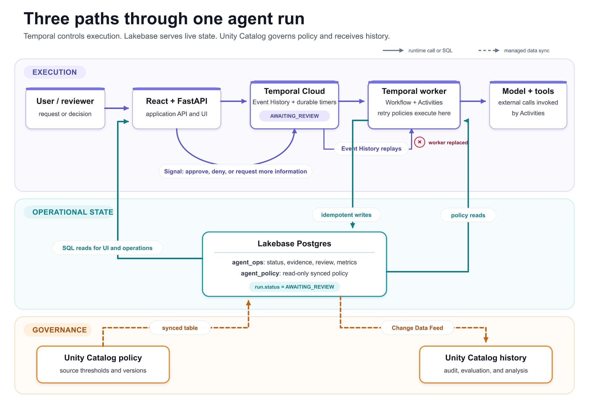

Agente de IA que faz uma chamada de API e devolve resposta é fácil de tornar resiliente, se falhar, tenta de novo. O problema aparece quando o agente executa um fluxo longo, várias etapas, chamada de ferramenta externa, espera por revisão humana no meio do caminho, e o worker que estava rodando aquilo cai na etapa 7 de 12. Reiniciar do zero pode duplicar efeito colateral já aplicado (mandar e-mail duas vezes, debitar duas vezes), e reiniciar do meio exige saber exatamente que estado já foi alcançado. A maioria dos frameworks de agente de mercado simplesmente não pensa nesse cenário, porque foi desenhada pra chamada curta, não pra workflow de negócio de verdade.

Um projeto de referência publicado pela Databricks junto com a Temporal ataca esse problema combinando duas peças com papel bem definido: Temporal cuida da execução durável do workflow, Lakebase Postgres serve o estado operacional que o resto do sistema (dashboard, API, humano revisando) precisa consultar em tempo real. Nenhuma das duas peças sozinha resolve o problema completo.

Vale situar por que nenhuma das duas resolve sozinha. Usar só Temporal sem um banco operacional dedicado funciona bem pra orquestrar a execução, mas consultar "em que ponto está o caso 4821 agora" exige ler o Event History bruto do motor de workflow, que não foi desenhado pra ser consultado como se fosse uma tabela de aplicação. Usar só um banco relacional sem Temporal resolve a parte de estado consultável, mas devolve pro desenvolvedor a responsabilidade de reimplementar retry, controle de concorrência e espera durável por evento externo na mão, exatamente o tipo de código repetitivo e sujeito a bug que motor de orquestração existe pra eliminar.

## O mecanismo: execução determinística mais estado consultável

A divisão de responsabilidade é clara:

- **Temporal preserva o progresso do agente** através de um Event History armazenado no Temporal Cloud. Se um worker cai, o trabalho já registrado é recuperado, operação que falhou é reexecutada automaticamente, e o workflow consegue esperar de forma durável por uma revisão humana no meio do processo, sem manter processo nenhum vivo enquanto espera.
- **Lakebase serve o estado da aplicação em tempo real**: evidência coletada, recomendação gerada, decisão de revisão e métrica operacional ficam consultáveis via SQL durante toda a execução, não só no fim.
- **Política governada via Unity Catalog**: o workflow lê política de underwriting (no exemplo usado, um caso de seguro) através de tabela sincronizada continuamente do Unity Catalog, e com Change Data Feed do Lakebase habilitado, publica mudança operacional de volta pra tabela Delta history, fechando o ciclo entre operação e governança.



A arquitetura completa usa Temporal Cloud pra despachar tarefa e guardar histórico de evento, Lakebase Postgres com dois schemas (um pra estado operacional, outro pra política sincronizada), e uma camada de aplicação em React e FastAPI cuidando de HTTP e interface.

## Mão na massa: idempotência é o detalhe que decide se isso funciona

O ponto mais importante da arquitetura, e o que menos aparece em diagrama bonito, é que Activity do Temporal pode ser reexecutada, e cada uma precisa convergir pro mesmo estado final mesmo se rodar duas vezes. Isso exige identificador determinístico e SQL de update com guarda, não um simples insert:

```python
import hashlib

def gera_id_deterministico(caso_id: str, etapa: str) -> str:
    """ID estável: mesma Activity reexecutada gera o mesmo identificador."""
    base = f"{caso_id}:{etapa}"
    return hashlib.sha256(base.encode()).hexdigest()[:16]

async def registra_evidencia_coletada(caso_id: str, evidencia: dict):
    registro_id = gera_id_deterministico(caso_id, "coleta_evidencia")
    # UPSERT com guarda: reexecução não duplica, só confirma o mesmo estado
    await conexao.execute(
        """
        INSERT INTO agent_ops.evidencias (id, caso_id, payload, status)
        VALUES (%s, %s, %s, 'coletada')
        ON CONFLICT (id) DO UPDATE
        SET payload = EXCLUDED.payload
        WHERE agent_ops.evidencias.status != 'coletada'
        """,
        (registro_id, caso_id, evidencia),
    )
```

Sem esse cuidado de ID determinístico e `ON CONFLICT` guardado, a promessa de durabilidade do Temporal vira uma faca de dois gumes, a Activity reexecuta com sucesso, só que duplica o efeito colateral que o Postgres registra.

**Minha leitura:** o que mais me chama atenção nessa arquitetura é que ela admite, sem rodeio, que durabilidade de workflow (Temporal) e estado consultável em tempo real (Lakebase) são dois problemas diferentes que a maioria dos frameworks de agente tenta resolver com a mesma peça, geralmente um banco de checkpoint genérico que não é bom em nenhum dos dois papéis. Separar isso é mais trabalho de desenho inicial, mas evita o cenário comum de workflow "recuperado com sucesso" cujo estado intermediário ninguém consegue consultar sem abrir o Event History bruto do motor de orquestração.

## O papel do Change Data Feed fechando o ciclo com governança

Um detalhe da arquitetura que merece mais atenção do que costuma receber é o uso do Change Data Feed do Lakebase pra publicar mudança operacional de volta pra tabela Delta history. Isso significa que toda decisão tomada durante a execução do agente, evidência coletada, recomendação gerada, aprovação registrada, não fica presa dentro do schema operacional do Postgres, ela flui de volta pro lakehouse em formato Delta, onde o resto da organização (auditoria, relatório de compliance, análise de tendência de decisão do agente ao longo do tempo) consegue consultar sem precisar acessar o banco operacional diretamente. Isso resolve um problema comum de arquitetura orientada a agente, que é o estado operacional ficar isolado num banco transacional que só o próprio sistema do agente enxerga, invisível pro resto da governança de dado da empresa.

## O que isso não resolve

Antes de adotar esse padrão, vale considerar:

- **Idempotência não vem de graça da plataforma, é responsabilidade de quem escreve cada Activity.** O framework garante reexecução, não garante que sua lógica de negócio lida bem com reexecução, isso é código que você escreve e testa.
- **Duas dependências externas novas (Temporal Cloud e Lakebase) somam superfície operacional**, não é uma simplificação de stack, é uma troca deliberada de simplicidade por robustez, que só vale a pena se o workflow realmente precisar de execução de longa duração com espera humana no meio.
- **O exemplo de referência é um caso de underwriting de seguro**, com schema e política específicos daquele domínio. Adaptar pra outro domínio de negócio exige redesenhar schema operacional e regra de idempotência do zero, o código do repositório de referência é ponto de partida, não solução pronta.

## Fechamento

Agente que realmente sobrevive à falha de infraestrutura, sem duplicar efeito colateral e sem perder rastro do que já foi feito, exige separar execução durável de estado operacional consultável, e tratar idempotência como parte do contrato de cada etapa, não como detalhe de implementação. É mais arquitetura do que a maioria dos protótipos de agente tem hoje, e é exatamente o tipo de rigor que separa demo de sistema que aguenta produção.

## Referências

- Post oficial: [Build durable agents with Temporal and Lakebase](https://www.databricks.com/blog/build-durable-agents-temporal-and-lakebase)
- Documentação oficial: [Lakebase autoscaling](https://docs.databricks.com/aws/en/oltp/projects/autoscaling)
- Documentação oficial (Microsoft Learn): [Autoscaling - Azure Databricks](https://learn.microsoft.com/en-us/azure/databricks/oltp/projects/autoscaling)
- Documentação oficial: [Temporal Workflows](https://docs.temporal.io/workflows)
- Repositório de referência: [temporal-sa/temporal-lakebase-agent](https://github.com/temporal-sa/temporal-lakebase-agent)

#Databricks #Lakebase #Temporal #AgentesDeIA
