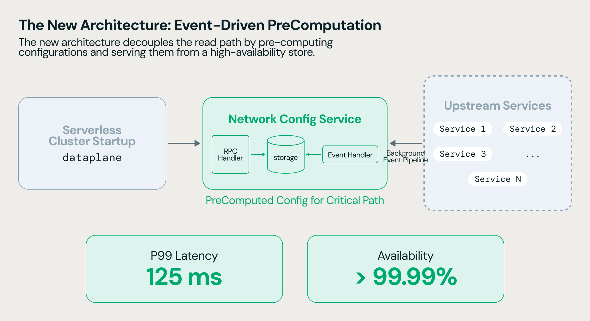

Todo cluster serverless que sobe precisa de uma coisa bem chata de garantir em escala: rede configurada corretamente antes da primeira linha de código do usuário rodar. Firewall, rota, isolamento entre workspaces, tudo isso precisa estar pronto no instante em que a VM liga. Quando esse processo depende de perguntar pra vários serviços "qual é a configuração de rede desse workspace agora", cada VM nova vira uma cadeia de chamadas síncronas. Em escala de milhares de VMs por hora isso é irritante mas tolerável. Em escala de dezenas de milhões por dia, vira o tipo de gargalo que aparece direto no painel de incidentes.

## O problema com o caminho síncrono

A arquitetura anterior, segundo o que a Databricks descreveu, fazia com que cada cluster buscasse sua configuração de rede consultando múltiplos serviços upstream no momento em que precisava dela. Isso funciona bem sob baixa carga, mas cria dependência direta entre a disponibilidade desses serviços upstream e a disponibilidade do próprio provisionamento de compute. Se um desses serviços está lento ou sobrecarregado, o efeito se propaga direto pro tempo de start do cluster. Os números publicados mostram o tamanho do problema: latência p99 de cerca de 5.000 milissegundos e disponibilidade de 99,8%, que parece alto até você fazer a conta de quantas tentativas falham por dia numa base de dezenas de milhões.

## A separação entre caminho de gerenciamento e caminho de atendimento

A mudança central é conceitualmente simples de explicar, mesmo sendo complexa de implementar: separar o que muda raramente (configuração de rede de um workspace) do que precisa responder em tempo real (uma VM pedindo sua configuração agora).



O desenho publicado tem quatro peças:

1. **Management path (background)**: serviços upstream emitem eventos sempre que algo relevante muda (workspace criado, política de rede alterada, etc). Esses eventos vão pra uma fila de mensagens.
2. **Event processing**: um processador consome a fila, determina quais workspaces foram afetados pela mudança e dispara a atualização correspondente.
3. **Snapshot store**: a configuração já pré-computada fica armazenada localmente, pronta pra ser lida sem nenhuma dependência externa.
4. **Serving path (crítico)**: quando um cluster novo precisa de configuração de rede, ele faz uma única leitura no snapshot store. Nada de chamada síncrona a serviço upstream nesse caminho.

Como rede de segurança contra eventos perdidos ou processados fora de ordem, existe um reconciliador periódico que resincroniza workspaces de tempos em tempos, garantindo que divergência entre o estado real e o snapshot não vire permanente.

## Por que isso é mais que só "trocar sync por async"

**Minha leitura:** esse tipo de refatoração de arquitetura interna raramente vira post de blog porque não tem feature nova pra anunciar, mas é exatamente esse tipo de trabalho que decide se uma plataforma aguenta escalar em ordem de grandeza sem reescrever tudo de novo daqui a dois anos. Separar caminho de leitura crítico do caminho de escrita/atualização é um padrão clássico de sistemas distribuídos (CQRS, na essência), mas aplicado aqui numa camada que a maioria dos usuários nunca vai ver ou pensar sobre: provisionamento de rede de VM.

O ganho reportado de 86% na redução do volume de chamadas upstream é o número que mais me chama atenção, porque ele indica que o gargalo não era só latência, era também carga desnecessária empurrada repetidamente pros mesmos serviços a cada novo cluster, mesmo quando a configuração de rede do workspace não tinha mudado nada desde a última vez.

## Mão na massa: o padrão aplicado ao seu próprio sistema

Você não implementa essa arquitetura específica do Azure Databricks, mas o padrão é replicável em qualquer sistema seu que sofre do mesmo problema: leitura frequente de configuração que muda raramente. Um esqueleto simplificado em Python usando um cache local atualizado por evento, em vez de consulta síncrona a cada leitura:

```python
import json
import threading
from pathlib import Path

class ConfigSnapshotStore:
    def __init__(self, snapshot_path: str):
        self._path = Path(snapshot_path)
        self._lock = threading.RLock()
        self._cache = {}
        self._load()

    def _load(self):
        with self._lock:
            if self._path.exists():
                self._cache = json.loads(self._path.read_text())

    def get(self, workspace_id: str) -> dict | None:
        # caminho crítico: leitura local, sem chamada de rede
        with self._lock:
            return self._cache.get(workspace_id)

    def apply_event(self, workspace_id: str, config: dict):
        # caminho de gerenciamento: só roda quando um evento chega
        with self._lock:
            self._cache[workspace_id] = config
            self._path.write_text(json.dumps(self._cache))
```

A ideia central: nenhuma leitura no caminho crítico depende de rede externa, e toda escrita vem de um evento processado de forma assíncrona, desacoplada do momento em que alguém precisa ler.

## O papel do reconciliador como rede de segurança

Vale dedicar um parágrafo só pro reconciliador periódico, porque é essa peça que separa "arquitetura orientada a eventos elegante" de "arquitetura orientada a eventos que quebra silenciosamente quando um evento se perde". Fila de mensagens pode ter mensagem duplicada, mensagem entregue fora de ordem, ou, em cenário de falha real, mensagem perdida. Se o snapshot store dependesse cegamente de cada evento chegar e ser processado corretamente, uma falha isolada de infraestrutura poderia deixar um workspace com configuração de rede desatualizada por tempo indefinido, sem ninguém perceber até um cluster começar a falhar de forma misteriosa. O reconciliador resolve isso varrendo periodicamente o estado real dos serviços upstream e comparando com o snapshot local, corrigindo divergência antes que ela vire incidente visível. É o tipo de componente que raramente aparece em diagrama de arquitetura chamativo, mas que decide se o sistema é confiável o suficiente pra rodar sem intervenção manual.

## O que isso não resolve

Arquitetura orientada a eventos troca um problema (latência síncrona) por outro (consistência eventual). Existe uma janela, ainda que pequena, entre uma mudança de configuração de rede acontecer e o snapshot local refletir isso. Pra a maioria dos casos de provisionamento de VM isso é aceitável, porque o reconciliador periódico cobre a divergência residual, mas é uma escolha explícita de trade-off, não um almoço grátis. Também vale lembrar que esse tipo de solução exige uma fila de mensagens confiável e um processador de eventos que não pode virar, ele mesmo, um novo ponto único de falha, o que a Databricks não detalhou em profundidade no post original. Quem for replicar esse padrão internamente precisa pensar explicitamente em como monitorar o próprio pipeline de eventos, não só o sistema final que consome o snapshot, porque um processador de eventos travado silenciosamente é exatamente o tipo de falha que some do radar até o reconciliador (se existir um) sinalizar divergência.

## Resumindo

A troca de chamada síncrona por pipeline orientado a eventos pra configuração de rede de VMs serverless é um lembrete de que, em escala suficiente, todo caminho crítico de leitura deveria estar desacoplado de qualquer dependência que pode estar lenta ou fora do ar no momento exato em que você precisa dela. Não é feature de produto, é fundação de infraestrutura, mas é esse tipo de fundação que sustenta o SLA que a Databricks vende pra quem roda workload em produção.

## Referências

- [Databricks network configuration: delivery to tens of millions of serverless VMs](https://www.databricks.com/blog/databricks-network-configuration-delivery-tens-millions-serverless-vms) (blog oficial Databricks)
- [Serverless compute plane networking](https://docs.databricks.com/aws/en/security/network/serverless-network-security/) (documentação oficial)
- [Serverless compute plane networking](https://learn.microsoft.com/en-us/azure/databricks/security/network/serverless-network-security/) (Microsoft Learn)

#Databricks #Serverless #Arquitetura #Engenharia
