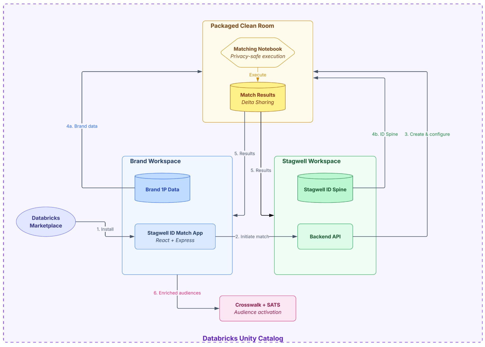

Toda negociação de cruzamento de dado entre duas empresas trava no mesmo ponto: quem confia em quem primeiro. O parceiro de dado não quer expor a base de cliente crua pra terceiro, e quem detém o algoritmo de matching não quer entregar a lógica proprietária que levou anos pra afinar. O resultado histórico é reunião jurídica longa, contrato de processamento de dado, e em muitos casos a integração simplesmente não sai do papel porque nenhum dos dois lados topa piscar primeiro.

As Clean Rooms do Azure Databricks já resolviam parte disso desde que existem, criando um ambiente onde duas organizações compartilham metadado e rodam notebook aprovado sem se ver o dado bruto uma da outra. O que muda com o modo empacotado é mais sutil e, pra quem já bateu de frente com esse tipo de negociação, mais relevante: ele quebra a simetria de privilégio entre os dois lados de propósito, porque o problema real raramente é simétrico.

## O mecanismo: dois papéis, dois conjuntos de privilégio

No modelo padrão de Clean Room (chamado de "no-trust" ou baseado em aprovação), todos os colaboradores têm privilégio igual: qualquer um pode subir notebook, mas ele só roda depois que todos os outros colaboradores aprovarem explicitamente o código, linha por linha se quiserem. Isso funciona bem quando as duas partes têm capacidade técnica parecida e querem revisar o que roda sobre o dado delas.

O modo empacotado assume outra configuração de poder, bem mais comum na prática: um parceiro (o "provedor") é dono de uma análise proprietária, tipo um algoritmo de matching de identidade, e quer que outra empresa (a "consumidora") rode essa análise contra o próprio dado dela, sem nunca enxergar o código por trás. A tabela abaixo, direto da documentação oficial, resume a diferença de privilégio entre os três papéis possíveis:

| Capacidade | Aprovação (padrão) | Empacotado (consumidor) | Empacotado (provedor) |
|---|---|---|---|
| Ver notebook/JAR | Código completo visível | Só o nome, sem código | Os próprios notebooks |
| Adicionar notebook/JAR | Sim | Não | Sim |
| Ver dado do outro lado | Tudo visível | Só o próprio dado | Só o próprio dado |
| Ver resultado da execução | Sim | Sim | Não |
| Disparar execução | Sim | Sim | Não |

Repare no que fica invisível em cada direção: o provedor nunca vê o dado do consumidor nem o resultado da execução (ele só sabe, pelo histórico, que uma execução aconteceu), e o consumidor nunca vê o código do provedor, só o nome do notebook, como se fosse uma biblioteca privada que ele confia sem auditar. Nenhum dos dois lados tem privilégio de administrador dentro da "clean room central", o ambiente efêmero e isolado, hospedado pela Databricks, onde a execução de fato acontece.



**Minha leitura:** o detalhe que mais gosto nesse desenho é que ele não tenta fingir simetria onde não existe. Toda vez que vi negociação de cruzamento de dado travar, era porque o modelo de confiança proposto (geralmente "os dois revisam tudo") não batia com a realidade de que um lado tem ativo proprietário que não vai expor de jeito nenhum. Empacotar essa assimetria em vez de negá-la é o que faz esse modelo ser adotável de verdade.

## Mão na massa: criando uma clean room empacotada via API

A criação passa por três decisões que precisam estar corretas desde o início, porque **o modo empacotado é definido na criação e não pode ser alterado depois**. Via REST API, o corpo da requisição de criação já sinaliza isso no campo `package_provider_collaborator_alias`:

```json
{
  "name": "matching-identidade-parceiro-x",
  "remote_detailed_info": {
    "cloud_vendor": "azure",
    "region": "eastus2",
    "collaborators": [
      {
        "global_metastore_id": "azure:eastus2:11111111-2222-3333-4444-555555555555",
        "collaborator_alias": "minha_empresa"
      }
    ],
    "egress_network_policy": {
      "internet_access": { "restriction_mode": "FULL_ACCESS" }
    },
    "package_provider_collaborator_alias": "minha_empresa"
  },
  "owner": "dono.projeto@empresa.com",
  "comment": "Clean room empacotada para matching de identidade com Parceiro X"
}
```

O campo que faz a diferença é `package_provider_collaborator_alias`: apontar o alias de um colaborador ali designa esse colaborador como provedor, e todos os outros entram automaticamente como consumidores. Depois de criada, cabe ao provedor subir o notebook e os assets de dado dele (visíveis só pra ele), e cabe ao consumidor adicionar o próprio dado (via **Add Input Data**, visível só pra ele) e disparar a execução. O consumidor então vê o resultado; o provedor só vê, no histórico de execução, que uma run aconteceu, sem acesso ao output.

## Onde isso resolve um problema real: matching de identidade sem expor a base

O case que a Databricks documentou com a Stagwell (agência que mantém um grafo de identidade próprio) ilustra bem o encaixe: a marca cliente tem a própria base de clientes com email, dispositivo e cookie, e a Stagwell tem o algoritmo proprietário de resolução de identidade construído ao longo de anos. Numa clean room empacotada, a Stagwell entra como provedora do notebook de matching, a marca entra como consumidora trazendo só a própria base, dispara a execução, e recebe de volta taxa de correspondência e cobertura, sem que a Stagwell precise expor a lógica de matching e sem que a marca precise exportar dado bruto de cliente pra fora do próprio ambiente controlado.

O resultado final também pode ser compartilhado de volta pros dois lados através de uma tabela de saída (`output table`), registrada num schema compartilhado que ambos conseguem ler, útil quando o objetivo não é só o consumidor ver o resultado, mas os dois lados alinharem sobre o mesmo número de cobertura.

## O que garante a confiança nesse modelo (e onde ela ainda depende de você)

Vale entender por que esse modelo não é "confiança cega". A clean room central roda em plano de computação serverless isolado, gerenciado pela própria Databricks, numa região que quem cria a clean room escolhe. Nenhuma das partes tem acesso de administrador a esse ambiente, e toda ação (quem rodou o quê, quando, qual versão do notebook) fica registrada numa tabela de sistema de eventos e no log de auditoria da conta.

Isso cobre o eixo "quem viu o quê", mas existe um eixo separado que continua sendo responsabilidade de quem entra como consumidor: a política de rede de saída (`egress network policy`) da clean room. Se o egress estiver liberado (`FULL_ACCESS`, como no exemplo acima) ou permitir endpoint externo que o consumidor não valida antes, o código do provedor, que o consumidor não pode inspecionar, tecnicamente teria como enviar o dado do consumidor pra fora do ambiente controlado. A documentação oficial é direta sobre isso: antes de contribuir dado sensível numa clean room empacotada, revisar a política de egress não é opcional, é a única auditoria que o consumidor ainda tem disponível já que o código em si está fechado pra ele.

**Na prática:** eu trataria a configuração de egress como o item número um de checklist antes de qualquer dado real entrar numa clean room empacotada como consumidor, não como detalhe de configuração pra revisar depois. É o único controle que sobra quando você abre mão de auditar o código.

## O que isso não resolve

O modo empacotado não é a opção certa quando as duas partes querem simetria de revisão, nesse caso o modelo de aprovação padrão continua sendo o adequado. Regra de auto-aprovação fica desabilitada pra todo mundo dentro de uma clean room empacotada, inclusive pro provedor, o que significa que não dá pra automatizar liberação de notebook novo sem intervenção manual. Cada clean room tem limite de dez colaboradores e não pode ser renomeada depois de criada, então o planejamento de nome e escopo precisa acontecer antes, não durante. E, como já dito, a decisão entre modelo empacotado e modelo de aprovação é definitiva no momento da criação, não existe migração de um pro outro depois que a clean room já está em uso.

## Vale a pena adotar?

Faz sentido quando existe assimetria real de propriedade intelectual entre as partes, um lado com algoritmo proprietário que não pode ser exposto, o outro com dado sensível que não pode ser exportado, e ambos precisam do resultado do cruzamento entre os dois. Não faz sentido forçar esse modelo quando as duas partes têm capacidade e interesse de revisar o código uma da outra, nesse caso a fricção extra de nunca ver o notebook completo não compra segurança adicional, só reduz visibilidade sem necessidade. Quem for adotar como consumidor: trate a política de egress como parte da diligência, não como detalhe técnico de configuração.

## Referências

- Microsoft Learn, "What is Azure Databricks Clean Rooms?": https://learn.microsoft.com/en-us/azure/databricks/clean-rooms/
- Microsoft Learn, "Packaged clean rooms": https://learn.microsoft.com/en-us/azure/databricks/clean-rooms/packaged-clean-rooms
- Databricks Docs, "Create a clean room (REST API)": https://docs.databricks.com/api/workspace/cleanrooms/create
- Databricks Blog, "How Stagwell built privacy-safe ID matching on Databricks": https://www.databricks.com/blog/how-stagwell-built-privacy-safe-id-matching-databricks

#Databricks #CleanRooms #UnityCatalog #Governanca
