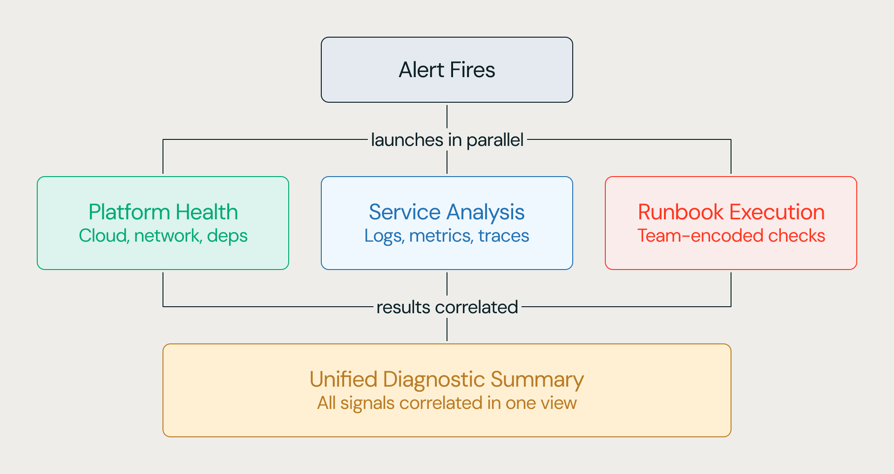

O engenheiro de plantão que já foi acordado por um alerta de madrugada conhece a sequência: abrir o dashboard, cruzar log de três serviços diferentes, checar se houve deploy recente, revisar métrica de dependência upstream, e só depois de vinte minutos montando esse quadro começar de fato a investigar a causa. A Databricks mediu isso internamente e chegou num número desconfortável: entre 60% e 80% do tempo de investigação de incidente não vai pra achar a causa raiz, vai pra montar o contexto necessário pra começar a procurar.

O AI SRE, agente interno que a Databricks documentou recentemente, ataca exatamente esse desperdício. A ideia central não é substituir o julgamento do engenheiro, é eliminar o trabalho mecânico de reunir contexto que vem antes desse julgamento, rodando em paralelo, em segundos, o que um humano levaria minutos pra montar manualmente.

## O mecanismo: três trilhas em paralelo, evidência antes de conclusão

Quando um incidente dispara, o AI SRE não espera um engenheiro pedir informação, ele já começa três investigações simultâneas:

**Checagem de saúde da plataforma**: verifica infraestrutura de nuvem, rede e dependência upstream, descartando de cara causa que não está no código do time (uma zona de disponibilidade com problema, um provedor externo fora do ar).

**Análise em nível de serviço**: examina log, métrica, trace, deploy recente e mudança de configuração do serviço específico envolvido no alerta.

**Execução de runbook**: roda os fluxos que o próprio time já documentou como "o que um especialista checaria nesse tipo de falha", convertidos em runbook agêntico.

O princípio de design que amarra as três trilhas juntas é declarado explicitamente pela equipe: "checagem estruturada antes de raciocínio aberto". Isso significa que o AI SRE roda primeiro checagem de plataforma determinística e passo de runbook, e só depois entrega esse resultado bruto pra camada de LLM sintetizar e explicar, nunca o contrário. A coleta de dado não fica a critério do julgamento do modelo, ela é feita antes, com processo fixo. Toda recomendação final vem amarrada à evidência que a sustenta, rastreável até a checagem específica que a gerou, não uma inferência solta do modelo sobre o que "provavelmente" aconteceu.



**Minha leitura:** esse é o tipo de decisão de design que só fica óbvia depois que alguém erra do outro jeito primeiro. Um agente que já parte pra "raciocínio aberto" sobre log e métrica, sem checagem determinística prévia, tende a soar convincente mesmo quando está errado, e incidente é exatamente o cenário onde uma causa raiz errada e convincente atrasa a correção real. Fixar "dado primeiro, interpretação depois" como regra de arquitetura, não como boa prática opcional, é o que faz esse tipo de agente ser seguro o suficiente pra rodar sem supervisão constante.

## Mão na massa: transformando checklist de plantão em runbook agêntico

A peça mais replicável fora do ambiente interno da Databricks é o próprio mecanismo de runbook, construído sobre o sistema público de skills do Genie Code (`.assistant/skills/`), o mesmo usado pra ensinar lógica de negócio a agente de dado. Qualquer time no Azure Databricks pode aplicar a mesma lógica pro próprio plantão, convertendo um checklist informal em skill:

```
Workspace/.assistant/skills/incidente-fila-kafka-atrasada/
└── SKILL.md
```

```markdown
---
name: incidente-fila-kafka-atrasada
description: Runbook para lag alto no consumer group de streaming. Use quando o alerta mencionar consumer lag, offset atrasado ou fila de eventos acumulando.
---

Checagem, na ordem:
1. Consultar `lag_by_partition` no painel de métricas do consumer group; lag acima de
   500 mil mensagens em qualquer partição é o limiar de atenção.
2. Verificar se houve deploy do consumer nas últimas 2 horas (causa mais comum:
   handler novo mais lento que o anterior).
3. Se não houve deploy, checar throughput do broker de origem; partição com lag
   isolado numa única partição indica hot partition, não problema de consumer.
4. Mitigação padrão: escalar réplica do consumer group primeiro, nunca aumentar
   partição em produção sem aprovação, isso reembaralha o particionamento existente.
```

Assim que documentado dessa forma, esse conhecimento deixa de morar só na cabeça de quem já resolveu esse incidente antes e passa a ser executável automaticamente na próxima vez que o alerta disparar, exatamente o efeito de "runbook agêntico" que o AI SRE aplica internamente, só que disponível pra qualquer time hoje, sem esperar acesso a uma ferramenta interna da Databricks.

## O trabalho que ninguém vê: dar acesso sem abrir brecha

A parte menos glamorosa desse projeto, e a que a própria equipe da Databricks destaca como tendo consumido mais esforço de engenharia do que o desenho do agente em si, foi reconstruir a camada de API que dá ao agente acesso à observabilidade da empresa. O motivo é direto: um agente que pode consultar log, métrica e trace livremente também pode, se mal configurado, gerar volume de consulta capaz de sobrecarregar o próprio sistema de observabilidade que sustenta o alerta crítico de produção, uma ironia cruel de um agente de confiabilidade derrubar a confiabilidade. A equipe precisou colocar limite de taxa, escopo de permissão e guarda-corpo suficiente pra deixar o agente rápido sem virar ele mesmo uma fonte de incidente.

Isso é uma lição que vale além do caso específico do AI SRE: todo projeto de agente com acesso amplo a sistema de produção carrega esse mesmo risco de segunda ordem, e o desenho de guarda-corpo geralmente exige mais tempo de engenharia do que o próprio comportamento do agente que ele protege. Subestimar essa parte é o motivo mais comum de projeto de agente interno travar em fase de segurança depois de já funcionar bem em prova de conceito.

## O que isso não resolve

O AI SRE não elimina a necessidade de runbook bem escrito, ele só executa mais rápido o que o time já sabe fazer. Se ninguém documentou o checklist de um tipo de incidente novo, não existe runbook pra rodar, e o agente cai de volta na trilha de checagem genérica de plataforma e serviço, sem o atalho de conhecimento específico do time. A arquitetura também assume acesso amplo à camada de observabilidade da própria empresa, redesenhar a API pra dar esse acesso com guarda-corpo suficiente pra não derrubar infraestrutura crítica de monitoramento foi, segundo a própria equipe, mais trabalho de engenharia do que o agente em si. E vale lembrar que é ferramenta interna: não existe hoje um produto público equivalente prontinho pra instalar, o que dá pra replicar é o padrão de arquitetura (checagem antes de raciocínio, runbook como skill versionada), não uma feature que se ativa com um clique.

## Fechamento

O ganho aqui não vem de um modelo mais esperto interpretando o incidente, vem de eliminar o tempo que se gasta montando contexto antes de sequer começar a interpretar. Pra qualquer time de plataforma que já mantém um Wiki de "como resolver X" que só quem já viu aquele incidente antes sabe procurar, o caminho natural é o mesmo que a Databricks descreve internamente: transformar esse conhecimento em runbook versionado e executável, e deixar a checagem determinística correr antes de qualquer camada de raciocínio livre entrar em cena.

## Referências

- Databricks Blog, "How Databricks Uses AI to Accelerate Incident Investigation": https://www.databricks.com/blog/how-databricks-uses-ai-accelerate-incident-investigation
- Databricks Docs, "Extend Genie Code with agent skills": https://docs.databricks.com/aws/en/genie-code/skills

#Databricks #AIEngineering #Observabilidade #SRE
