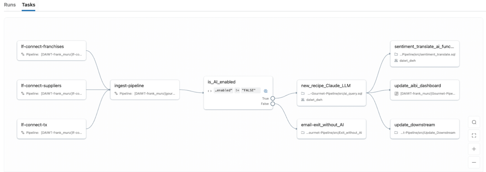

Todo time de dado enterprise tem uma pasta de rede, um SharePoint ou um Google Drive cheio de contrato, nota fiscal, laudo técnico e formulário escaneado que nunca vira linha de tabela. A resposta clássica é um projeto de OCR paralelo, com fila de mensagem, um modelo de extração customizado e um time inteiro dedicado a manter aquilo rodando fora do resto da plataforma de dados. Isso é caro, frágil, e cria mais um silo justamente no lugar onde você já tinha decidido não ter silo.

A Databricks empacotou o problema de outro jeito, tratando documento não estruturado como só mais uma fonte que entra pelo Lakeflow e passa por camadas bronze, silver e gold, igual dado tabular sempre passou. A diferença é que agora a camada bronze aceita PDF, imagem escaneada e DOCX como entrada nativa, com funções de IA fazendo o trabalho que antes exigia um serviço de OCR terceirizado. Vale destacar de cara: as três funções centrais desse pipeline, `ai_parse_document`, `ai_extract` e `ai_classify`, já estão GA na documentação atual, o que muda o cálculo de risco de quem hesitava em colocar isso em produção.

Na minha experiência conversando com time de dado de empresa grande, o obstáculo real nunca foi convencer alguém de que "processar documento com IA" é útil, isso todo mundo já sabe. O obstáculo é convencer o time de segurança e o jurídico de que o documento sensível não vai sair do perímetro de governança da empresa pra passar por um serviço terceiro de OCR na nuvem de outro fornecedor. Resolver isso dentro do mesmo Unity Catalog que já governa o resto do dado da empresa é, na prática, o argumento que destrava aprovação, mais do que qualquer benchmark de acurácia de extração.

## O mecanismo: quatro funções, uma tabela Delta no fim

A arquitetura recomendada tem cinco etapas, todas dentro do Lakehouse, sem componente externo:

1. **Ingestão via Lakeflow Connect**, trazendo arquivo de SharePoint, Google Drive ou volume direto pro Unity Catalog Volumes, com OAuth e controle de acesso nativos.
2. **Parsing com `ai_parse_document`** (GA), que converte o arquivo bruto numa representação estruturada em VARIANT, capturando texto, tabela, descrição de imagem e a estrutura do documento, inclusive letra de médico ruim e imagem escaneada torta.
3. **Extração e classificação com `ai_extract` e `ai_classify`** (ambas GA), que tiram campo específico do documento parseado, tipo data de vencimento de contrato ou valor total de nota fiscal, e roteiam o documento por tipo ou nível de risco.
4. **Preparação pra busca com `ai_prep_search`** (ainda Beta), que faz o chunking semântico do documento, com contexto de título, cabeçalho e referência de página, no formato que o AI Search espera.
5. **Orquestração com Lakeflow Jobs**, cuidando de controle de fluxo avançado, compute serverless e observabilidade nativa do pipeline inteiro.

O ponto central é que cada uma dessas etapas é uma função SQL ou Python chamável dentro de um notebook ou pipeline declarativo, não um serviço separado que você precisa provisionar, versionar e monitorar à parte.



## Mão na massa: um pipeline mínimo de bronze a gold

Um exemplo simplificado de como isso fica em SQL, processando contrato em PDF que chega via volume:

```sql
-- Bronze: parse do documento bruto
CREATE OR REPLACE TABLE bronze.contratos_parsed AS
SELECT
  path,
  ai_parse_document(content) AS documento_estruturado
FROM READ_FILES('/Volumes/juridico/contratos/raw/', format => 'binaryFile');

-- Silver: extração de campos e classificação de risco
CREATE OR REPLACE TABLE silver.contratos_extraidos AS
SELECT
  path,
  ai_extract(
    documento_estruturado,
    array('data_vencimento', 'valor_total', 'parte_contratada')
  ) AS campos,
  ai_classify(
    documento_estruturado,
    array('baixo_risco', 'medio_risco', 'alto_risco')
  ) AS nivel_risco
FROM bronze.contratos_parsed;

-- Gold: pronto pra dashboard e alerta de vencimento
CREATE OR REPLACE TABLE gold.contratos_monitorados AS
SELECT
  path,
  campos.data_vencimento,
  campos.valor_total,
  nivel_risco
FROM silver.contratos_extraidos
WHERE nivel_risco IN ('medio_risco', 'alto_risco');
```

Esse pipeline inteiro pode rodar como Lakeflow Job agendado, com o resultado alimentando um dashboard AI/BI de contrato perto do vencimento sem que ninguém tenha escrito uma linha de código de OCR.

Um detalhe que faz diferença na prática: o resultado de `ai_parse_document` fica em VARIANT, um tipo semi-estruturado que aceita schema variável entre linha e linha, o que é exatamente o que você quer quando o lote de documento mistura contrato de duas página com laudo técnico de quarenta. Isso significa que consultar o campo extraído exige notação de acesso a VARIANT (`documento_estruturado:paginas`, por exemplo) em vez de coluna fixa, e vale testar isso num notebook antes de montar o pipeline inteiro, porque schema inconsistente entre documento é a causa mais comum de query que quebra silenciosamente nessa etapa.

## Onde essa arquitetura ganha do modelo antigo de OCR isolado

Vale comparar diretamente com o modelo anterior pra deixar claro o que muda. Antes, um pipeline de IDP típico envolvia um serviço de OCR externo, uma fila de mensagem pra desacoplar processamento pesado, um banco de metadado separado pra guardar resultado de extração, e um processo próprio de sincronização pra levar aquele resultado de volta pro lakehouse. Cada uma dessas peças tinha dono, versão e ciclo de deploy próprio. No modelo baseado em Lakeflow e funções de IA, as quatro peças viram uma sequência de tabela Delta, com linhagem automática, controle de acesso herdado do Unity Catalog e observabilidade compartilhada com qualquer outro pipeline de dado da empresa. O ganho não é só técnico, é organizacional: o time que já sabe operar pipeline de dado no Azure Databricks não precisa aprender uma stack nova pra processar documento.

**Minha leitura:** o salto de Public Preview pra GA em `ai_extract` e `ai_classify` é o tipo de detalhe que muda a conversa com jurídico e compliance. Preview costuma vir com SLA mais fraco e sem garantia de estabilidade de schema de saída, o que trava qualquer aprovação de produção em setor regulado. GA muda esse cálculo, mas antes de eu apostar um processo crítico nisso eu testaria a extração num lote de documento real do cliente, com letra ruim e formato inconsistente de verdade, porque a demonstração da Databricks sempre usa documento limpo, e o mundo real não é assim.

## O que isso não resolve

O pipeline resolve bem o problema de "documento entra, campo estruturado sai", mas não resolve tudo. Três limites reais:

- **`ai_prep_search` ainda é Beta**, e é justamente a etapa que decide a qualidade do chunk que vai pro RAG. Se você depende de retrieval preciso pra um agente de atendimento, testar essa etapa com dado real antes de produção é obrigatório, não opcional.
- **Extração de campo com LLM erra em documento ambíguo ou com informação conflitante entre página**, e a função não te dá, por padrão, um score de confiança fácil de auditar linha a linha. Você ainda precisa de uma camada de validação humana pra caso de alto risco.
- **Custo por token de VARIANT gerado por `ai_parse_document` em documento grande (contrato de 40 página, por exemplo) soma rápido** se você reprocessa o lote inteiro toda vez que muda um prompt de extração. Vale desenhar o pipeline pra reprocessar só o que mudou, não a base inteira.

## Fechamento

O que a Databricks está vendendo aqui não é uma feature isolada, é a ideia de que documento não estruturado não precisa de uma stack de dados paralela. Pra quem já vive dentro do Unity Catalog e do Lakeflow, isso reduz superfície de manutenção de verdade. Ainda assim, GA na função central não significa que o resultado da extração é confiável sem revisão, então trate isso como aceleração de um pipeline que você ainda precisa validar, não como caixa preta que substitui julgamento humano em documento crítico.

## Referências

- Post oficial: [Building with Databricks Document Intelligence and Lakeflow](https://www.databricks.com/blog/building-databricks-document-intelligence-and-lakeflow)
- Documentação oficial: [Intelligent Document Processing](https://docs.databricks.com/aws/en/generative-ai/agent-bricks/intelligent-document-processing)
- Documentação oficial (Microsoft Learn): [Intelligent document processing - Azure Databricks](https://learn.microsoft.com/en-us/azure/databricks/generative-ai/agent-bricks/intelligent-document-processing)

#Databricks #DocumentIntelligence #Lakeflow #DataEngineering
