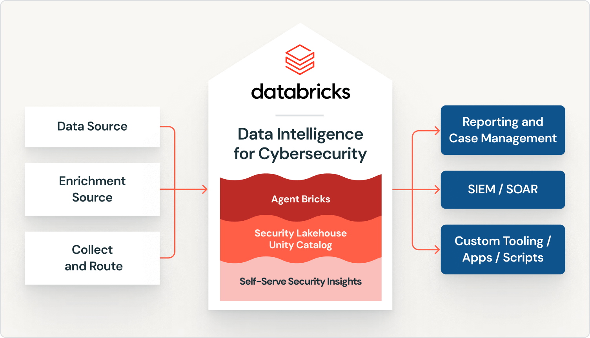

Time de segurança que já operou um SIEM tradicional conhece bem esse dilema: cada gigabyte adicional de log ingerido custa dinheiro, então a decisão de "o que vale a pena logar" acaba sendo tomada pelo orçamento, não pela necessidade real de visibilidade. O resultado previsível é ponto cego, exatamente na fonte de dado que parecia cara demais pra manter dentro da retenção padrão. Isso é um problema de arquitetura, não de disciplina do time de segurança.

A proposta da Databricks com Data Intelligence for Cybersecurity é tratar telemetria de segurança como qualquer outro dado de lakehouse: armazenado em formato aberto (Delta Lake), padronizado por um schema comum (Open Cybersecurity Schema Framework, OCSF), e consultado com o mesmo motor que já processa o resto do dado corporativo. Isso desacopla o custo de retenção do custo de licença por volume que caracteriza SIEM legado, e permite reter mais telemetria por mais tempo sem multiplicar o orçamento de segurança.



## O mecanismo: três camadas sobre uma fundação comum

A arquitetura se organiza em três peças que compartilham a mesma base de dado. Na entrada, telemetria de nuvem, endpoint, SaaS e sistema legado é normalizada pra OCSF, um padrão aberto que evita que cada fonte tenha um formato proprietário próprio, o que historicamente era um dos maiores custos ocultos de integração em SOC. No meio, o Unity Catalog aplica controle de acesso granular e trilha de auditoria sobre essa base, o "Security Lakehouse" citado na arquitetura oficial. Na saída, Agent Bricks entra como camada de automação, executando triagem de alerta, enriquecimento contextual e orquestração de resposta entre canal, o tipo de trabalho repetitivo que hoje consome a maior parte do tempo de analista júnior de SOC.

Lakebase complementa essa base como banco operacional de baixa latência dentro do mesmo ecossistema, útil pra caso que precisa de leitura e escrita rápida de estado (por exemplo, o status atual de um caso sendo investigado) sem depender de um banco transacional externo desconectado do resto do dado de segurança.

## Mão na massa: consultando telemetria normalizada com OCSF

Uma vez que a telemetria está normalizada em OCSF sobre Delta Lake, consultas que antes exigiam sintaxe proprietária do SIEM viram SQL padrão sobre tabela governada:

```sql
-- eventos de autenticação suspeitos nas últimas 24h,
-- já normalizados no schema OCSF (categoria authentication)
SELECT
  time,
  actor.user.name AS usuario,
  src_endpoint.ip AS ip_origem,
  status,
  count(*) AS tentativas
FROM security.ocsf.authentication
WHERE time >= current_timestamp() - INTERVAL 24 HOURS
  AND status = 'Failure'
GROUP BY time, usuario, ip_origem, status
HAVING count(*) > 5
ORDER BY tentativas DESC;
```

O ganho aqui não é a sintaxe SQL em si, times de segurança maduros já usam SQL há anos dentro de SIEM moderno. O ganho é que essa mesma tabela `security.ocsf.authentication` está sob a mesma governança de Unity Catalog que qualquer outra tabela do lakehouse corporativo, com lineage, controle de acesso em nível de linha e auditoria, sem precisar exportar dado pra outro sistema e perder essa governança no caminho.

## Genie e autoatendimento pra quem não escreve SQL

AI/BI Genie permite que analista de segurança faça pergunta em linguagem natural sobre a base de telemetria sem escrever consulta, o que remove um gargalo real: hoje boa parte da investigação depende de engenheiro de dado disponível pra escrever a query certa. Não é substituição de analista experiente, é redução do tempo entre "tenho uma hipótese" e "tenho o dado pra confirmar ou descartar essa hipótese".

**Minha leitura:** os números de redução de custo e tempo de resposta divulgados no anúncio (até 90% de redução em tempo médio de detecção, até 80% de redução em custo de SIEM) vêm de caso de cliente específico, e citar Arctic Wolf processando 8 trilhões de evento por semana é impressionante, mas não diz nada sobre o esforço de migração que uma empresa média vai enfrentar pra sair de um SIEM estabelecido há anos. Migrar SOC de plataforma é projeto de meses, não de fim de semana, mesmo com conector pronto. Eu trataria esse tipo de anúncio como validação de que a arquitetura funciona em escala, não como estimativa de esforço pra qualquer empresa que decida migrar amanhã.

## Retenção como decisão técnica, não como decisão de orçamento

O argumento de fundo que sustenta essa arquitetura vale destacar de forma isolada: quando o custo de armazenar telemetria de segurança por mais tempo é o mesmo custo de armazenar qualquer outro dado no Delta Lake, com camada de storage barata e separada de compute, a decisão de quanto reter deixa de ser dominada por orçamento de licença de SIEM e passa a ser uma decisão técnica de política de retenção. Isso muda o tipo de investigação possível: um incidente descoberto seis meses depois do comprometimento inicial, cenário comum em ataque de longa duração, ainda tem telemetria disponível pra reconstrução forense, em vez de esbarrar numa janela de retenção de 30 ou 90 dias definida por custo de licenciamento, não por necessidade de segurança.

## O que isso não resolve

Normalizar telemetria em OCSF exige mapeamento de fonte que não segue o padrão nativamente, e esse trabalho de mapeamento não desaparece só porque a plataforma de destino é melhor, alguém ainda precisa garantir que o conector ou pipeline de ingestão está traduzindo o evento da ferramenta de endpoint específica pra dentro do schema OCSF corretamente. Detecção baseada em regra e correlação que hoje já roda madura dentro de um SIEM tradicional também não é recriada automaticamente: migrar a lógica de detecção existente, ajustada ao longo de anos pra reduzir falso positivo, é trabalho manual de reescrita e reteste, não portabilidade automática. E depender de um ecossistema de parceiro (mais de 25 citados no anúncio, incluindo ferramenta de SIEM, descoberta de dado e segurança de agente de IA) significa que parte da experiência final depende da maturidade da integração de cada parceiro específico, não só da Databricks.

## Fechamento

Tratar dado de segurança como dado de lakehouse, governado pelo mesmo Unity Catalog e armazenado no mesmo formato aberto que o resto da plataforma, ataca um problema estrutural real de SOC moderno: o custo de retenção que hoje limita visibilidade. Vale a pena avaliar com cuidado a extensão do esforço de migração de regra de detecção existente antes de tratar isso como troca simples de fornecedor.

## Referências

- Databricks Blog, "Announcing Data Intelligence for Cybersecurity": https://www.databricks.com/blog/transforming-cybersecurity-data-intelligence
- Databricks, "Lakebase": https://www.databricks.com/product/lakebase
- Databricks, "Databricks AI Security Framework (DASF)": https://www.databricks.com/resources/whitepaper/databricks-ai-security-framework-dasf

#Databricks #Ciberseguranca #UnityCatalog #Lakebase
