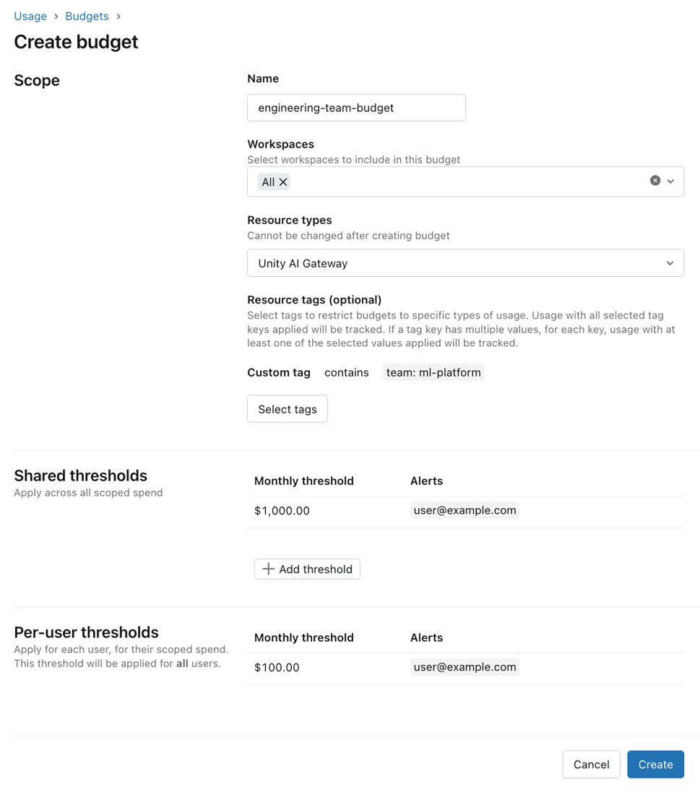

Todo lançamento de modelo de IA vem com a mesma promessa de marketing, "modelo de fronteira", e a mesma pergunta sem resposta óbvia por trás: melhor mesmo, ou só mais caro com discurso melhor? A saída mais comum é binária, travar acesso até alguém validar com calma, o que atrasa todo mundo, ou liberar geral pro time inteiro testar, o que já se provou caro na prática. Quando um piloto de acesso livre a um modelo novo rodou sem controle de gasto, o desenvolvedor médio gastou 60% a mais do que gastava antes, sem nenhum ganho de qualidade comprovado até então.

A Databricks documentou o processo interno que resolveu esse dilema, não escolhendo entre rápido e seguro, mas separando as duas coisas em fases com responsabilidade financeira isolada: acesso experimental no dia do lançamento pra mais de 12 mil funcionários, com o risco de custo contido antes mesmo da avaliação de qualidade terminar.

## O problema que acesso livre e acesso travado não resolvem

Travar acesso até validação completa parece prudente, mas empurra a decisão pra um comitê que não tem urgência nenhuma de responder rápido, e nesse meio tempo o time perde a vantagem real de testar modelo novo cedo. Liberar geral sem controle resolve a velocidade, mas erra a mão no lado financeiro, porque ninguém sabe ainda se aquele modelo específico entrega ganho de qualidade proporcional ao custo mais alto que normalmente acompanha lançamento novo. O ponto cego comum aos dois extremos é tratar "dar acesso" e "controlar gasto" como a mesma decisão, quando na prática são dois problemas com prazo diferente, acesso pode ser imediato, controle de custo precisa durar até a avaliação real terminar.

## Fase 1: acesso experimental imediato via Unity Gateway

O modelo novo entra no Unity Gateway, o hub central de governança de IA da empresa, e a configuração se distribui pra mais de 12 mil funcionários via Unity Gateway CLI, instalado nos laptops através de gerenciamento de dispositivo móvel. Na interface, o modelo aparece marcado como "Experimental", um sinal visual simples que já avisa o usuário que aquilo ainda não é uma escolha validada, sem esconder a opção nem quebrar o fluxo de trabalho de quem prefere continuar no modelo já conhecido.

## Fase 2: isolar o risco financeiro com orçamento em camada

A parte que evita repetir o problema do piloto anterior é o desenho de orçamento por camada, com quatro níveis por usuário: um teto mensal geral, um limite diário de segurança contra estouro acidental, ajustável via Slack quando necessário, uma fatia reservada pra modelo premium de dois a três vezes mais caro só pra tarefa que realmente justifica, e uma fatia separada exclusiva pra modelo experimental novo. O ponto central é que o modelo recém-lançado só consome a fatia experimental, isolando o risco financeiro do resto do orçamento da pessoa.



A documentação oficial do Unity Gateway detalha como esse orçamento é configurado na prática: um orçamento tem escopo por workspace e por tipo de recurso, aceita tag de recurso opcional pra restringir a um time específico, e suporta até quatro limites compartilhados e vinte limites individualizados por usuário, cada um podendo disparar alerta por e-mail, bloqueio de uso, ou os dois. Bloqueio de uso é aplicado de forma aproximada, baseado em estimativa quase em tempo real, então uma rajada de uso pode passar do limite configurado antes do bloqueio efetivamente travar a próxima chamada.

**Minha leitura:** o detalhe que mais chama atenção aqui não é o número de camada de orçamento, é a documentação ser honesta sobre a imprecisão do próprio mecanismo de bloqueio. Um bloqueio "aproximado" parece fraqueza à primeira vista, mas é exatamente o tipo de limitação que time nenhum vai notar até confiar demais no número e ser surpreendido por uma fatura levemente acima do teto configurado. Vale tratar esse tipo de orçamento como rede de segurança contra descontrole grosseiro, não como garantia matemática de teto absoluto.

## Mão na massa: criando um orçamento de Unity Gateway pro grupo experimental

Um orçamento pro time que vai testar modelo experimental, com limite compartilhado e individual, e as duas ações de alerta e bloqueio configuradas:

```bash
databricks account budgets create --json '{
  "budget_configuration": {
    "display_name": "modelo-experimental-time-plataforma",
    "filter": {
      "workspace_id": ["all"],
      "tags": {"team": ["ml-platform"]}
    },
    "resource_types": ["UNITY_AI_GATEWAY"],
    "alert_configurations": [
      {
        "scope": "SHARED",
        "monthly_threshold_usd": 1000,
        "alert_emails": ["plataforma-ia@empresa.com"],
        "action": "ALERT"
      },
      {
        "scope": "PER_USER",
        "monthly_threshold_usd": 100,
        "alert_emails": ["plataforma-ia@empresa.com"],
        "action": "BLOCK_USAGE"
      }
    ]
  }
}'
```

O ponto prático desse desenho é que o limite compartilhado funciona como alarme cedo pro time inteiro, enquanto o bloqueio por usuário individual é a rede de segurança que impede uma única pessoa de consumir o orçamento do grupo inteiro sozinha, sem exigir revisão manual de cada requisição.

## Fase 3: três sinais decidem promover ou descartar em poucos dias

A decisão de manter o modelo novo como padrão ou descartar combina três sinais, nenhum sozinho é suficiente. O primeiro é benchmark controlado, testes internos que cobrem tanto avaliação offline, tipo raciocínio sobre documento e busca dentro do workspace, quanto comparação lado a lado em tarefa real, tipo criação de pull request. O segundo é feedback qualitativo de usuário avançado, coletado via Slack e pesquisa, sobre como o modelo se comporta na prática comparado ao anterior. O terceiro é rastreamento de custo via OpenTelemetry, com todo o tráfego do Unity Gateway logado num formato de trace unificado, normalizado por sessão e estratificado por padrão de uso, pra não comparar maçã com laranja quando quem adota cedo tem um perfil de uso diferente do usuário médio.

Combinando os três sinais, dois modelos testados nesse ciclo confirmaram ganho real de custo por sessão em relação ao antecessor, uma queda de 29% num caso e 48% no outro, o suficiente pra promoção de acesso experimental pra disponibilidade padrão em questão de três dias.

## O que essa arquitetura não resolve sozinha

Nada aqui substitui já ter uma suíte de avaliação interna madura, capaz de rodar teste offline e comparação lado a lado em tarefa real de forma consistente, sem isso os três sinais viram só dois, benchmark formal fica de fora e a decisão passa a depender mais de opinião subjetiva do que deveria. A normalização de custo por padrão de uso também é uma escolha de modelagem, não um fato objetivo, se quem adota cedo tiver um perfil de uso sistematicamente diferente do resto da empresa, a comparação de custo por sessão carrega viés que precisa ser revisado, não só aceito de olhos fechados. E o próprio bloqueio de orçamento sendo aproximado significa que esse desenho protege contra descontrole grosseiro, não contra estouro fino e recorrente que nunca dispara o alerta configurado.

## Vale a pena adotar esse desenho?

O ganho real aqui não é liberar modelo novo mais rápido por si só, é conseguir fazer isso sem repetir o erro do piloto sem controle, onde velocidade de acesso e responsabilidade financeira acabaram descoladas uma da outra. Pra empresa que já testa modelo novo com frequência, separar orçamento por camada e amarrar promoção a sinal combinado, não só benchmark isolado, é uma arquitetura replicável mesmo fora do ecossistema Databricks. O que exige investimento real antes de copiar o resultado de três dias é a parte que a documentação assume como dada, ter benchmark interno e infraestrutura de rastreamento de custo já maduros antes do próximo modelo de fronteira aparecer.

## Referências

- Databricks Blog, "How Databricks rolls out frontier models to 12,000 employees on Day 1": https://www.databricks.com/blog/how-databricks-rolls-out-frontier-models-14000-employees-day-1
- Databricks Docs, "Manage budgets for Unity AI Gateway": https://docs.databricks.com/aws/en/ai-gateway/budgets
- Microsoft Learn, "Manage budgets for Unity Gateway - Azure Databricks": https://learn.microsoft.com/en-us/azure/databricks/ai-gateway/budgets

#Databricks #AzureDatabricks #UnityGateway #Governanca
