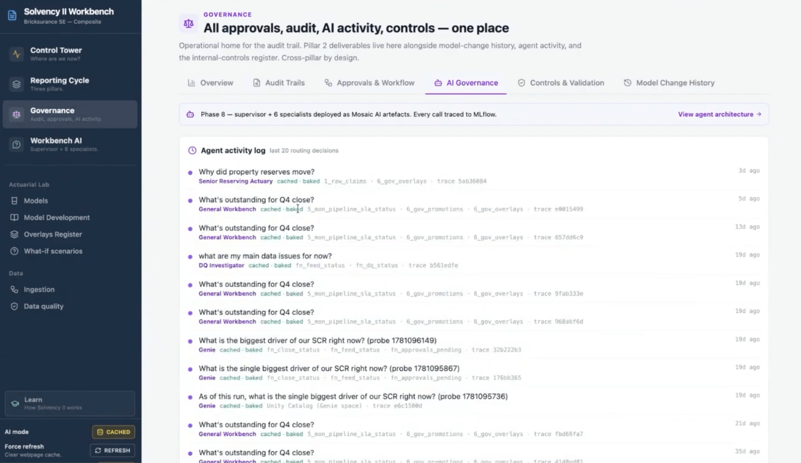

Quem já passou por um ciclo de fechamento regulatório em seguradora conhece o ritual: planilha trocada por e-mail entre atuário e controladoria, motor de cálculo (Prophet, RAFM, Igloo) rodando isolado, e alguém no fim do processo tentando reconciliar número de fontes diferentes horas antes do prazo do QRT vencer. O problema raramente é falta de modelo atuarial bom, é a cola entre os pedaços, ingestão, controle de qualidade, orquestração de modelo e trilha de aprovação, que normalmente não existe como sistema, existe como conhecimento tribal de quem já fez aquilo por anos.

A Databricks propôs endereçar essa cola diretamente, não como um dashboard de BI a mais, mas como uma camada de controle central sobre o fluxo de reporte inteiro. Isso muda a pergunta de "que ferramenta de BI mostra o Solvency Ratio" pra "onde mora a visão única de onde o processo está, o que está atrasado, e quem aprovou o quê".

Esse tipo de proposta chega numa hora interessante do mercado segurador, com pressão regulatória crescente e prazo de reporte cada vez mais curto em várias jurisdições, e ao mesmo tempo com o mesmo time de atuária e controladoria sendo cobrado a fazer mais com o mesmo quadro de pessoas. Uma camada de orquestração que reduz o tempo gasto reconciliando número entre planilha tem valor mesmo antes de qualquer feature de IA generativa entrar na conversa, e é importante separar essas duas coisas na hora de avaliar a proposta.

## O mecanismo: control tower sobre um fluxo que já existia

A arquitetura descrita se apoia em cinco peças que, individualmente, não são novidade, a novidade é elas conversarem em um só lugar:

1. **Control Tower**: um painel central mostrando Solvency Ratio, prontidão para o prazo, aprovações pendentes, feed atrasado e problema em aberto, tudo num único ponto de visão em vez de espalhado por planilha.
2. **Ingestão automatizada com checagem de qualidade**, validando frescor de dado, completude, dono do dado e regra de negócio customizada, com fluxo de decisão configurável pra cada tipo de falha.
3. **Orquestração de modelo atuarial**, onde a Databricks prepara o dado que motores como Prophet, RAFM e Igloo consomem, e depois ingere e governa a saída desses motores de volta pro lakehouse.
4. **Governança e trilha de auditoria**, registrando promoção, aprovação e toda atividade relacionada ao relatório, com Unity Catalog como camada de controle de acesso.
5. **Análise assistida por IA**, com LLM ajudando a redigir seção do relatório ORSA, e agente de IA revisando reconciliação de QRT e rodando análise de cenário (por exemplo, "e se a carteira de seguro cyber dobrar de tamanho").

O ponto estrutural é que o motor atuarial continua sendo o motor atuarial, a Databricks não substitui Prophet ou RAFM, ela vira a camada que prepara o insumo, governa a saída e dá visibilidade do processo inteiro em cima disso.



## Mão na massa: um exemplo de regra de qualidade e disposição de falha

Um esboço de como ficaria uma checagem de completude e roteamento de falha, simplificado em SQL/Python dentro de um pipeline declarativo:

```python
from pyspark.sql import functions as F

def valida_feed_atuarial(df, coluna_data="data_referencia", dono_esperado="atuarial"):
    hoje = F.current_date()
    df_validado = (
        df
        .withColumn("atraso_dias", F.datediff(hoje, F.col(coluna_data)))
        .withColumn(
            "status_qualidade",
            F.when(F.col("atraso_dias") > 2, "atrasado")
             .when(F.col("dono_dado") != dono_esperado, "dono_incorreto")
             .when(F.col("valor_total").isNull(), "incompleto")
             .otherwise("ok")
        )
    )
    return df_validado

# Disposição: separa o que segue pro motor atuarial do que vai pra fila de correção
feed_validado = valida_feed_atuarial(spark.table("bronze.feed_apolices"))
feed_validado.filter("status_qualidade = 'ok'").write.saveAsTable("silver.feed_pronto_para_prophet")
feed_validado.filter("status_qualidade != 'ok'").write.saveAsTable("control_tower.fila_correcao")
```

Esse padrão de "valida, classifica, roteia" é o tipo de lógica que sustenta o painel do control tower, cada linha na fila de correção vira um item visível de pendência, não um erro escondido que só aparece no dia do prazo.

**Minha leitura:** o pedaço mais interessante dessa proposta não é a parte de IA, é a trilha de auditoria nativa sobre um processo que hoje, na maioria das seguradoras que conheço, é auditado via captura de tela de planilha e e-mail de aprovação. Ter promoção, aprovação e atividade de relatório registrada de forma consistente no mesmo catálogo de dado é uma melhoria de governança que vale por si só, independente de qualquer feature de IA generativa. A parte de agente revisando reconciliação de QRT eu trataria com mais cautela, reconciliação regulatória tem zero margem pra erro silencioso, e eu exigiria trilha de decisão auditável e revisão humana obrigatória antes de qualquer número desses ir pro órgão regulador.

## O que isso não resolve

Vale ser honesto sobre os limites dessa proposta:

- **O motor atuarial legado continua sendo uma caixa preta externa.** A Databricks governa entrada e saída, mas não abre o cálculo atuarial em si, então qualquer erro de modelagem dentro do Prophet ou do RAFM continua fora do alcance dessa camada de governança.
- **"Análise assistida por IA" pra ORSA e reconciliação de QRT é a parte mais nova e menos testada da proposta.** Redigir rascunho de relatório regulatório com LLM ajuda a velocidade, mas não elimina a necessidade de revisão técnica por atuário sênior, e o post oficial não detalha nível de confiança ou processo de validação desse rascunho.
- **Migrar um processo de fechamento regulatório inteiro pra um control tower novo é projeto de transformação, não configuração.** Seguradora com processo já consolidado (mesmo que manual) enfrenta custo real de mudança de gestão antes de colher o benefício de visibilidade única.

## Quem já usa Genie e MLflow tem vantagem de adoção

Vale reforçar um ponto prático: nada nessa arquitetura é exclusivo de seguradora ou de Solvency II especificamente. Control Tower como padrão de orquestração, checagem de qualidade configurável com disposição de falha, e trilha de auditoria via Unity Catalog são blocos genéricos que qualquer processo de fechamento regulatório complexo (tributário, contábil, prudencial) pode reaproveitar. A camada de Genie pra consulta em linguagem natural sobre o estado do processo, e MLflow pra rastrear versão e desempenho de modelo, também não são específicos do setor de seguro. Isso quer dizer que uma seguradora que já usa Databricks pra outro workload tem vantagem real de adoção aqui, o esforço de configurar o control tower de Solvency II reaproveita infraestrutura de governança que ela provavelmente já pagou e já opera.

## Fechamento

Solvency II sempre foi mais um problema de processo do que de cálculo, e atacar a cola entre ingestão, modelo e aprovação com um control tower único é uma resposta sensata pra esse tipo de dor. A parte de IA generativa é a cereja do bolo, útil, mas não o motivo pelo qual esse tipo de arquitetura vale a pena adotar. Quem decide entrar nesse caminho deveria priorizar a parte de governança e trilha de auditoria primeiro, e tratar o agente de reconciliação como um assistente em avaliação, não como substituto de revisão humana.

## Referências

- Post oficial: [A practical approach to end-to-end Solvency II reporting in Databricks](https://www.databricks.com/blog/practical-approach-end-end-solvency-ii-reporting-databricks)

#Databricks #FinancialServices #Governança #SolvencyII
