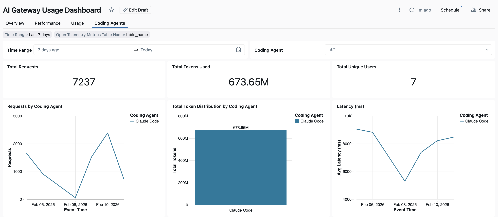

Modelo de fronteira muda de melhor opção a cada poucos dias, e isso cria um dilema estrutural pra qualquer empresa que queira dar acesso a agente de código pro time inteiro. Travar num único provedor economiza dor de cabeça de governança, mas te deixa preso à opção de seis meses atrás quando surge algo melhor. Deixar cada time escolher livremente resolve o problema de estagnação, mas espalha chave de API, limite de gasto e log de auditoria por um monte de sistema desconectado, cada agente de código com sua própria conta, seu próprio segredo de acesso colado na máquina do desenvolvedor.

A Unity Gateway CLI do Azure Databricks ataca esse dilema sem inventar um sistema de permissão novo: ela reaproveita o Unity Catalog que já governa o resto do dado da empresa, e devolve pro desenvolvedor a experiência mais simples possível, um comando que abre o agente aprovado já autenticado, sem chave de provedor colada em lugar nenhum da máquina local.

## O que o comando único resolve de verdade

A Unity Gateway CLI (`ug`) é o ponto de entrada único pra rodar agente de código contra o Unity Gateway: ela cuida do OAuth, escreve o arquivo de configuração de cada agente, e roteia todo tráfego pelo modelo ou servidor MCP que já estiver registrado no workspace. `ug claude` abre o Claude Code, `ug codex` abre o Codex CLI, `ug gemini` abre o Gemini CLI, e a mesma CLI também cobre OpenCode, GitHub Copilot CLI e o Pi, com `ug --help` listando a lista completa suportada.

Registrar ferramenta segue o mesmo padrão de simplicidade: `ug mcp add` conecta servidor MCP nativo do Azure Databricks, função do Unity Catalog, AI Search, SQL warehouse e conexão externa já descoberta no workspace, sem o desenvolvedor precisar montar essa integração na mão. `ug usage` devolve um resumo de consumo dos últimos sete dias direto no terminal, sem precisar abrir um painel separado pra uma checagem rápida.

A sacada estrutural aqui não é a interface de linha de comando em si, é o que ela evita: sem esse ponto central, cada time acaba colando chave de API de provedor direto na configuração local de cada ferramenta, e a empresa perde visibilidade agregada exatamente na hora que mais precisa dela, quando o gasto com agente de código começa a escalar.

## Como o admin governa acesso e gasto

O ponto que mais chama atenção em quem já administra Azure Databricks: governar coding agent não exige aprender um sistema novo. Um serviço de modelo se governa como qualquer outro objeto protegido do Unity Catalog, com os mesmos três mecanismos de sempre.

Primeiro, permissão: no Catalog Explorer, conceder `EXECUTE` no serviço de modelo pra usuário ou grupo, na aba **Permissions**, decide quem pode usar aquele modelo através de agente de código. Segundo, limite de taxa: ainda no Catalog Explorer, na aba **Overview** do serviço de modelo, configurar um limite de requisição por minuto (QPM) ou de token por minuto (TPM), pra todo mundo ou por usuário. Terceiro, orçamento: um administrador de conta cria um orçamento que agrega gasto de todos os endpoints do Unity Gateway, com limite configurável pra alertar ou bloquear uso antes que o custo passe do combinado.

Depois de configurado, dá pra confirmar que o tráfego realmente está passando pelo Unity Gateway e sendo registrado consultando a tabela de sistema de uso:

```sql
SELECT service_name, requester, status_code, COUNT(*) AS calls
FROM system.ai_gateway.usage
WHERE service_type = 'MODEL_SERVICE'
GROUP BY service_name, requester, status_code
ORDER BY calls DESC;
```

Isso significa que trocar quem tem acesso a qual modelo, ou apertar limite de gasto de um time específico, é uma alteração de permissão do Unity Catalog de sempre, não uma configuração paralela que o time de plataforma precisa aprender do zero.

## Smart Routing: economia por tarefa, ainda em Beta

Smart Routing escolhe automaticamente o modelo de menor custo capaz de resolver cada tarefa, pra desenvolvedor não precisar escolher modelo a cada prompt. O recurso está em Beta e é habilitado por conta: um administrador de conta precisa ligar o preview antes que qualquer usuário consiga usar.

A ativação é por agente, via flag da própria CLI:

```bash
ug codex --enable-smart-routing
ug claude --enable-smart-routing
```

A configuração persiste entre sessões, e desligar segue o mesmo padrão (`--disable-smart-routing`). Duas restrições importam na prática: Smart Routing só escolhe entre serviço de modelo com prefixo `system.ai`, e o usuário precisa ter `EXECUTE` em todo modelo candidato do roteamento, senão a requisição falha citando exatamente qual serviço de modelo falta permissão, não um erro genérico. Cruzar roteamento entre agente diferente (Claude Code pra Codex, por exemplo) exige o Omnigent, versão 0.8.0 ou superior; dentro de um único agente, o roteamento já funciona sozinho via CLI.

## Rastreamento: da tabela de uso ao OpenTelemetry



Além da consulta SQL direta na tabela `system.ai_gateway.usage`, o Azure Databricks expõe um painel pronto: em **Govern**, no canto superior direito da página do Unity Gateway, a aba **Usage Dashboard** traz uma seção dedicada a Coding Agents, com gráfico de uso e custo por ferramenta sem precisar montar consulta nenhuma.

Pra quem quer granularidade maior que a tabela de uso agregada, o Azure Databricks também suporta exportar métrica e log via OpenTelemetry direto pra tabela Delta gerenciada pelo Unity Catalog, com schema de métrica e de log já pronto pra criar via `CREATE TABLE`. O Claude Code, por exemplo, exporta isso configurando `CLAUDE_CODE_ENABLE_TELEMETRY` e um conjunto de variável `OTEL_EXPORTER_OTLP_*` apontando pro endpoint `/api/2.0/otel/v1/metrics` do workspace, mas esse caminho exige habilitar antes o preview de OpenTelemetry no Azure Databricks.

## Mão na massa: do zero à governança configurada

A instalação exige Python 3.12 ou superior e o `uv`, feita uma vez por dispositivo:

```bash
uv tool install git+https://github.com/databricks/unity-gateway
```

Com isso instalado, o desenvolvedor abre o agente aprovado, e no primeiro uso a CLI pergunta a URL do workspace e autentica sozinha:

```bash
ug claude     # Claude Code
ug codex      # Codex CLI
ug gemini     # Gemini CLI
ug opencode   # OpenCode
ug copilot    # GitHub Copilot CLI
```

Do lado do admin, sem precisar de nenhuma API nova: conceder `EXECUTE` no serviço de modelo pra um grupo no Catalog Explorer, configurar QPM ou TPM na mesma tela, e criar um orçamento de conta cobrindo os endpoints do Unity Gateway. As três ações usam a interface que qualquer admin de Unity Catalog já conhece, o coding agent só passa a ser mais um consumidor do mesmo modelo servido pela plataforma.

## O que isso não resolve sozinho

Smart Routing ainda é Beta, habilitado por conta e restrito a região com suporte a Unity Gateway, então nem todo workspace tem acesso hoje. O roteamento dentro de um agente só funciona se o usuário tiver `EXECUTE` em cada modelo candidato, faltando permissão num só candidato já derruba a requisição. Cruzar roteamento entre agente diferente não é nativo da CLI, depende do Omnigent numa versão específica. E rastreamento fino via OpenTelemetry, embora documentado, exige habilitar um preview à parte, não vem ligado por padrão junto com a CLI.

Fora isso, nem todo cliente tem cobertura via `ug`: Cursor IDE, por exemplo, ainda depende de configuração manual (URL base e chave apontando pro Unity Gateway direto nas configurações do editor), a CLI cobre só os agentes de terminal.

## Vale a pena adotar assim?

O ponto mais forte aqui não é a CLI em si, é o fato de governar agente de código não exigir sistema de permissão paralelo: é o mesmo `EXECUTE` de Unity Catalog, o mesmo limite de taxa por serviço de modelo, o mesmo orçamento de conta que qualquer admin de Azure Databricks já usa pra outro workload. Pra empresa que já sente o sintoma clássico, chave de provedor espalhada, gasto invisível até a fatura chegar, esse reaproveitamento de mecanismo reduz o custo de adoção justamente porque não pede aprender nada novo de governança, só aplicar o que já existe num tipo de consumidor a mais. O ganho de Smart Routing é real, mas condicional a estar disponível na sua região e sua conta já ter o preview ligado, então vale confirmar isso antes de prometer economia de roteamento pro time.

## Referências

- Microsoft Learn, "Integrate with coding agents - Azure Databricks": https://learn.microsoft.com/en-us/azure/databricks/ai-gateway/coding-agent-integration-model-services
- Microsoft Learn, "Tutorial: Govern a coding agent's model access with Unity Gateway - Azure Databricks": https://learn.microsoft.com/en-us/azure/databricks/ai-gateway/govern-coding-agent-models
- Microsoft Learn, "Smart Routing for coding agents - Azure Databricks": https://learn.microsoft.com/en-us/azure/databricks/ai-gateway/smart-routing
- Databricks Blog, "Deploy and manage coding agents at scale with the Unity Gateway CLI": https://www.databricks.com/blog/deploy-and-manage-coding-agents-scale-unity-gateway-cli
- Unity Gateway, repositório oficial: https://github.com/databricks/unity-gateway

#AzureDatabricks #UnityGateway #UnityCatalog #Governanca
