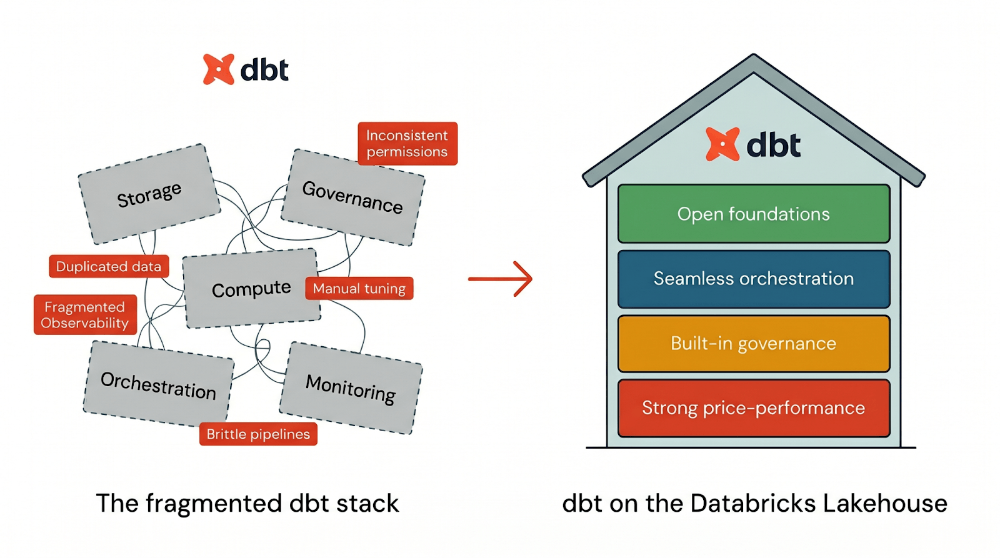

Times que adotaram dbt cedo resolveram um problema real, transformação SQL versionada, testável e documentada, mas herdaram outro no processo: o projeto dbt vive numa ferramenta, o agendamento vive em outra (Airflow, cron, ou o próprio dbt Cloud), e o catálogo de dado onde o resultado final pousa é um terceiro sistema. Quando uma transformação falha às quatro da manhã, o analista de plantão precisa abrir três abas diferentes só pra reconstruir o que aconteceu.

A aposta da Databricks é remover essa fragmentação tratando dbt como tarefa de primeira classe dentro do Lakeflow Jobs, na mesma superfície onde já rodam ingestão via Auto Loader, pipeline declarativo e dashboard de BI. Isso não substitui o dbt, o modelo continua sendo escrito em SQL com Jinja como sempre foi, o que muda é onde a execução, o log de falha e a governança do resultado vivem.



## O mecanismo: dbt como tarefa, não como sistema externo

Na configuração nativa, o projeto dbt precisa estar num repositório Git conectado via Databricks Git folders, não pode viver em DBFS. A execução acontece em compute do Databricks, enquanto o SQL gerado pelo dbt é efetivamente rodado num SQL warehouse serverless ou pro. A Databricks recomenda o pacote `dbt-databricks`, uma camada de adaptação otimizada pra plataforma, em vez do adaptador genérico `dbt-spark`, porque ele conhece particularidade de sintaxe e otimização específica do motor SQL da Databricks.

Isso significa que o comando `dbt run` que rodava antes num agente do Airflow ou numa VM dedicada do dbt Cloud passa a ser uma tarefa dentro do mesmo DAG que já orquestra o resto do pipeline de dado, com retry, notificação de falha e histórico de execução compartilhando a mesma interface.

## Mão na massa: uma tarefa dbt dentro de um job Lakeflow

Um job que primeiro ingere dado via Auto Loader e depois roda a transformação dbt, tudo no mesmo DAG, se declara assim:

```yaml
resources:
  jobs:
    pipeline_vendas:
      name: "pipeline_vendas_diario"
      tasks:
        - task_key: ingestao_bronze
          notebook_task:
            notebook_path: /Repos/dados/ingestao_autoloader

        - task_key: transformacao_dbt
          depends_on:
            - task_key: ingestao_bronze
          dbt_task:
            project_directory: /Repos/dados/projeto_dbt
            commands:
              - "dbt deps"
              - "dbt run --select staging+"
              - "dbt test"
            warehouse_id: "abc123def456"
            catalog: "vendas"
            schema: "silver"
```

A tarefa `transformacao_dbt` só dispara depois que `ingestao_bronze` termina com sucesso, e uma falha no `dbt test` interrompe o job com o mesmo mecanismo de alerta que qualquer outra tarefa do Lakeflow usa, sem precisar de um segundo sistema de monitoramento dedicado só ao dbt.

## Governança que persiste através de rebuild de tabela

Um detalhe técnico que faz diferença prática: permissão de acesso concedida via Unity Catalog em nível de schema persiste através de reconstrução de tabela feita pelo dbt. Isso resolve um problema clássico de quem já usou dbt com `--full-refresh`, onde a tabela é recriada do zero e historicamente exigia reaplicar grant de acesso manualmente depois. A funcionalidade `persist_docs` do dbt também integra a documentação do modelo direto no comentário de tabela e coluna dentro do Unity Catalog, então a documentação do dbt e o catálogo de metadado deixam de ser duas fontes de verdade divergentes.

Lineage em nível de coluna também é capturado automaticamente a partir da transformação SQL que o dbt gera, rastreando o caminho desde a ingestão até o consumo final, sem depender de anotação manual dentro do `.yml` do projeto dbt.

## Performance: Photon e Liquid Clustering entram de graça

**Minha leitura:** esse é o ponto que, na minha experiência, mais surpreende quem migra de warehouse genérico pra Databricks rodando dbt. Photon, o motor de execução vetorizado, já vem habilitado por padrão em SQL warehouse serverless, então o modelo dbt ganha aceleração sem precisar mudar uma linha de SQL. Liquid Clustering, integrado nativamente na configuração de tabela do adaptador `dbt-databricks`, substitui particionamento rígido tradicional por uma abordagem mais flexível que se adapta ao padrão de consulta real, e Predictive Optimization automatiza manutenção de tabela (compactação, coleta de estatística) usando IA pra decidir quando vale a pena rodar, sem exigir job de manutenção agendado manualmente. Nenhum desses três exige reescrever modelo dbt existente, é ganho de infraestrutura por baixo, o que é raro o suficiente em engenharia de dado pra merecer nota.

## Portabilidade: o argumento contra vendor lock-in

Um ponto que a Databricks reforça, e que merece verificação própria de quem já foi pego de surpresa por dependência de fornecedor antes, é a portabilidade do resultado. Como o lakehouse usa formato de tabela aberto (Delta Lake, com suporte também a Apache Iceberg) e o SQL do warehouse segue padrão ANSI, o modelo dbt compilado continua legível por qualquer engine de consulta externo que saiba ler esses formatos, não fica preso a um dialeto SQL proprietário nem a um formato de arquivo fechado. Isso não elimina o custo de trocar de plataforma se um dia fizer sentido, migração de dado sempre tem custo operacional, mas reduz o risco de ficar refém de uma sintaxe SQL específica que não existe fora do ecossistema Databricks.

## O que isso não resolve

Quem já usa dbt Platform (antigo dbt Cloud) com feature avançada de CI/CD própria da plataforma dbt precisa saber que a integração nativa de "dbt Platform task" dentro do Lakeflow Jobs ainda está em Beta, então depender dela pra produção crítica hoje é aceitar instabilidade de feature em amadurecimento. A exigência de repositório Git via Databricks Git folders também significa que projeto dbt organizado de forma não convencional, ou com processo de deploy que dependia de DBFS, precisa de trabalho de migração antes de adotar a tarefa nativa. E nenhuma dessas integrações resolve o problema de modelagem dbt mal desenhado desde o início, teste insuficiente e dependência circular mal gerenciada continuam sendo responsabilidade de quem escreve o projeto, não da plataforma que executa.

## Fechamento

A promessa central aqui não é dbt ficar mais poderoso como linguagem de transformação, é o entorno operacional dele parar de ser um sistema à parte com governança, monitoramento e performance próprios. Pra time que já sofre com reconciliar permissão entre dbt e catálogo depois de todo `full-refresh`, ou que mantém um Airflow só pra agendar `dbt run`, vale medir o esforço real de migrar o projeto pro Git folder nativo antes de assumir que é apenas trocar o executor.

## Referências

- Databricks Blog, "Open Platform, Unified Pipelines: Why dbt on Databricks is Accelerating": https://www.databricks.com/blog/open-platform-unified-pipelines-why-dbt-databricks-accelerating
- Databricks Docs, "Use dbt transformations in a Databricks job": https://docs.databricks.com/aws/en/jobs/how-to/use-dbt-in-workflows
- dbt Labs Docs, "Databricks configurations": https://docs.getdbt.com/reference/resource-configs/databricks-configs

#Databricks #dbt #Lakeflow #UnityCatalog
