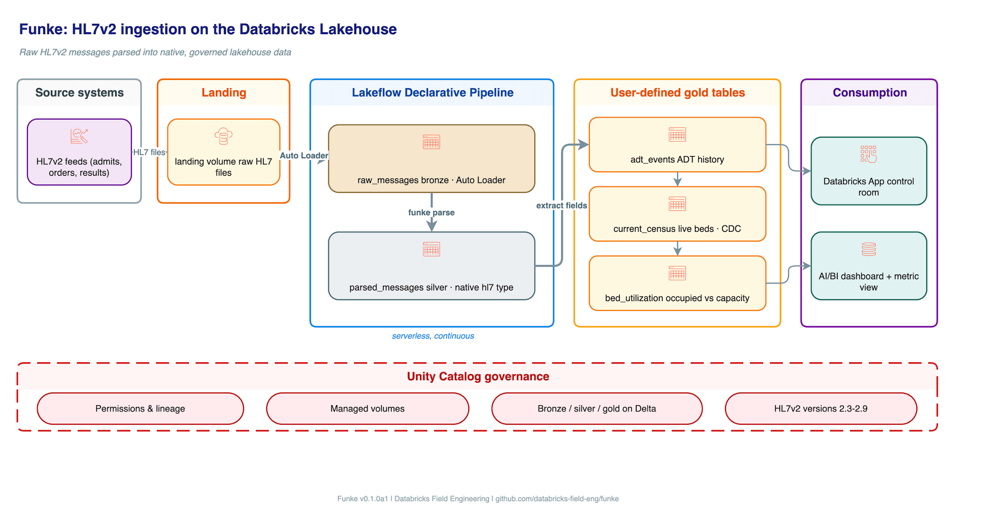

Quem já abriu uma mensagem HL7v2 crua sabe a sensação: um bloco de texto separado por pipe e circunflexo, onde cada campo pode esconder repetição, componente e subcomponente, e o significado de cada posição varia de hospital pra hospital. É dado de produção crítico, evento de admissão, alta, transferência, resultado de laboratório, guardado num formato que resiste a qualquer tentativa direta de `SELECT`.

A resposta mais comum até agora era escolher entre dois caminhos imperfeitos: converter a mensagem pra FHIR antes de qualquer análise, o que adiciona uma camada de tradução e pode perder detalhe da estrutura original, ou mandar a mensagem pra um motor de terceiro que achata tudo em tabela larga, o que tira o dado da plataforma, adiciona custo de licença, e remove o acesso direto à estrutura granular original. O Funke, acelerador open source do Azure Databricks, tenta um terceiro caminho: manter a hierarquia completa da mensagem dentro do lakehouse, sob a mesma governança do resto do dado.

## Por que HL7v2 resiste tanto a análise direta

HL7v2 é um padrão de mensageria de saúde amplamente implantado, mas sua estrutura aninhada e delimitada por caractere não foi desenhada pra consulta analítica, foi desenhada pra transporte entre sistemas. Cada segmento (como MSH pro cabeçalho ou PID pro paciente) carrega campos endereçáveis por posição, repetição, componente e subcomponente, e o formato exato varia entre sistemas emissores diferentes, mesmo dentro do mesmo padrão nominal.

Isso cria duas dores que qualquer equipe de dado de saúde conhece: query que precisa navegar posição por posição dentro do texto, e schema que muda de hospital pra hospital sem aviso.

## O modelo de dado do Funke

A peça central do Funke é tratar uma mensagem parseada como um mapa de segmento para repetições de segmento, onde cada campo é endereçável por posição de campo, repetição, componente e subcomponente. Em vez de achatar isso numa tabela larga fixa, o parser preserva a estrutura original dentro de uma única coluna de tipo nativo Spark, chamada `hl7`.

O parser lê os separadores declarados no próprio cabeçalho MSH da mensagem, em vez de assumir um delimitador fixo, e trata as sequências de escape padrão do protocolo. Isso é relevante porque o delimitador pode, teoricamente, variar entre sistemas emissores diferentes, e um parser que assume delimitador fixo quebra silenciosamente nesse cenário.



## A arquitetura em camadas, do pouso ao gold

O pipeline segue o padrão medallion já conhecido de quem trabalha com Azure Databricks, mas aplicado especificamente ao formato HL7:

- **Pouso para bronze**: Auto Loader lê arquivos HL7 de um volume do Unity Catalog pra uma tabela `raw_messages`, guardando hash MD5, timestamp de inserção e ID da mensagem.
- **Bronze para silver**: uma tabela `parsed_messages` aplica o parser e adiciona a coluna `hl7` de tipo nativo Spark, sem achatar nada ainda.
- **Gold**: fica a cargo de quem implementa. O próprio demo do Funke inclui uma tabela `adt_events`, uma tabela `current_census` mantida via change data capture com chave de número de visita, e uma tabela `bed_utilization`.

## Mão na massa: extraindo campo específico via Spark SQL

Depois que a camada silver existe com a coluna `hl7` parseada, extrair um campo específico é uma questão de navegar o caminho posicional direto em SQL, sem reescrever o parser:

```sql
SELECT
  md5Hash AS messageId,
  hl7.MSH[0].fields[9][0][1][1] AS messageType,
  hl7.PID[0].fields[2][0][1][1] AS patientId,
  hl7.PID[0].fields[5][0][1][1] AS patientLastName
FROM saude.bronze.parsed_messages
WHERE hl7.MSH[0].fields[9][0][1][1] IS NOT NULL
```

O mesmo caminho funciona em PySpark puro, útil quando a extração de campo faz parte de uma pipeline declarativa maior em vez de uma consulta ad hoc:

```python
import pyspark.sql.functions as F

gold_df = (
    silver_df
    .withColumn("messageType", F.col("hl7.MSH")[0]["fields"][9][0][1][1])
    .withColumn("patientId", F.col("hl7.PID")[0]["fields"][2][0][1][1])
    .where(F.col("messageType").isNotNull())
)
```

O padrão `[segmento][repetição][campo][componente][subcomponente]` é verboso, mas é exatamente a verbosidade que preserva a estrutura original da mensagem sem perder informação na conversão, o trade-off central da proposta do Funke.

## O que isso não resolve

Funke é parser e acelerador de ingestão, não motor de interface (interface engine) nem substituto para expertise clínica. Ele não decide, por exemplo, que o segmento PID posição 5 significa "sobrenome do paciente" pra sua organização específica, isso ainda é mapeamento de negócio que alguém com conhecimento clínico precisa validar e manter. E como é um acelerador de código aberto da categoria Databricks Industry Solutions, ele não vem com SLA de suporte formal da Databricks, o suporte é comunitário via o próprio repositório.

**Minha leitura:** o ganho real aqui não é só evitar o custo de um motor de terceiro, é manter o dado de saúde sob a mesma política de acesso, linhagem e auditoria do resto do Unity Catalog, em vez de ter um sistema paralelo de interface engine com seu próprio modelo de permissão. Pra equipe de dado de saúde que já opera Azure Databricks, isso fecha uma lacuna de governança que normalmente ficava aberta justamente na porta de entrada do dado mais sensível que existe.

## Vale a pena adotar?

Se sua organização já tem pipeline próprio de parsing HL7v2 funcionando, a pergunta não é "preciso trocar agora", é "meu parser atual preserva repetição e subcomponente, ou já achatei informação que não consigo recuperar". Se a resposta for a segunda, vale pelo menos rodar o demo do Funke contra uma amostra real pra comparar fidelidade estrutural antes de decidir.

## Referências

- Funke no GitHub, Databricks Industry Solutions: https://github.com/databricks-industry-solutions/funke-hl7v2
- Databricks Blog, "Introducing Funke: Native HL7v2 Parsing on Databricks": https://www.databricks.com/blog/introducing-funke-native-hl7v2-parsing-databricks
- Databricks Blog, "Burning Through Electronic Health Records in Real Time with Smolder" (antecessor do Funke): https://www.databricks.com/blog/2021/01/28/burning-through-electronic-health-records-in-real-time-with-smolder.html
- Microsoft Learn, "What is Auto Loader?": https://learn.microsoft.com/en-us/azure/databricks/ingestion/cloud-object-storage/auto-loader/
- Microsoft Learn, "What are Unity Catalog volumes?": https://learn.microsoft.com/en-us/azure/databricks/volumes/

#AzureDatabricks #Saude #UnityCatalog #DataEngineering
