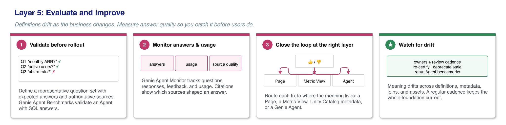

Todo time de ML aprendeu, geralmente da pior forma, que um modelo que não é reavaliado depois do deploy vai degradar silenciosamente: a distribuição do dado muda, a suposição original para de valer, e ninguém percebe até o resultado errado já ter causado dano. O estranho é que a mesma disciplina raramente aparece quando o "modelo" em produção é um agente de dado conversacional. O time valida o Genie Agent com um punhado de pergunta de demonstração, aprova, publica, e a partir daí a precisão dele vira um artigo de fé, não uma métrica acompanhada.

O Genie Ontology, arquitetura de camadas que o Azure Databricks documentou pra dar contexto de negócio a agente de dado, tem uma camada final que existe justamente pra fechar essa lacuna: avaliação e melhoria contínua, sustentada por um mecanismo concreto chamado Genie Agent Benchmarks. Vale entender como ele funciona, porque é a peça mais fácil de pular quando o prazo aperta, e a mais cara de não ter quando o agente já está em produção errando sem ninguém saber.

## O mecanismo: dois jeitos de medir "certo", dependendo do tipo de pergunta

Um Genie Agent pode acumular até 500 pergunta de benchmark, cada uma rodando como conversa isolada, sem herdar contexto de thread anterior, exatamente como aconteceria se um usuário novo perguntasse pela primeira vez. Existem dois modos de avaliação, e a escolha entre eles depende do tipo de pergunta:

**Modo Chat**: compara o SQL que o agente gerou (ou o resultado dele) contra uma "resposta padrão-ouro" fornecida por quem escreveu o benchmark. A régua é objetiva: SQL idêntico é "Bom", resultado idêntico com ordenação diferente também é "Bom", número que bate em 4 dígitos significativos também conta. Resultado vazio, coluna extra, ou valor de célula divergente é "Ruim". A comparação cobre até 5 mil linhas, então pergunta cujo resultado plausível passa disso precisa de `ORDER BY` explícito nos dois lados pra não gerar falso negativo por causa da truncagem.

**Modo Agent**: usado quando a resposta não é um resultado tabular simples de comparar, e sim um relatório textual de múltiplas etapas de raciocínio. Aqui um juiz de LLM avalia a resposta contra uma "nota de avaliação" opcional que quem escreveu o benchmark forneceu, descrevendo o que a resposta certa precisa conter.

A escolha do modo acontece na hora de rodar o benchmark, não na hora de cadastrar a pergunta, então a mesma base de perguntas pode ser reavaliada dos dois jeitos conforme o tipo de resposta que o agente está gerando naquele momento.



**Minha leitura:** o detalhe que acho mais sensato nesse desenho é o modo Chat recompensar variação legítima (ordenação diferente, precisão numérica) sem recompensar erro estrutural (coluna a mais, resultado vazio). Um benchmark ingênuo que exige igualdade byte a byte gera ruído demais, marca resposta correta como errada só porque o agente ordenou diferente, e times acabam ignorando o próprio benchmark depois de um tempo por desconfiar do sinal. Calibrar a régua pra separar "diferença cosmética" de "erro de fato" é o que faz o time confiar no número o suficiente pra agir quando ele cai.

## Mão na massa: cadastrando benchmark com variação de fraseado

Uma prática recomendada explicitamente pela documentação, e que costuma ser ignorada por quem cadastra benchmark rápido demais: a mesma pergunta de negócio raramente chega no agente sempre com a mesma frase. Usuário real pergunta "receita do trimestre passado" e "quanto faturamos no Q3" pro mesmo dado, e um agente que acerta uma fraseação e erra a outra não é confiável de verdade, mesmo que o benchmark ingênuo com só uma variação reporte 100% de acerto.

O fluxo de cadastro, feito direto na aba **Benchmarks** do Genie Agent:

```
Pergunta 1: "Qual foi a receita total do último trimestre fechado?"
Pergunta 2: "Quanto a gente faturou no Q3?"
Pergunta 3: "Receita do trimestre passado, quanto foi?"

SQL Answer (mesma pra todas as 3):
SELECT SUM(valor_pedido) AS receita_total
FROM vendas.pedidos
WHERE trimestre_fiscal = (
  SELECT MAX(trimestre_fiscal) FROM vendas.pedidos
  WHERE data_fechamento IS NOT NULL
)
```

A recomendação oficial é entre duas e quatro variações de fraseado por pergunta de negócio real. Rodar esse conjunto depois de qualquer mudança na Metric View ou na definição de termo subjacente mostra rápido se a mudança quebrou uma fraseação específica sem quebrar as outras, sinal que normalmente passaria despercebido até um usuário real esbarrar nele.

## O ciclo que fecha o loop: do benchmark de volta pro contexto do agente

O ganho real não é o número de acurácia isolado, é o que acontece depois de uma execução de benchmark. Rodar o conjunto inteiro e revisar pergunta por pergunta escala mal, então o fluxo recomendado usa o próprio Genie Code pra analisar a execução inteira de uma vez: ele revisa o que era esperado, o que o agente de fato gerou, e o contexto atual do agente, e propõe ajuste de instrução ou de contexto pra cada gap encontrado, pra quem administra o agente aceitar ou rejeitar individualmente.

Esse mesmo padrão de "revisão em lote via Genie Code" também vale pro uso real, não só pro benchmark formal: o **Monitor** do agente traz um resumo semanal de volume de mensagem, usuário ativo e taxa de feedback positivo/negativo, e o botão "Analisar uso do agente" lança o Genie Code pra vasculhar seis meses de mensagem real em busca de tópico recorrente e problema repetido, com citação linkando direto pra conversa original. Na prática, isso significa que o sinal de "onde o agente está errando" vem de duas fontes complementares: o benchmark controlado, desenhado pra cobrir o que o time já sabe que importa, e o uso real, que revela o que ninguém pensou em testar.

## O que isso não resolve

Feedback de usuário sozinho não muda o comportamento do agente automaticamente, a documentação é explícita sobre isso: alguém com permissão de administração precisa revisar o feedback e decidir se vira ajuste de contexto ou não, então benchmark sem revisão humana periódica ainda é um mecanismo que junta poeira. O modo Chat também depende inteiramente da qualidade da SQL padrão-ouro cadastrada, pergunta sem `SQL Answer` cai em revisão manual obrigatória, e SQL padrão-ouro escrita errada silenciosamente ensina o agente a errar do jeito certo. E o resultado detalhado de uma execução de avaliação individual fica visível só por uma semana, então quem quiser rastrear tendência de acurácia ao longo de meses precisa exportar ou registrar o número em algum lugar externo, a ferramenta não guarda histórico de longo prazo sozinha.

## Vale a pena investir nisso desde o início?

Cadastrar benchmark antes mesmo do agente ir pra produção parece trabalho redundante quando a demonstração inicial já convenceu todo mundo, mas é exatamente o oposto: o benchmark só ganha valor real depois, quando a Metric View muda, quando um termo de negócio é redefinido, quando o agente ganha uma fonte de dado nova. Sem um conjunto de pergunta com resposta certa já cadastrada, cada uma dessas mudanças exige validação manual do zero. Com ele, a mesma pergunta feita da vez passada roda de novo em segundos, e a resposta pra "isso quebrou alguma coisa" vira número, não achismo.

## Referências

- Databricks Blog, "Operationalizing Genie Ontology in Your Data Stack": https://www.databricks.com/blog/operationalizing-genie-ontology-your-data-stack
- Databricks Docs, "Test and monitor a Genie Agent": https://docs.databricks.com/genie-agents/monitor
- Microsoft Learn, "Test and monitor a Genie Agent - Azure Databricks": https://learn.microsoft.com/en-us/azure/databricks/genie-agents/monitor

#Databricks #GenieOntology #AIEngineering #Avaliacao
