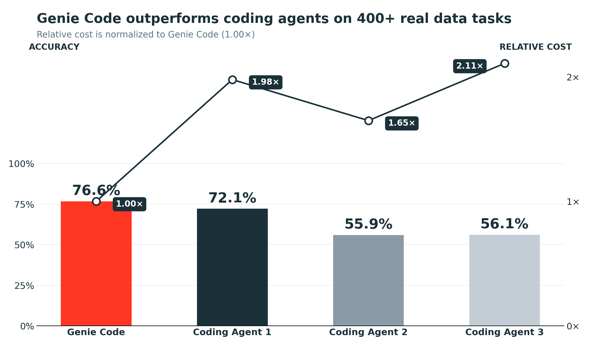

Largar um agente de código genérico pra resolver "por que a receita da região sul caiu no dashboard" costuma terminar do mesmo jeito: ele lista tabela, abre notebook, tenta adivinhar qual coluna significa o quê, erra o join, tenta de novo. Cada exploração consome chamada de ferramenta, e cada chamada de ferramenta consome token. O agente não é burro, ele só está começando do zero num workspace que ele nunca viu antes, toda vez.

Um benchmark interno recente da Databricks, rodado contra 401 tarefas reais de descoberta de dado em ambiente corporativo, tenta isolar exatamente esse efeito: será que um agente especializado, com acesso estruturado ao catálogo de dado, vence um agente de código genérico só por conhecer melhor o terreno, mesmo usando modelo de linguagem comparável por trás? O resultado, com Genie Code do Azure Databricks levando 76,6% de acurácia contra 55,9% a 72,1% dos concorrentes testados, e custando US$ 0,55 por tarefa contra US$ 0,91 a US$ 1,16 dos outros, sugere que sim, e o motivo importa mais que o número em si.

## O mecanismo: não é o modelo, é o que o agente já sabe sem perguntar

A diferença central não está em raciocínio melhor, está em informação que o agente especializado já tem de cara, então nunca precisa gastar chamada de ferramenta descobrindo. Três peças sustentam isso:

**Busca semântica sobre catálogo e workspace**: em vez de listar tabela por tabela até achar a certa, o agente busca por significado, então uma pergunta sobre "receita por região" já aponta pra tabela certa mesmo que o nome dela seja `fact_sales_v3`.

**Memória persistente de tabela e lógica de negócio frequentes**: tabela que o time já usa com frequência, e a lógica de negócio já validada em consulta anterior, não precisam ser redescobertas a cada tarefa nova. Isso inclui, na peça pública equivalente desse mecanismo (o Genie Ontology, hoje em Public Preview), a capacidade de o agente consultar definição de métrica e dica de join já documentada pelo time antes de escrever o SQL.

**Entendimento semântico de contexto corporativo**: interpretar o que "cliente ativo" ou "pedido cancelado" significam dentro daquela empresa específica, não a definição genérica do dicionário.

A consequência prática apareceu no próprio benchmark: o agente especializado precisou, em média, de 8,3 chamadas de ferramenta por tarefa, menos que qualquer agente genérico testado. Menos exploração às cegas significa menos chamada de ferramenta, e cada chamada de ferramenta a menos é custo e tempo que não vira gasto.



**Minha leitura:** o dado que mais chama atenção aqui não é a acurácia mais alta, é a causa dela ser estrutural e não uma questão de "modelo mais esperto". Isso importa porque significa que trocar o modelo de linguagem por trás de um agente genérico não fecha essa lacuna sozinho, o problema não é raciocínio, é falta de contexto estruturado sobre o ambiente. Quem quiser competir nesse eixo precisa investir em dar contexto ao agente, não só em trocar de modelo.

## Mão na massa: ensinando lógica de negócio ao agente com skills

A peça que qualquer time pode configurar hoje, sem esperar por feature nova, é o mecanismo de skills do Genie Code: uma pasta `.assistant/skills/` (em nível de workspace ou de usuário) onde cada subpasta é uma skill com seu próprio `SKILL.md`. O agente carrega a skill automaticamente quando o pedido do usuário casa com a descrição dela, sem precisar de invocação manual.

Um exemplo de skill documentando a lógica de "pedido cancelado" pra um time de e-commerce:

```
Workspace/.assistant/skills/pedidos-cancelados/
├── SKILL.md
└── exemplos-consulta.sql
```

```markdown
---
name: pedidos-cancelados
description: Define o que conta como pedido cancelado neste workspace e onde consultar. Use quando a pergunta envolver cancelamento, estorno ou pedido não concluído.
---

Pedido cancelado é qualquer linha em `vendas.pedidos` com `status_pedido IN ('CANCELADO', 'ESTORNADO')`
E `motivo_cancelamento IS NOT NULL`. Pedido com status `PENDENTE` há mais de 48h
não conta como cancelado, conta como pendente de pagamento (ver skill separada).

A tabela de fato já teve rename de `id_pedido` pra `pedido_sk` na migração de 2026-03,
use `pedido_sk` em consulta nova.
```

Sem essa skill, o agente teria que inferir a regra de cancelamento olhando dado de exemplo e arriscando interpretação errada, exatamente o tipo de exploração que consome chamada de ferramenta e ainda corre risco de sair errado. Com ela documentada, a resposta vem correta na primeira tentativa, e continua correta pra próxima pessoa do time que perguntar algo parecido, sem precisar redocumentar.

## Como o benchmark foi montado

Vale entender a metodologia antes de aceitar o número de cara. As 401 tarefas vieram de uso real e interno, não de pergunta sintética criada só pra favorecer um lado, o que reduz (mas não elimina) o viés de "prova feita sob medida". Cada agente testado, especializado ou genérico, teve acesso ao mesmo workspace e ao mesmo conjunto de tabelas, então a variável isolada foi de fato a estratégia de descoberta de dado, não uma vantagem de acesso desigual. A métrica de custo por tarefa correta (não custo por tarefa executada) é a que mais importa aqui: um agente mais barato por execução mas que erra a resposta com frequência maior ainda sai mais caro por resposta certa, e foi exatamente essa métrica composta que abriu a maior diferença entre os dois grupos.

## O que isso não resolve

Esse tipo de vantagem estrutural desaparece se o catálogo em si estiver mal documentado, sem descrição de coluna, sem convenção de nome, sem skill nenhuma escrita. O agente especializado ainda depende de metadado de qualidade pra ter algo estruturado pra consultar, sem isso ele volta a se comportar como um agente genérico explorando às cegas. O benchmark também mede tarefa de descoberta e análise de dado especificamente, não generaliza pra toda tarefa de engenharia de software, um agente de código genérico ainda pode ser a escolha certa pra refatoração de aplicação ou trabalho fora do universo de dado e catálogo. E calibração de benchmark interno de fornecedor sempre merece ceticismo saudável: vale reproduzir o teste com tarefa real do seu próprio workspace antes de tratar os números como garantia, principalmente porque o ganho documentado depende diretamente de quanto o workspace testado já estava bem documentado, algo que a Databricks controla no próprio ambiente de teste e que a maioria das empresas não tem de graça.

## Fechamento

O argumento de fundo aqui é simples de generalizar: agente de propósito geral compete em raciocínio, agente de domínio específico compete em contexto que ele já tem de graça. Pra time que já usa Azure Databricks, o caminho de curto prazo pra capturar esse efeito não é trocar de agente, é investir em documentar lógica de negócio como skill e manter metadado de catálogo atualizado, porque é exatamente esse investimento que faz a diferença de custo e acurácia aparecer.

## Referências

- Databricks Blog, "Why A Frontier Data Agent Outperforms General Coding Agents in Quality and Cost": https://www.databricks.com/blog/why-frontier-data-agent-outperforms-general-coding-agents-quality-and-cost
- Databricks Docs, "Genie Code features and capabilities": https://docs.databricks.com/aws/en/genie-code/features-capabilities
- Microsoft Learn, "Genie Code features and capabilities - Azure Databricks": https://learn.microsoft.com/en-us/azure/databricks/genie-code/features-capabilities
- Databricks Docs, "Extend Genie Code with agent skills": https://docs.databricks.com/aws/en/genie-code/skills

#Databricks #GenieCode #AIEngineering #Agentes
