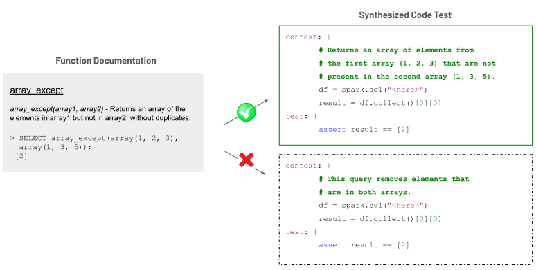

Benchmark de geração de código pra linguagem geral (Python, JavaScript) é abundante, tem HumanEval, MBPP, uma dúzia de variante. Biblioteca de nicho, como as centenas de função específicas do Spark SQL, não tem esse luxo. Se você quer saber se um modelo de código realmente entende `array_intersect` ou `transform` do jeito que o Spark SQL implementa, muito provavelmente não existe benchmark público bom pra isso, e escrever um caso de teste manual pra cada função de uma API grande é trabalho que ninguém tem paciência de fazer na mão.

A resposta da Databricks pra esse problema específico foi construir um pipeline que gera o próprio benchmark automaticamente, partindo da documentação da função, sem precisar de humano escrevendo caso de teste um por um. O resultado prático foram 286 casos de teste de Spark SQL gerados dessa forma, junto com uma descoberta que interessa a qualquer time avaliando ou fine-tunando modelo de código: o jeito como você escreve a instrução muda o resultado do modelo de forma mensurável, mesmo mantendo a tarefa idêntica.

O motivo pelo qual esse tipo de trabalho ainda importa hoje, mesmo o texto original sendo de 2024, é que o problema de fundo, avaliar modelo de código numa API de nicho sem depender de benchmark genérico de linguagem geral, ficou mais comum, não menos. Toda empresa que constrói biblioteca interna própria (função customizada de transformação de dado, wrapper de API interna, DSL proprietária) enfrenta exatamente esse mesmo problema quando quer avaliar se um coding agent lida bem com o código específico daquela empresa, e o HumanEval genérico não ajuda em nada nesse caso.

## O mecanismo: quatro estágios, do exemplo da documentação ao caso de teste validado

O pipeline segue uma lógica de validação cruzada em cadeia:

1. **Filtragem da função semente**: cada função candidata é validada rodando o exemplo de código documentado contra o resultado de referência esperado, garantindo saída determinística e compatibilidade com o ambiente de execução. Função com comportamento não determinístico é descartada aqui.
2. **Geração de instrução de código**: um modelo de ponta gera um comentário de código conciso (a instrução) a partir do nome da função, sua definição e exemplo, deliberadamente evitando mencionar o nome da função na instrução, pra forçar o modelo avaliado a inferir qual função usar, não só copiar o nome citado.
3. **Validação da instrução gerada**: a instrução é testada pedindo pro mesmo modelo de ponta gerar uma solução a partir dela, que é executada e comparada contra o resultado da função semente original. Instrução que não produz solução equivalente é descartada.
4. **Avaliação do modelo de código**: os modelos candidatos são avaliados em modo fill-in-the-middle (completar o meio de um trecho de código), com métrica pass@1, contra o conjunto final de 286 casos de teste de Spark SQL.

O resultado reportado mostra Deepseek-coder-6.7b em 0,528 de pass@1 contra 0,748 do GPT-4o, e a maior parte dos erros vem de identificação incorreta da função certa ou de query aninhada complicada demais pra resolver um problema simples.



## Mão na massa: reproduzindo o princípio de geração de instrução

O pipeline completo depende de acesso a modelo de ponta em escala, mas o princípio central, gerar instrução sem citar o nome da função e validar com execução real, dá pra prototipar em pequena escala assim:

```python
import re

def extrai_nome_funcao(assinatura: str) -> str:
    return re.match(r"(\w+)\(", assinatura).group(1)

def gera_instrucao_sem_nome(nome_funcao: str, definicao: str, exemplo_sql: str) -> str:
    """Gera instrução evitando citar o nome da função (simplificado)."""
    prompt = f"""
    Baseado na definição abaixo, escreva um comentário curto descrevendo
    o QUE a query faz, sem mencionar o nome literal '{nome_funcao}':

    Definição: {definicao}
    Exemplo: {exemplo_sql}
    """
    return chama_modelo_ponta(prompt)

def valida_instrucao(instrucao: str, sql_esperado_resultado):
    """Pede pro modelo resolver a partir só da instrução, e compara execução."""
    solucao_gerada = chama_modelo_ponta(f"-- {instrucao}\nSELECT ")
    resultado_gerado = executa_spark_sql(solucao_gerada)
    return resultado_gerado == sql_esperado_resultado

# Exemplo com array_intersect
nome = extrai_nome_funcao("array_intersect(array1, array2)")
instrucao = gera_instrucao_sem_nome(
    nome,
    "Retorna um array com os elementos comuns entre dois arrays, sem duplicata.",
    "SELECT array_intersect(array(1,2,3), array(2,3,4))"
)
valido = valida_instrucao(instrucao, sql_esperado_resultado=[2, 3])
```

Esse esqueleto captura o essencial do estágio 2 e 3 do pipeline original, gerar instrução que testa compreensão semântica em vez de memorização de nome de função, e validar com execução real em vez de confiar cegamente na saída do modelo gerador.

**Minha leitura:** o achado mais reaproveitável desse trabalho, pra quem usa Azure Databricks no dia a dia, nem é o benchmark de 286 casos em si, é a descoberta de que incluir o comentário `# Databricks notebook source` no prompt melhorou o desempenho do modelo de forma mensurável. Isso é um lembrete simples e prático: contexto de ambiente (saber que aquilo é um notebook do Azure Databricks, não um script solto) muda o comportamento de modelo de código de um jeito que vale a pena testar antes de assumir que seu prompt está bem otimizado. Eu testaria essa mesma ideia, adicionar marcador de contexto de ambiente no prompt, em qualquer pipeline de geração de código assistido por IA que eu estivesse validando hoje, é barato de testar e o ganho relatado não é desprezível.

## Adaptando o pipeline pra biblioteca interna própria

Pra quem quer aplicar essa metodologia na própria empresa, o requisito de entrada é mais simples do que parece: você precisa de uma função com exemplo de uso documentado e resultado esperado determinístico, o resto do pipeline (gerar instrução sem citar o nome, validar com execução, avaliar com fill-in-the-middle) é reutilizável quase sem modificação. A parte que mais exige cuidado ao adaptar é o estágio 1, filtragem da função semente, porque biblioteca interna geralmente tem função com efeito colateral (grava em banco, chama serviço externo) que não é seguro executar repetidamente durante a geração e validação do benchmark. Vale isolar essas funções com efeito colateral do conjunto elegível antes de rodar o pipeline, ou mockar o efeito colateral de forma determinística.

## O que isso não resolve

Esse tipo de benchmark automatizado tem limite claro:

- **A qualidade do benchmark gerado depende inteiramente da qualidade do modelo gerador da instrução.** Se o modelo de ponta usado pra gerar e validar instrução tem viés ou lacuna de conhecimento sobre uma função específica, esse viés se propaga pro benchmark inteiro sem ninguém perceber.
- **286 casos de teste é uma cobertura parcial da superfície de função do Spark SQL**, que tem centenas de função built-in. O pipeline é uma metodologia reutilizável, não um benchmark definitivo e completo.
- **Pass@1 mede se a primeira tentativa do modelo acerta, não mede robustez em produção** frente a schema real, dado sujo ou combinação de função em query mais complexa do que os casos de teste sintéticos cobrem.

## Fechamento

Passados quase dois anos desde a publicação original, a metodologia continua atual porque o problema que ela resolve, falta de benchmark bom pra biblioteca de nicho, não desapareceu, só ficou mais relevante conforme mais gente usa LLM pra gerar código Spark SQL no dia a dia. O valor prático real está no padrão de "gera, valida com execução, depois avalia", que qualquer time pode adaptar pra própria biblioteca interna sem depender de um benchmark público que provavelmente não existe pro seu caso de uso.

## Referências

- Post oficial: [Generating Coding Tests for LLMs: A Focus on Spark SQL](https://www.databricks.com/blog/generating-coding-tests-llms-focus-spark-sql)
- Documentação de referência: [Spark SQL built-in functions](https://spark.apache.org/docs/latest/api/sql/)

#Databricks #SparkSQL #DataEngineering #LLM
