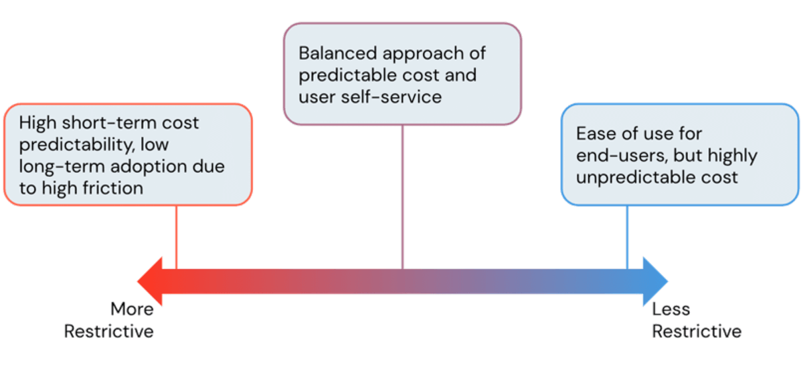

Todo administrador de plataforma de dado já viveu essa cena: a fatura da nuvem chega mais alta que o esperado, e a investigação começa reativamente, vasculhando log de cluster de três semanas atrás tentando entender quem deixou o quê ligado. Esse modelo de gestão de custo, reativo e baseado em auditoria posterior, não escala com o tamanho do time nem com a quantidade de workspace. A alternativa que funciona de verdade é estrutural: restringir a configuração possível antes que ela vire gasto, não depois.

O Databricks Unit (DBU) é a unidade de consumo da plataforma, calculada a partir de número de nó no cluster e poder computacional do tipo de instância escolhido, variando por tipo de workload (Jobs, All-Purpose, pipeline declarativo, SQL, serverless) e por tier de assinatura. Entender esse mecanismo é pré-requisito, mas a alavanca prática que realmente move a agulha é a cluster policy.

## O mecanismo: cluster policy como cerca, não como sugestão

Cluster policy é um conjunto de regra administrativa que restringe o que um usuário pode configurar ao subir um cluster, seja via valor fixo, faixa de valor, padrão regex ou valor default. Diferente de uma diretriz documentada que depende de disciplina individual pra ser seguida, a policy é aplicada no momento da criação do cluster, o usuário simplesmente não consegue configurar fora do que foi permitido.



Esse espectro entre "mais restritivo" e "menos restritivo" é a tensão central de qualquer decisão de FinOps em plataforma de dado: política restritiva demais garante previsibilidade de gasto, mas gera fricção que empurra usuário avançado a pedir exceção toda semana; política solta demais dá autoatendimento, mas custo vira imprevisível. O ponto de equilíbrio, segundo a própria documentação da Databricks, costuma ser uma abordagem balanceada, com custo previsível e autoatendimento controlado dentro de limite conhecido.

## Mão na massa: uma policy de exemplo

Uma policy típica pra ambiente de desenvolvimento, limitando tamanho de cluster e forçando prática de economia, se parece com isto:

```json
{
  "spark_version": {
    "type": "regex",
    "pattern": "1[5-9]\\..*",
    "defaultValue": "16.4.x-scala2.12"
  },
  "node_type_id": {
    "type": "allowlist",
    "values": ["Standard_D4ds_v5", "Standard_D8ds_v5"]
  },
  "autotermination_minutes": {
    "type": "range",
    "minValue": 10,
    "maxValue": 60,
    "defaultValue": 30
  },
  "num_workers": {
    "type": "range",
    "maxValue": 4
  },
  "custom_tags.cost_center": {
    "type": "fixed",
    "value": "dados-analytics"
  },
  "aws_attributes.availability": {
    "type": "fixed",
    "value": "SPOT_WITH_FALLBACK"
  }
}
```

Repare que a tag `cost_center` é obrigatória e fixa, não uma sugestão que o usuário preenche se lembrar. Essa tag propaga pro billing da nuvem, o que transforma atribuição de custo por time de uma reconciliação manual trabalhosa numa consulta direta em tabela de uso.

## Onde o dinheiro realmente vaza

Três mecanismos concentram a maior parte do desperdício evitável. Auto-termination encerra cluster ocioso depois de um período configurável de inatividade, e é surpreendente quantos workspace ainda operam sem esse limite ligado por padrão, pagando por cluster esquecido ligado num fim de semana inteiro. Autoscaling ajusta o número de nó conforme a carga de trabalho real, bom pra cluster compartilhado e job batch de complexidade variável, mas inadequado pra workload sensível a latência onde o tempo de scale-up vira gargalo. E instância spot, com desconto de até 90% frente ao preço sob demanda, resolve bem carga tolerante a falha como ambiente de desenvolvimento e staging, mas exige que o pipeline saiba lidar com preempção no meio da execução.

**Na prática:** o erro mais comum que já vi em auditoria de custo não é uma dessas três coisas configurada errada isoladamente, é a ausência completa de cluster policy obrigatória pra usuário não técnico. Analista de negócio que só quer rodar uma consulta SQL não deveria ter a opção de subir um cluster All-Purpose de 20 nós, a interface deveria nem oferecer essa possibilidade. Migrar mesmo que seja 10% do workload de cluster interativo pra cluster de job com policy restrita já costuma gerar economia de cinco dígitos, segundo relato da própria Databricks, e isso bate com o que se observa na prática: a maior fonte de gasto evitável não é o job mal otimizado, é o cluster interativo esquecido ligado.

## Compute serverless muda o cálculo de novo

SQL warehouse serverless elimina a cobrança dupla que existia no modelo clássico, onde se pagava DBU e instância de nuvem separadamente. Com serverless, a própria Databricks gerencia o pool de compute por trás, cobrando de forma unificada, com autoscaling praticamente instantâneo e sem tempo de start frio pra warehouse pequeno. Isso reduz drasticamente o incentivo perverso de deixar warehouse superdimensionado ligado "por garantia".

## Monitoramento: da fatura reativa ao dashboard de consumo

Depois que a policy estrutural está no lugar, a segunda camada é visibilidade contínua. A página de uso do Account Console permite visualizar consumo por DBU ou por valor em dólar, filtrado por workspace ou por SKU, tanto de forma agregada quanto detalhada por tabela. No Azure, a integração com Azure Cost Management entrega granularidade por tag através de todo o conjunto de serviço da assinatura, não só Azure Databricks, o que ajuda a comparar gasto de plataforma de dado com o resto do orçamento de nuvem numa visão só. Pra quem quer ir além do dashboard pronto, a exportação diária de log de uso em CSV permite montar pipeline próprio, carregando esse histórico numa tabela Delta e construindo alerta customizado em cima, por exemplo, um aviso quando o gasto semanal de um cost center específico ultrapassa a média das últimas quatro semanas em mais de 20%.

## O que isso não resolve

Cluster policy bem desenhada não substitui monitoramento contínuo. Ela previne o pior caso (cluster gigante esquecido ligado), mas não identifica automaticamente query mal escrita rodando repetidamente num warehouse corretamente dimensionado, nem job redundante que dois times diferentes criaram sem saber da existência um do outro. Pra isso ainda é necessário consumir tabela de uso via API de billable usage ou System Tables, com pipeline próprio de análise, e isso é trabalho de engenharia recorrente, não configuração de política que se faz uma vez e esquece. Vale também lembrar que política de ciclo de vida de storage precisa estar coordenada com o ciclo de vacuum do Delta Lake, aplicar TTL de storage sem essa coordenação pode corromper tabela por remover arquivo de dado ainda referenciado pelo log de transação.

## Fechamento

Gestão de custo eficaz em Azure Databricks se parece mais com desenho de sistema de permissão do que com trabalho de auditoria financeira. Cluster policy, tag obrigatória e compute serverless bem configurado removem grande parte da superfície onde gasto acidental acontece, antes que ele vire linha na fatura do mês seguinte. O trabalho de monitorar consumo continua sendo necessário depois disso, mas parte de uma base bem menor de coisa que pode dar errado.

## Referências

- Databricks Blog, "Best Practices for Cost Management on Databricks": https://www.databricks.com/blog/best-practices-cost-management-databricks
- Microsoft Learn, "Classic compute configuration best practices - Azure Databricks": https://learn.microsoft.com/en-us/azure/databricks/compute/cluster-config-best-practices

#Databricks #FinOps #ClusterPolicies #Governança
