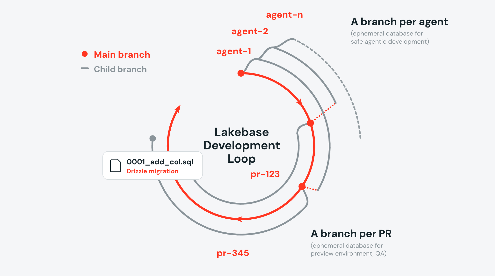

Colocar um agente de código pra trabalhar numa tarefa é fácil. Colocar três agentes trabalhando em paralelo contra o mesmo banco de dado de desenvolvimento é onde a maioria das equipes descobre um problema que não existia quando só havia humano no teclado.

Agente de código trabalha rápido e em paralelo por natureza, o que amplifica um risco que já existia antes dele: conflito de schema entre mudanças concorrentes, um agente pisando no dado que outro estava usando pra testar, ou, pior, a tentação de recorrer a mock que não reflete o dado real só pra evitar esse conflito. E como agente trabalha rápido, o risco de alguém apontar acidentalmente pra produção, ou pra uma cópia de produção com dado sensível, sobe junto.

O branching de banco do Lakebase, aplicado especificamente ao ciclo de vida de desenvolvimento assistido por agente (SDLC agêntico), ataca isso dando a cada agente, ou a cada pull request, seu próprio banco isolado, criado em menos de um segundo independente do tamanho do banco original.

## O problema não é exclusivo de agente, mas agente piora ele

Múltiplos desenvolvedores compartilhando um banco de staging já é fonte clássica de atrito: alguém roda uma migration enquanto outra pessoa está no meio de um teste, e os dois saem prejudicados. Com agente de código, esse mesmo atrito acontece com menos supervisão humana por ciclo e com mais ciclos por hora, porque o agente não para pra perguntar "alguém está usando esse banco agora" antes de agir.

## Copy-on-write: por que criar um branch não copia nada

A mecânica que sustenta tudo isso é a mesma do Lakebase em geral: um branch novo herda schema e dado do pai, mas compartilha o storage subjacente através de ponteiro pra mesma informação, sem duplicar nada na criação. O Lakebase só grava dado novo quando o próprio branch diverge do pai escrevendo algo diferente. É por isso que criar o branch é instantâneo independente do tamanho do banco de origem, e branch que expira é cobrado só pela fração de dado que de fato mudou nele, enquanto branch permanente é cobrado pelo tamanho cheio.

## Dois padrões de aplicação: por agente e por pull request

A peça documentada mostra dois jeitos concretos de amarrar isso ao fluxo de trabalho real:

**Por agente, via worktree do Git.** Worktree do Git já isola o diretório de código por tarefa. Um hook `post-checkout` cria um branch do Lakebase pra cada worktree novo, então o agente ganha, ao mesmo tempo, seu próprio diretório de código e seu próprio banco, sem depender de coordenação manual entre as duas coisas.

**Por pull request, via GitHub Actions.** Um workflow cria um branch a partir de produção pra cada PR aberto, roda as migrations (via Drizzle, Flyway, Liquibase ou Alembic, a ferramenta não importa pro mecanismo em si) contra esse branch, faz deploy de uma versão de preview do app no Databricks Apps apontando pra esse branch específico, e comenta o diff de schema direto no PR. Quando o PR fecha ou é mergeado, o CI apaga o branch.

## O que não existe aqui: merge de volta

Um ponto que vale deixar explícito porque contraria a intuição de quem vem do mundo Git: branch do Lakebase não é mergeado de volta pro pai. Dado do pai e dado do branch podem divergir de forma independente, então não existe operação de "merge" de dado fazendo sentido aqui. O que de fato precisa voltar pro pai é mudança de schema, e essa parte continua vivendo como migration versionada em código, aplicada ao pai pelas ferramentas de migration já mencionadas, não como uma operação de merge de branch de banco.



## Mão na massa: ativando o fluxo por worktree

O comando que inicia esse ciclo, do lado do agente, é simples de disparar, mesmo que a automação por trás (hook de `post-checkout` criando o branch) seja o que faz o trabalho pesado:

```bash
claude --worktree feature-123
```

O hook associado a esse worktree, conceitualmente, resolve três coisas em sequência: cria o diretório de trabalho isolado do worktree, dispara a criação do branch do Lakebase correspondente, e escreve as variáveis de conexão daquele branch específico num arquivo de ambiente que o agente lê ao iniciar a sessão. Isso é o que garante que o agente nunca precisa decidir manualmente contra qual banco ele está rodando, a amarração entre worktree e branch já resolve isso antes dele começar a trabalhar.

## O que isso não resolve

Branching isolado não resolve conflito de schema em si, ele só isola o lugar onde o conflito pode acontecer. Se dois agentes, em branches separados, propõem migrations incompatíveis pro mesmo pai, esse conflito ainda aparece no momento de aplicar as duas migrations em sequência contra produção, só que mais tarde, no PR, onde um humano revisa o diff de schema antes do merge. E a limitação mais importante: nenhum mecanismo aqui impede, por si só, que um branch criado a partir de produção carregue dado sensível pra dentro do ambiente de teste de um agente. Mascaramento via Unity Catalog, citado como workflow adicional além do exemplo principal, é o que resolve essa parte, e não vem configurado por padrão só por usar branch.

**Minha leitura:** o ganho real não é só velocidade de provisionamento, é remover a pressão que levava equipe a usar mock de dado só porque dado real era caro ou arriscado de disponibilizar por ambiente. Com branch instantâneo e descartável, o argumento econômico pra usar mock desaparece, o que sobra é decisão deliberada de quando mascarar dado sensível, não atalho por falta de alternativa viável.

## Vale a pena adotar?

Se sua equipe já roda múltiplos agentes de código em paralelo contra staging compartilhado, o sintoma que vale observar antes de adotar isso é simples: quantas vezes por semana alguém já perdeu trabalho porque outro processo (humano ou agente) alterou dado ou schema no meio de um teste. Se a resposta for "mais de zero", o padrão de branch por worktree ou por PR documentado aqui já paga o investimento de configurar o hook e o workflow.

## Referências

- Databricks Blog, "Lakebase and Agentic SDLC: Branching Databases for Coding Agents": https://www.databricks.com/blog/lakebase-and-agentic-sdlc-branching-databases-coding-agents
- Microsoft Learn, "Database branches - Azure Databricks": https://learn.microsoft.com/en-us/azure/databricks/oltp/projects/branches
- Microsoft Learn, "Lakebase architecture - Azure Databricks": https://learn.microsoft.com/en-us/azure/databricks/oltp/projects/architecture
- Repositório de exemplo, Lakebase Agentic CI: https://github.com/databricks/tmm/tree/main/Lakebase-Agentic-CI

#AzureDatabricks #Lakebase #AgenticAI #DevOps
