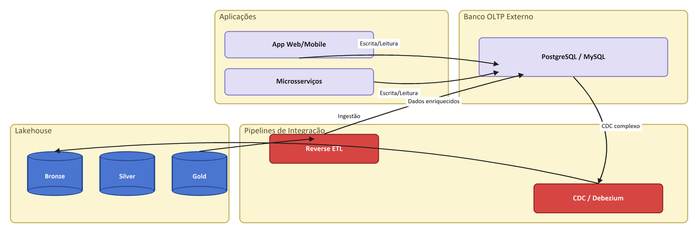
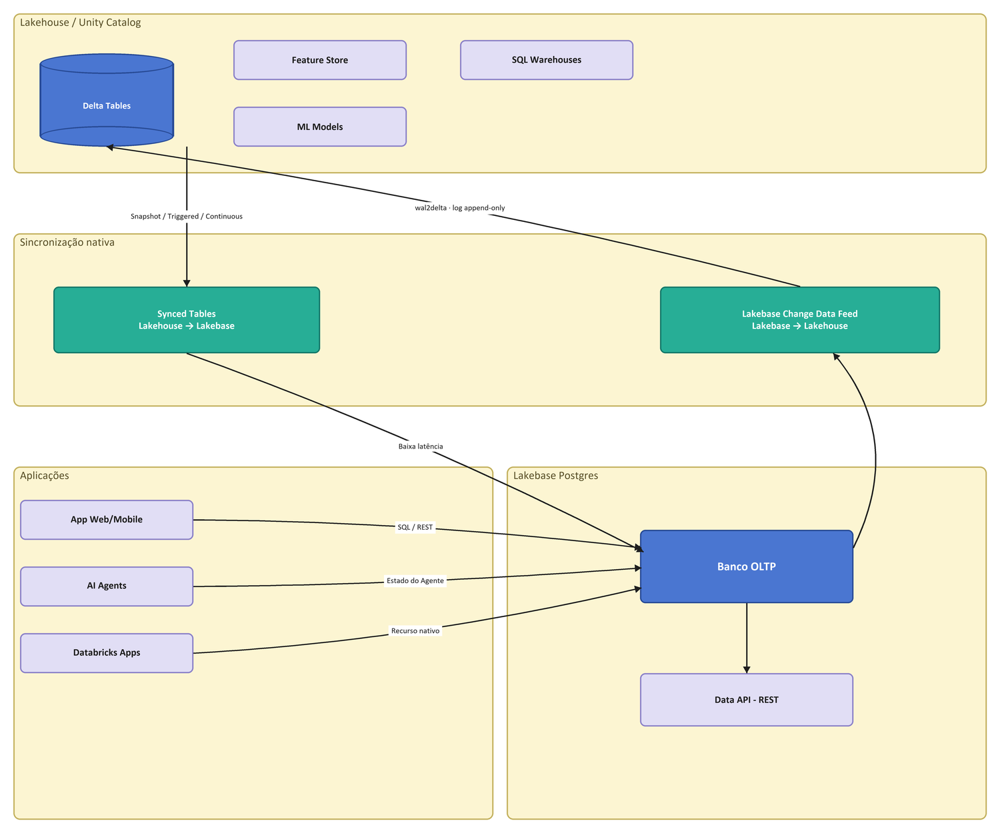
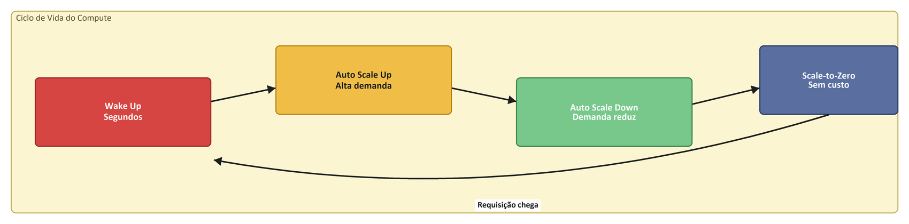
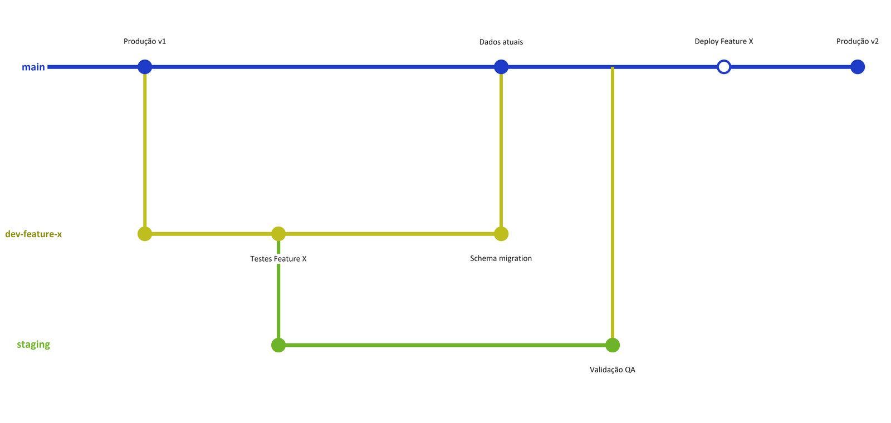
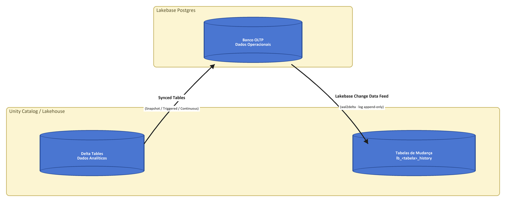

*Atualizado em 28/09/2026: corrigida a lista de regiões (o texto original trazia códigos da AWS), atualizada a seção de sincronização reversa pra refletir o Lakebase Change Data Feed, que substituiu o antigo Lakehouse Sync, corrigida a janela de restore, e adicionada menção a GA, read replicas, alta disponibilidade e suporte a Postgres 16/17/18.*

Imagine este cenário: seu time de dados construiu um lakehouse impecável. Pipelines de ingestão, camadas bronze/silver/gold, dashboards brilhando. Tudo está funcionando perfeitamente.

Até que alguém pergunta: "e a aplicação de produção? Onde ela armazena os dados transacionais?"

É aí que começa a dor de cabeça. Você precisa de um banco OLTP separado (Postgres, MySQL, DynamoDB...), pipelines de CDC pra levar os dados ao lakehouse, reverse ETL pra devolver dados enriquecidos à aplicação, e um time de infraestrutura pra manter tudo funcionando. O resultado é data silo, latência de sincronização, complexidade operacional e custo cada vez maior.

## Arquitetura tradicional, e seus pontos de dor

É assim que a maioria das empresas opera hoje:

Os pontos de dor dessa arquitetura são conhecidos de quem já operou algo parecido:

- Múltiplas ferramentas e fornecedores pra gerenciar.
- Latência significativa entre a escrita no OLTP e a disponibilidade no lakehouse.
- Governança fragmentada, já que o Unity Catalog não enxerga o banco externo.
- Custo operacional alto associado aos pipelines de sincronização.

## O que é o Lakebase

Lakebase é um banco de dados Postgres totalmente gerenciado e integrado nativamente à plataforma Azure Databricks, projetado pra preencher a lacuna entre workload transacional (OLTP) e analítico (OLAP), unificando os dois num único ecossistema.

Em termos simples: é como ter um servidor Postgres de alto desempenho vivendo dentro do seu lakehouse, com governança unificada via Unity Catalog, sincronização bidirecional nativa e recursos modernos como autoscaling, scale-to-zero e database branching.

Desde 2 de março de 2026, o Lakebase está em disponibilidade geral (GA) no Azure Databricks, com autoscaling, scale-to-zero, branching e instant restore como recursos GA. A plataforma suporta Postgres 16, 17 (versão padrão) e 18.

## A nova arquitetura com Lakebase

O que muda em relação ao modelo tradicional:

- Zero infraestrutura de banco de dados externo.
- Sincronização bidirecional nativa, sem Debezium, sem Airflow.
- Governança unificada por meio do Unity Catalog.
- Um único control plane pra OLTP e OLAP.

## As inovações arquiteturais do Lakebase

Lakebase não é só mais um Postgres gerenciado. Ele leva conceito moderno de engenharia de dados pro mundo transacional.

**Separação entre compute e storage.** Diferente de banco de dados tradicional, onde CPU e disco estão acoplados, o Lakebase separa completamente compute de storage. Cada um escala de forma independente, e você paga só pelo que usa.

**Copy-on-write storage.** O storage usa uma abordagem copy-on-write: quando você cria uma branch do banco, não há duplicação de dado, só a alteração é armazenada separadamente. Isso torna operação de branching e restore praticamente instantânea.

**Autoscaling e scale-to-zero.** O compute ajusta a capacidade automaticamente conforme a demanda. Em período de inatividade, o banco executa scale-to-zero, eliminando custo, e volta a acordar em segundos quando chega uma requisição nova.

**Read replicas.** Além do compute primário de leitura e escrita, dá pra adicionar réplicas de leitura, até 6 por branch, pra escalar consulta analítica e de relatório sem competir com o workload transacional principal.

**Alta disponibilidade.** Failover automático configurável por branch, mantendo o banco disponível mesmo quando o compute primário falha.

## Database branching: Git pros seus dados

Esse é provavelmente o recurso mais inovador. Assim como desenvolvedor cria branch no Git pra trabalhar numa feature isolada, o Lakebase deixa criar branch pro banco de dados inteiro.

Casos de uso poderosos:

- **Desenvolvimento:** cada desenvolvedor tem sua própria branch do banco de dados, sem interferir em produção.
- **Teste de migração:** teste alteração de schema numa branch isolada antes de aplicar em produção.
- **Instant restore:** restaure o banco pra qualquer ponto no tempo (janela configurável de 2 a 30 dias, padrão de 7 dias) criando uma branch a partir desse ponto.

## Sincronização bidirecional: o fim do reverse ETL

Uma das maiores vantagens é a sincronização nativa entre lakehouse e Lakebase:

**Synced Tables (lakehouse para Lakebase).** Tabela do Unity Catalog é sincronizada automaticamente com o Lakebase, permitindo que aplicação consulte dado analítico enriquecido com baixa latência. Há suporte aos modos snapshot, triggered e continuous.

**Lakebase Change Data Feed, CDF (Lakebase para lakehouse).** Esse recurso, antes chamado de Lakehouse Sync, foi reformulado: hoje é implementado pela extensão `wal2delta`, que captura a mudança direto do write-ahead log do Postgres e grava como Delta Table gerenciada no Unity Catalog (`lb_<tabela>_history`). Diferente da versão anterior, o destino não é mais uma dimensão SCD Type 2, e sim um log de eventos append-only: cada linha marcada com `_pg_change_type` (insert, delete, update_preimage, update_postimage), LSN e timestamp, no mesmo formato do Delta Change Data Feed. Ainda está em Public Preview.

**Minha leitura:** isso elimina completamente a necessidade de ferramenta externa de CDC (Debezium, Fivetran), pipeline de reverse ETL (Census, Hightouch) e job customizado de sincronização em Airflow ou Prefect. Pra quem já manteve essa esteira de ferramentas rodando, a economia de superfície operacional é o argumento que mais pesa, mais até do que a promessa de latência baixa. Vale só lembrar que, sendo Public Preview, o formato de destino (log append-only, não SCD Type 2) ainda pode evoluir antes de virar GA.

## Três casos de uso estratégicos

**Feature serving pra ML em tempo real.** O Lakebase funciona como online store pro Feature Store do Azure Databricks. Feature calculada no lakehouse é sincronizada via Synced Tables pro Lakebase, de onde o modelo de ML consulta com latência de milissegundos.

**Estado de AI Agents.** Agente de IA precisa persistir estado entre requisição, contexto de conversa, histórico de ação, dado de workflow. O Lakebase fornece banco de dados transacional nativo pra guardar esse estado com consistência ACID.

**Dado transacional pra aplicação.** Databricks Apps, ou qualquer aplicação externa, pode usar o Lakebase como banco de dados principal. A integração é nativa, basta adicionar o projeto Lakebase como resource na aplicação. Além disso, a Data API oferece interface REST compatível com PostgREST pra acesso HTTP direto.

## Comparação: antes e depois

| Aspecto | Sem Lakebase | Com Lakebase |
|---|---|---|
| Banco OLTP | Externo (RDS, Cloud SQL...) | Nativo na plataforma |
| Sincronização | CDC externo + reverse ETL | Bidirecional nativa |
| Governança | Fragmentada entre sistemas | Unity Catalog unificado |
| Scaling | Manual ou semiautomático | Autoscaling + scale-to-zero |
| Ambiente de teste | Dump/snapshot lento | Branching instantâneo |
| Custo de inatividade | Paga compute ocioso | Zero (scale-to-zero) |
| Time-to-recovery | Restore de backup (minutos/horas) | Instant restore (segundos) |
| Feature serving | Infra separada (Redis, DynamoDB) | Online store nativo |
| Réplicas de leitura | Configuração manual externa | Nativo, até 6 por branch |
| Alta disponibilidade | Depende de arquitetura externa | Failover automático nativo |

## Disponibilidade

O Lakebase Postgres Autoscaling está disponível nas seguintes regiões do Azure: eastus, eastus2, centralus, northcentralus, southcentralus, westus, westus2, canadacentral, brazilsouth, northeurope, uksouth, westeurope, francecentral, germanywestcentral, australiaeast, centralindia, southeastasia, eastasia e japaneast.

A presença em brazilsouth é particularmente relevante pra nós da comunidade brasileira, garantindo baixa latência pra aplicação hospedada no Brasil.

## O que isso não resolve

Vale o mesmo ceticismo saudável que aplico a qualquer feature nova: unificar OLTP e OLAP numa plataforma só resolve o problema de infraestrutura fragmentada, mas não resolve sozinho decisão de modelagem de dado, disciplina de schema entre ambiente, nem a curva de aprendizado de quem nunca operou Postgres em produção. E a cobertura de região ainda é uma lista fechada, então quem depende de uma região fora dela precisa esperar ou desenhar em volta disso.

## Conclusão

O Lakebase representa uma mudança de paradigma: em vez de tratar OLTP e OLAP como mundos separados que precisam de pontes complexas, ele os unifica numa única plataforma.

Pros times de dados brasileiros, isso significa menos ferramenta pra gerenciar e integrar, menos pipeline que quebra silenciosamente às três da manhã, mais tempo focado em gerar valor com dado, e governança real em todo o ciclo de vida do dado, da escrita transacional ao dashboard executivo.

O lakehouse finalmente tem seu banco de dados transacional nativo. E ele fala Postgres.

## Referências

- Microsoft Learn, "Lakebase Postgres - Azure Databricks": https://learn.microsoft.com/en-us/azure/databricks/oltp/projects/
- Microsoft Learn, "Lakebase Change Data Feed - Azure Databricks": https://learn.microsoft.com/en-us/azure/databricks/oltp/projects/lakebase-cdf
- Microsoft Learn, "Manage projects - Azure Databricks (region availability)": https://learn.microsoft.com/en-us/azure/databricks/oltp/projects/manage-projects
- Microsoft Learn, "Branches - Azure Databricks": https://learn.microsoft.com/en-us/azure/databricks/oltp/projects/branches
- Databricks Blog, "Databricks Lakebase is now Generally Available": https://www.databricks.com/blog/databricks-lakebase-generally-available
- Databricks, "Lakebase - Serverless Postgres for Agents and Apps": https://www.databricks.com/product/lakebase

#AzureDatabricks #Lakebase #Postgres #Arquitetura
