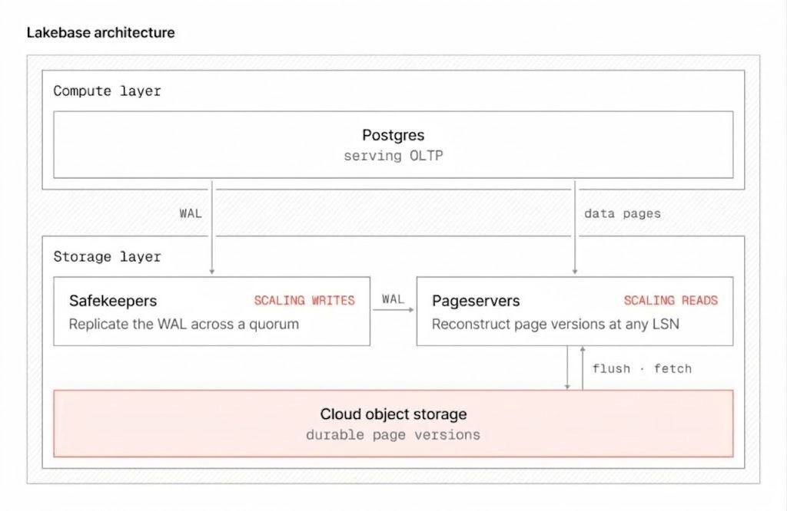

Carga em massa sempre teve o mesmo gargalo estrutural em qualquer banco transacional: existe um escritor primário, e cada linha inserida passa por ele, não importa quantos núcleos a máquina tenha disponível. Um cliente do Lakebase carregando cerca de 1 bilhão de linhas por dia via Synced Tables sentia exatamente isso, mais de 8 horas por carga, saturando CPU e memória do Postgres, e tendo que superdimensionar o recurso OLTP só para absorver aquele pico.

O LTAP Direct Writes, capacidade da arquitetura LTAP (Lake Transactional/Analytical Processing) do Azure Databricks, ataca esse problema de um jeito que não é só "paralelizar a escrita", é redesenhar onde a construção do dado acontece. A Databricks reporta carga de 1 TB em menos de 5 minutos depois dessa mudança, até 147 vezes mais rápido sem consumir recurso da aplicação viva.

## Por que Postgres não escala carga em massa linearmente com mais núcleo

Em qualquer Postgres padrão, toda escrita, não importa a origem, passa pela instância primária. Isso não é limitação de configuração, é a garantia transacional do próprio motor: o primário precisa coordenar a ordem de commit, manter consistência e gerenciar o write-ahead log numa sequência única. Jogar mais paralelismo no lado do cliente não ajuda muito quando o gargalo está no único processo que pode escrever de verdade.

É por isso que carga de bilhões de linha historicamente competia direto com a aplicação de produção pelo mesmo recurso de CPU e memória do primário, forçando a escolha entre throughput de carga e latência da aplicação.

## LTAP, rapidamente: um storage, duas formas de ler

A arquitetura LTAP separa compute de storage no Lakebase e, à medida que o dado é materializado em object storage, transcodifica a representação em linha do Postgres pra formato colunar Parquet, legível via Delta ou Iceberg. Isso cria uma cópia lógica única do dado, servida por dois motores especializados: Postgres pra workload transacional, engine analítico pra workload de OLAP, sem pipeline externo de CDC pra manter sincronizado.

Synced Tables, a capacidade que serve dado do lakehouse de volta pro Lakebase, é uma das implementações concretas dessa arquitetura, e é exatamente onde o LTAP Direct Writes entra como aceleração da carga inicial.

## Como o Direct Writes contorna o escritor único

O mecanismo central é tirar a construção do dado de dentro do primário e fazer isso em paralelo, fora dele:

- **Construção paralela de página**: cada executor Spark roda uma instância Postgres isolada (sandboxed) em modo de upgrade binário, o mesmo mecanismo que o `pg_upgrade` usa internamente. Cada sandbox reaproveita os OIDs de catálogo do destino, e o driver atribui faixas de OID que não se sobrepõem, pra objetos concorrentes não colidirem.
- **COPY binário congelado**: dentro de cada sandbox, um `COPY` binário com `FREEZE` constrói a fatia do heap daquele executor. Tuplas congeladas são tratadas como já commitadas, então o sandbox não precisa manter histórico de transação.
- **Checksum por página**: cada worker calcula checksum da própria página construída. O pageserver do Lakebase valida isso na ingestão, então página corrompida nunca se torna autoritativa.
- **Índice sem baixar o heap inteiro**: cada worker exporta as colunas-chave e o ID de tupla pra object storage. Um table access method customizado alimenta isso no construtor de B-tree padrão do Postgres, deslocando cada ponteiro de tupla pelo tamanho cumulativo das fatias anteriores. O heap completo nunca precisa ser baixado de volta pra construir o índice.
- **Handoff atômico**: o driver Spark escreve um manifesto e chama uma única função SQL. O primário registra a importação como um registro compacto de WAL, carregando só a descrição da importação, não o volume de dado inteiro. O pageserver reivindica os arquivos, aquece eles em SSD local, e o primário troca atomicamente o dado staged pra dentro da tabela visível ao usuário. Até esse commit, a tabela importada fica isolada.

O time que construiu isso é explícito: a técnica usa extensão de Postgres e um table access method customizado, sem modificar o core do Postgres.



## Mão na massa: criando uma Synced Table com Direct Writes

A capacidade que se beneficia do Direct Writes hoje é a criação de uma Synced Table. Via CLI, o comando básico (sem a aceleração ligada ainda, que por enquanto é um checkbox na UI, não um campo explícito documentado na API) se parece com isto:

```bash
databricks postgres create-synced-table main.vendas.pedidos_sync \
  --json '{
    "spec": {
      "source_table_full_name": "main.vendas.pedidos",
      "branch": "projects/meu-projeto/branches/production",
      "primary_key_columns": ["pedido_id"],
      "scheduling_policy": "SNAPSHOT",
      "postgres_database": "meudb",
      "create_database_objects_if_missing": true
    }
  }'
```

O detalhe que vale observar antes de rodar isso em volume grande: o LTAP Direct Writes acelera a carga inicial em todos os modos de sincronização, e acelera toda sincronização subsequente especificamente no modo `SNAPSHOT`, porque esse modo faz refresh completo a cada ciclo. Nos modos `TRIGGERED` e `CONTINUOUS`, a aceleração vale só pra carga inicial, as atualizações seguintes já são incrementais via Change Data Feed, não carga em massa.

## O que isso não resolve

O próprio time que construiu a funcionalidade admite a limitação mais importante: o benchmark de 147 vezes mede só o tempo de construção do heap, a construção de índice ainda não está paralelizada da mesma forma, e esse é um trabalho declaradamente em andamento. Isso significa que uma tabela com muitos índices secundários provavelmente não vê o mesmo ganho proporcional que uma tabela simples viu no benchmark divulgado.

Também vale registrar o status real de cada peça: registrar o Lakebase no Unity Catalog e servir dado via Synced Tables já são GA, mas o próprio LTAP Direct Writes ainda é Beta, exige Postgres 16, 17 ou 18 no projeto Lakebase, e só pode ser escolhido na criação da tabela, não adicionado depois. Pra aplicar numa tabela já existente, é preciso recriar ela do zero.

**Minha leitura:** o ganho de performance chama atenção, mas o detalhe arquitetural que mais importa é outro: a carga pesada sai de dentro do primário e vira trabalho do Spark, isolado, sem competir com a aplicação viva durante a execução. Isso resolve o problema real que o cliente citado tinha, que não era "carga lenta" isolado, era "carga lenta competindo por recurso com produção". Testaria isso primeiro numa tabela sem índice secundário complexo antes de assumir que o ganho de 147x se repete igual em qualquer schema.

## Resumindo

LTAP Direct Writes não é feature isolada, é a aplicação prática de separar compute de storage até dentro do próprio processo de carga em massa. Pra quem já usa Synced Tables e sente o peso de carga grande no primário, vale testar o Beta antes de assumir que overprovisionar o OLTP é a única saída.

## Referências

- Databricks Blog, "Load terabytes of data in minutes into Lakebase Postgres": https://www.databricks.com/blog/load-terabytes-data-minutes-lakebase-postgres
- Microsoft Learn, "LTAP architecture - Azure Databricks": https://learn.microsoft.com/en-us/azure/databricks/oltp/projects/ltap-overview
- Microsoft Learn, "Serve lakehouse data with synced tables": https://learn.microsoft.com/en-us/azure/databricks/oltp/projects/sync-tables
- Microsoft Learn, "Lakebase architecture - Azure Databricks": https://learn.microsoft.com/en-us/azure/databricks/oltp/projects/architecture
- Databricks Blog, "Lakebase LTAP: rethinking database storage": https://www.databricks.com/blog/lakebase-ltap-rethinking-database-storage

#AzureDatabricks #Lakebase #Postgres #LTAP
