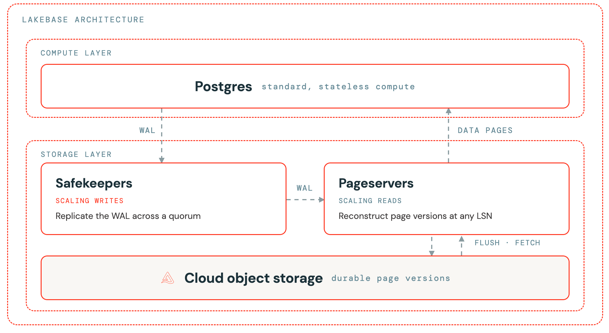

Todo engenheiro que já operou Postgres em produção aprendeu, de um jeito ou de outro, que ajustar `shared_buffers` é meio ritual, meio ciência exata. O valor clássico é algo como 25% da RAM disponível, e o resto fica por conta do cache de página do sistema operacional, que o Postgres nem enxerga diretamente. Esse acordo tácito entre banco e SO funciona bem quando os dois vivem na mesma máquina física, com o mesmo disco embaixo. O problema é que essa premissa desmorona assim que você desacopla compute de armazenamento, que é exatamente o que acontece dentro do Lakebase.

## O problema que a arquitetura desagregada cria

No Postgres tradicional, uma página que não está nos shared buffers cai no cache de página do SO, que por sua vez é backed por um filesystem local. Duas camadas de cache, uma decisão de despejo (eviction) coordenada implicitamente pelo kernel. No Lakebase, a camada de compute é stateless: o dado durável vive numa camada de storage separada, com pageservers reconstruindo versões de página sob demanda e safekeepers replicando o write-ahead log via consenso Paxos. Isso significa que uma leitura que não está em memória não cai num filesystem local rápido, ela pode significar uma viagem de rede até o pageserver. Duplicar cache (shared buffers + cache de SO) deixou de fazer sentido, porque não existe mais aquele segundo nível "de graça" que o SO oferecia.

## Como a Databricks reorganizou as camadas de cache



A solução documentada combina três frentes, cada uma endereçando um ponto de fricção diferente:

**Local File Cache (LFC)**: uma camada de cache autoscaling que roda em paralelo aos shared buffers, usando NVMe local como storage secundário. Ela absorve o volume de leitura que não cabe nos shared buffers sem exigir round-trip até a camada de storage remota.

**Shared buffers expandidos para compute fixo**: em instâncias com capacidade de computação (CU) alta e estável, o LFC foi desabilitado e os shared buffers foram configurados para ocupar até 75% da DRAM disponível. Faz sentido: quando a carga é previsível e o compute não escala pra baixo com frequência, vale mais a pena centralizar tudo num único nível de cache maior do que manter duas camadas coordenando entre si.

**Huge pages (2 MB) em toda a stack virtualizada**: essa é a parte que costuma passar despercebida. Numa VM, a tradução de endereço de memória passa por host, hypervisor e guest kernel. Com páginas de 4 KB (o padrão), o número de entradas na TLB (translation lookaside buffer) explode, gerando cache misses de tradução de endereço em cada camada. Usar páginas de 2 MB reduz drasticamente esse overhead.

**Minha leitura:** o motivo pelo qual gosto desse tipo de post é que ele expõe o trabalho de infraestrutura que normalmente fica invisível pro usuário final. Quem provisiona um banco no Lakebase não escolhe huge page nem decide se o LFC está ligado, mas é exatamente esse tipo de decisão de engenharia embaixo do capô que determina se o SLA de latência que a Databricks promete se sustenta sob carga real.

## Os números que a Databricks publicou

Os benchmarks divulgados mostram três cenários distintos, cada um batendo numa configuração diferente:

- Um caso com aproximadamente 2x de ganho em throughput e 5x de redução em leituras do storage remoto (de 8 mil pra 1,5 mil reads por segundo).
- Um segundo caso com 1,3x de ganho em throughput e taxa de acerto de cache (cache hit rate) próxima de 100%.
- Um terceiro caso com 5x de redução de uso de CPU (de 20 pra 4 núcleos) e 2x de throughput.
- Testes isolados de huge pages mostrando redução de cerca de 40% na tail latency (p99) e 30% em uso de CPU.

## Mão na massa: o que dá pra observar no seu próprio workload

Você não configura huge pages nem LFC manualmente no Lakebase, isso é gerenciado pela plataforma. Mas dá pra monitorar o efeito prático disso via métricas do Postgres. Um jeito simples de acompanhar taxa de acerto de cache dos shared buffers:

```sql
SELECT
    sum(heap_blks_read) AS heap_read,
    sum(heap_blks_hit) AS heap_hit,
    round(
        sum(heap_blks_hit)::numeric /
        nullif(sum(heap_blks_hit) + sum(heap_blks_read), 0),
        4
    ) AS cache_hit_ratio
FROM pg_statio_user_tables;
```

Se o `cache_hit_ratio` está consistentemente abaixo de 0.99 num workload que deveria caber em memória, vale investigar se o tamanho do compute (CU) escolhido está subdimensionado, porque no Lakebase isso se traduz diretamente em mais round-trips até a camada de storage remota, não só em mais uso de disco local como seria num Postgres convencional.

Outra query útil é olhar o tamanho efetivo do working set versus a memória disponível, pra decidir se vale a pena subir de tier de compute antes de tentar qualquer otimização de query:

```sql
SELECT pg_size_pretty(pg_database_size(current_database())) AS db_size;
```

## O que isso não resolve

Cache maior e mais eficiente não resolve query mal escrita, índice ausente, nem falta de particionamento em tabela grande. Se o padrão de acesso é aleatório demais, ou se o working set genuinamente não cabe em nenhuma configuração razoável de CU, nenhuma camada de cache turbina isso o suficiente. Também vale lembrar que shared buffers expandidos pra 75% da DRAM só fazem sentido em compute fixo e previsível; num compute que escala pra zero ou pra baixo com frequência, esse tipo de configuração estática provavelmente reintroduziria o problema que o LFC resolve.

**Na prática:** eu testaria o comportamento de failover e scale-to-zero com essas configurações de cache antes de assumir que o ganho de benchmark se replica em produção. Cache quente se perde em cold start, e o primeiro conjunto de queries depois de uma pausa de compute provavelmente não vê nenhum desses ganhos até "esquentar" de novo.

## Resumindo

O Lakebase precisou reinventar a lógica de cache do Postgres porque a premissa de compute e storage colados na mesma máquina não existe mais nesse modelo desagregado. A combinação de LFC autoscaling, shared buffers maiores pra compute fixo e huge pages na stack inteira entrega ganhos reais e documentados, mas é uma engenharia de infraestrutura que roda por trás da cena. Pra quem usa Lakebase no dia a dia, o valor prático está em monitorar cache hit ratio e dimensionar CU corretamente, não em tentar replicar manualmente o que a plataforma já faz.

## Referências

- [Improving Lakebase Postgres compute cache performance](https://www.databricks.com/blog/improving-lakebase-postgres-compute-cache) (blog oficial Databricks)
- [Lakebase Postgres architecture](https://docs.databricks.com/aws/en/oltp/projects/architecture) (documentação oficial)

#Databricks #Lakebase #Postgres #Performance
