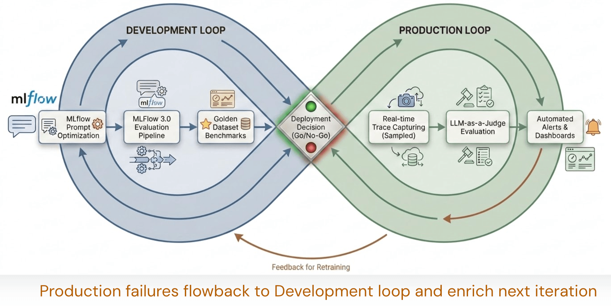

A maioria dos times que constrói agente de IA trata avaliação como uma etapa que acontece antes do deploy e depois nunca mais, um notebook rodado uma vez, um número de acurácia bonito num slide, e o agente vai pra produção sem nenhum mecanismo sistemático de saber se ele continua bom depois que o tráfego real, cheio de caso de borda que ninguém previu, começa a chegar. O resultado usual é um agente que degrada silenciosamente, e ninguém percebe até o cliente reclamar.

O case da Zepto usando Azure Databricks e MLflow ilustra um jeito diferente de organizar isso, tratando avaliação como um sistema com dois loops que se retroalimentam, não como um checkpoint único. A escala ajuda a evidenciar o padrão (80%+ de automação de ticket de suporte, redução de custo relatada em 65%), mas o valor real do case está na arquitetura de avaliação em si, que qualquer time construindo agente em produção pode replicar independente do volume de tráfego.

A composição do agente em si também merece nota: em vez de um agente monolítico tentando resolver todo tipo de ticket de suporte, a Zepto usa uma arquitetura composável, com agente especialista vertical pra cada tipo de problema (pedido errado, item faltante, prazo de validade, devolução, qualidade) e agente de supervisão horizontal cuidando de preocupação transversal como detecção de fraude e manipulação de imagem enviada pelo cliente. Isso importa pro tema de avaliação porque cada agente especialista pode ter seu próprio dataset dourado e seu próprio critério de qualidade, em vez de um critério genérico tentando cobrir toda a superfície de problema ao mesmo tempo.

## O mecanismo: dois loops, um portão de qualidade no meio

A arquitetura tem duas metades com propósito diferente:

- **Loop de desenvolvimento**: onde nova versão de agente é construída e iterada com confiança, testada contra um dataset de avaliação antes de qualquer coisa tocar tráfego real.
- **Loop de produção**: onde o comportamento ao vivo é monitorado e falha é detectada continuamente, com trace completo de cada interação.
- **Portão de qualidade**: controla a promoção entre os dois loops, uma versão só sobe pra produção se passar em critério objetivo definido previamente.



Por baixo dos dois loops, três peças técnicas do MLflow 3 sustentam o sistema:

1. **Tracing automático**, via `mlflow.<library>.autolog()` e o decorador `@mlflow.trace`, capturando prompt, resposta, documento recuperado, chamada de ferramenta e caminho de decisão como spans OpenTelemetry. Vale notar, pela documentação atual, que em compute serverless o autolog de tracing genAI não vem habilitado por padrão, precisa de chamada explícita.
2. **Dataset dourado**, com exemplo anotado cobrindo caso normal, caso de borda e caso de falha, crescendo ao longo do tempo (a Zepto foi de 500 pra mais de 5.200 exemplos).
3. **Scorers**, na terminologia atual do MLflow: juiz pronto (built-in judge) pra avaliação rápida, juiz customizado com critério e tipo de retorno flexível, e scorer baseado em código pra checagem determinística tipo formato ou correspondência exata. A combinação dos três forma o que a Zepto chama de "júri de IA", com 80 a 90% de calibração contra rótulo humano.

## Mão na massa: um scorer customizado simples com MLflow

Um exemplo de como fica um scorer básico combinando checagem determinística com um juiz de LLM, no espírito do que o MLflow 3 oferece:

```python
import mlflow
from mlflow.genai.scorers import scorer

@scorer
def resposta_cita_prazo_reembolso(inputs, outputs, trace):
    """Scorer baseado em código: valida se a resposta menciona prazo, exigência dura."""
    texto = outputs.get("resposta", "")
    tem_prazo = any(p in texto.lower() for p in ["dia útil", "dias úteis", "prazo de"])
    return {"passou": tem_prazo, "motivo": "menciona prazo" if tem_prazo else "sem prazo explícito"}

@mlflow.trace
def agente_suporte(pergunta: str) -> dict:
    resposta = chama_llm_com_contexto(pergunta)
    return {"resposta": resposta}

# Rodando avaliação contra o dataset dourado
resultado = mlflow.genai.evaluate(
    data=dataset_dourado,
    predict_fn=agente_suporte,
    scorers=[resposta_cita_prazo_reembolso],
)
```

Esse tipo de scorer determinístico é barato de rodar em todo trace de produção, o que viabiliza a amostragem estratificada por risco que a Zepto usa, cobrindo de 18% a 20% do tráfego total mas concentrando essa amostra em interação de maior risco, e obtendo, segundo o case, nove vezes mais detecção de caso de borda do que amostragem uniforme teria dado com o mesmo volume.

**Minha leitura:** o detalhe que mais chama atenção nesse case não é o número de redução de custo, é o fato de o dataset dourado ser tratado como ativo vivo que cresce dez vezes ao longo do projeto, não como um artefato congelado criado uma vez no início. Isso é trabalho manual real, alguém tem que rotular caso de borda continuamente, e é o tipo de investimento que a maioria dos times corta primeiro quando o prazo aperta. Eu testaria a calibração do júri de IA contra rótulo humano no meu próprio domínio antes de confiar no número de 80 a 90% relatado pela Zepto, porque calibração de juiz de LLM varia bastante conforme o tipo de conteúdo avaliado, resposta de suporte de e-commerce é mais fácil de julgar automaticamente do que, por exemplo, laudo médico ou parecer jurídico.

## Otimização de prompt automatizada fecha o loop

Uma peça que costuma passar batido nesse tipo de case é a otimização automatizada de prompt. O registro de prompt do MLflow (prompt registry) gera e testa variante de prompt contra os scorers já definidos, o que significa que a melhoria de prompt deixa de ser um processo manual de tentativa e erro feito por um engenheiro e passa a ser um processo mensurável, com cada variante avaliada contra o mesmo critério objetivo antes de ser promovida. Isso fecha o loop entre avaliação e desenvolvimento de um jeito que eu acho subestimado: o dataset dourado não serve só pra aprovar ou reprovar uma versão do agente, ele também serve como sinal de otimização pra gerar a próxima versão.

## O que isso não resolve

Vale dizer com clareza onde essa arquitetura tem limite:

- **Scorer baseado em LLM continua custando token**, e rodar júri de IA sobre volume alto de trace de produção sem estratégia de amostragem vira custo relevante rápido, daí a necessidade da amostragem estratificada, que por sua vez exige uma boa definição prévia do que é "interação de risco".
- **Portão de qualidade automatizado reduz, mas não elimina, risco de regressão silenciosa.** Um critério numérico bem calibrado hoje pode ficar desatualizado conforme o comportamento do usuário muda, o dataset dourado precisa de manutenção contínua pra continuar representativo.
- **Nada disso substitui desenho de agente bom.** Arquitetura de avaliação sofisticada não conserta um agente com prompt mal escrito ou ferramenta mal desenhada, ela só torna visível, mais rápido, que o agente está errando.

## Fechamento

O padrão de loop duplo com portão de qualidade é generalizável bem além de suporte ao cliente, qualquer agente de produção se beneficia de separar claramente "estou testando uma versão nova" de "estou monitorando o que está no ar", com um critério objetivo decidindo a travessia entre os dois. A parte de infraestrutura (MLflow tracing, scorers, dataset dourado) é replicável hoje. A parte de disciplina, manter o dataset crescendo e recalibrando o júri de IA, é o trabalho de verdade que a maioria dos times subestima.

## Referências

- Post oficial: [Evaluation-First AI Agents: How Zepto Scales Customer Support on Databricks and MLflow](https://www.databricks.com/blog/evaluation-first-ai-agents-how-zepto-scales-customer-support-databricks-and-mlflow)
- Documentação oficial: [Automatic tracing para GenAI](https://docs.databricks.com/aws/en/mlflow3/genai/tracing/app-instrumentation/automatic)
- Documentação oficial (Microsoft Learn): [Automatic tracing - Azure Databricks](https://learn.microsoft.com/en-us/azure/databricks/mlflow3/genai/tracing/app-instrumentation/automatic)
- Documentação oficial: [Scorers no MLflow GenAI](https://docs.databricks.com/aws/en/mlflow3/genai/eval-monitor/concepts/scorers)
- Documentação oficial (Microsoft Learn): [Scorers and LLM judges - Azure Databricks](https://learn.microsoft.com/en-us/azure/databricks/mlflow3/genai/eval-monitor/concepts/scorers)

#Databricks #MLflow #AIEngineering #Avaliação
