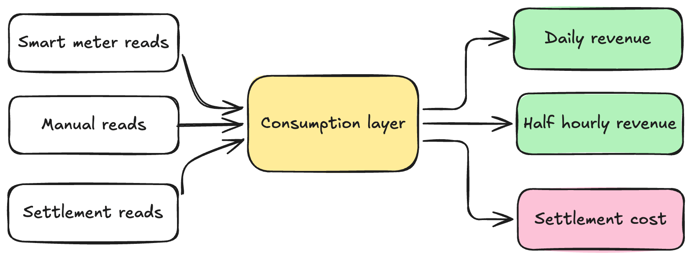

Existe um erro de design que se repete em pipeline de dados regulatório: tratar tudo com a mesma granularidade e a mesma frequência, só porque é mais simples de manter um pipeline só. O problema é que dado de liquidação regulatória, dado de receita pra tarifa dinâmica e dado de receita padrão têm SLAs completamente diferentes entre si, e forçar os três dentro do mesmo fluxo mensal monolítico significa reprocessar volume gigantesco de dado que, na prática, muda pouco. Foi exatamente esse o diagnóstico que levou a Octopus Energy a redesenhar o pipeline de MHHS (Market-wide Half-Hourly Settlement, o regime de liquidação de energia do Reino Unido) em três fluxos separados.

## O problema: um pipeline monolítico carregando três SLAs diferentes

O regime MHHS exige processar leitura de medidor a cada 30 minutos pra fins de liquidação regulatória. Antes da mudança, esse processamento era feito de forma mensal e monolítica, processando cerca de 25 bilhões de linhas por execução. Só que dentro desse volume gigantesco existiam três necessidades bem distintas: liquidação regulatória (que precisa de granularidade de meia hora, mas pode tolerar atraso de processamento), receita de tarifa smart (clientes com carro elétrico ou bomba de calor, que se beneficiam de dado mais fresco pra decisões de precificação dinâmica) e receita de tarifa padrão (que não precisa de granularidade fina, diária já é suficiente).

## A solução: arquitetura multi-grain com três fluxos independentes

A resposta da Octopus Energy foi parar de tratar isso como um problema só. A nova arquitetura separa em três streams paralelos:



1. **Settlement (meia hora)**: cobre a obrigação regulatória de custo, rodando na cadência exigida pelo regime MHHS.
2. **Revenue half-hourly**: cobre receita pra cliente com tarifa smart, na mesma granularidade de meia hora, porque esse segmento se beneficia de visibilidade fina.
3. **Daily revenue**: cobre receita de tarifa padrão, processada diariamente, porque a granularidade fina simplesmente não agrega valor pra esse segmento.

O ponto que amarra os três é uma camada de consumo unificada que reconcilia leitura de medidor contra liquidação, mesmo vindo de fluxos com granularidades diferentes. Sem essa camada, você teria três pipelines desconexos gerando visões inconsistentes entre si.

## As peças técnicas que sustentam o ganho

A arquitetura multi-grain sozinha não explica o ganho de custo, o que faz a diferença é a combinação com processamento incremental de verdade:

**Change Data Feed (CDF) do Delta Lake**: em vez de reprocessar a tabela inteira a cada execução, o pipeline passa a identificar apenas os registros que de fato mudaram desde a última execução, usando os metadados de mudança de linha do Delta Lake.

**dbt em microbatch com watermark**: o modelo incremental do dbt, combinado com watermark de tempo, evita reler dado histórico que já foi processado e não mudou.

**Adaptive Query Execution (AQE) do Spark**: ajusta o plano de execução da query em tempo real, com base em estatística real coletada durante a própria execução, em vez de depender só de estimativa estática feita antes de rodar.

**Databricks Serverless**: elimina a latência de start de cluster no ciclo de desenvolvimento iterativo, o que segundo a Octopus Energy foi relevante pra acelerar a própria reformulação do pipeline.

**Workflow "job of jobs"**: orquestra a dependência entre os três fluxos e a camada de consumo unificada, garantindo ordem de execução correta sem acoplamento rígido entre eles.

## Os números que sustentam o case

| Métrica | Antes | Depois |
|---|---|---|
| Linhas processadas | 25 bilhões | 300 milhões |
| Custo projetado por dia de dado MHHS | US$ 23,63 | US$ 0,48 |
| Frequência de atualização | Semanal | Diária |
| Volume de dado suportado | Baseline | 48x maior |

A redução de custo por unidade de dado processada gira em torno de 50x, com economia mensal projetada de aproximadamente US$ 83 mil frente à trajetória anterior, o que a empresa projeta em cerca de US$ 1 milhão anualizado (sem contar economia adicional em etapas anteriores do pipeline).

**Minha leitura:** o número de 98,8% de redução em linhas processadas (de 25 bilhões pra 300 milhões) é mais revelador que o número de custo em dólar, porque ele mostra que a maior parte daquele processamento anterior era, na prática, trabalho redundante. Reprocessar dado que não mudou, numa granularidade mais fina do que o necessário pra boa parte do volume, é o tipo de ineficiência que só aparece quando alguém para pra segmentar o problema por SLA real, em vez de aceitar "processa tudo igual" como default.

## Mão na massa: um exemplo de leitura incremental via CDF

O padrão central, ler só o que mudou usando Change Data Feed, é replicável em qualquer tabela Delta. Um exemplo de consulta incremental usando `table_changes`, guardando o último ponto processado:

```sql
-- habilita CDF numa tabela existente de leitura de medidor
ALTER TABLE bronze.leituras_medidor
SET TBLPROPERTIES (delta.enableChangeDataFeed = true);

-- lê só as mudanças desde a última versão processada,
-- em vez de reprocessar a tabela inteira
SELECT
    medidor_id,
    timestamp_leitura,
    valor_kwh,
    _change_type
FROM table_changes('bronze.leituras_medidor', :ultima_versao_processada)
WHERE _change_type IN ('insert', 'update_postimage');
```

Em modelo dbt incremental, o equivalente seria configurar o materialization como `incremental` com uma estratégia de merge baseada nessa mesma coluna de mudança, processando só o delta a cada execução em vez da tabela inteira.

## O que isso não resolve

Arquitetura multi-grain exige disciplina de modelagem que não é trivial de manter: toda vez que uma regra de negócio muda (por exemplo, um novo tipo de tarifa que precisa de granularidade diferente das três já existentes), alguém precisa decidir conscientemente em qual fluxo ela entra, e ajustar a camada de consumo unificada pra continuar reconciliando corretamente. Além disso, separar fluxos por SLA adiciona complexidade operacional real: mais pipelines pra monitorar, mais pontos de falha possíveis, e uma dependência maior de que o "job of jobs" orquestre a ordem certa. É trade-off, não solução isenta de custo.

## Resumindo

O ganho de 50x na Octopus Energy não veio de uma feature isolada, veio de reconhecer que dado de liquidação regulatória, receita de tarifa smart e receita de tarifa padrão simplesmente não deveriam competir pelo mesmo pipeline mensal monolítico. Separar por granularidade real, e usar CDF, AQE e processamento incremental de verdade dentro de cada fluxo, é o tipo de decisão de arquitetura que qualquer time de engenharia de dados lidando com regulação ou multiplicidade de SLA deveria revisitar antes de simplesmente pedir mais compute pro mesmo pipeline de sempre.

## Referências

- [Scaling MHHS: how Octopus Energy achieved 50x cost reduction in margin data engineering](https://www.databricks.com/blog/scaling-mhhs-how-octopus-energy-achieved-50x-cost-reduction-margin-data-engineering) (blog oficial Databricks)
- [Delta Lake Change Data Feed](https://docs.databricks.com/aws/en/delta/delta-change-data-feed) (documentação oficial)
- [Use change data feed on Azure Databricks](https://learn.microsoft.com/en-us/azure/databricks/tables/features/change-data-feed) (Microsoft Learn)

#Databricks #DeltaLake #DataEngineering #Custo
