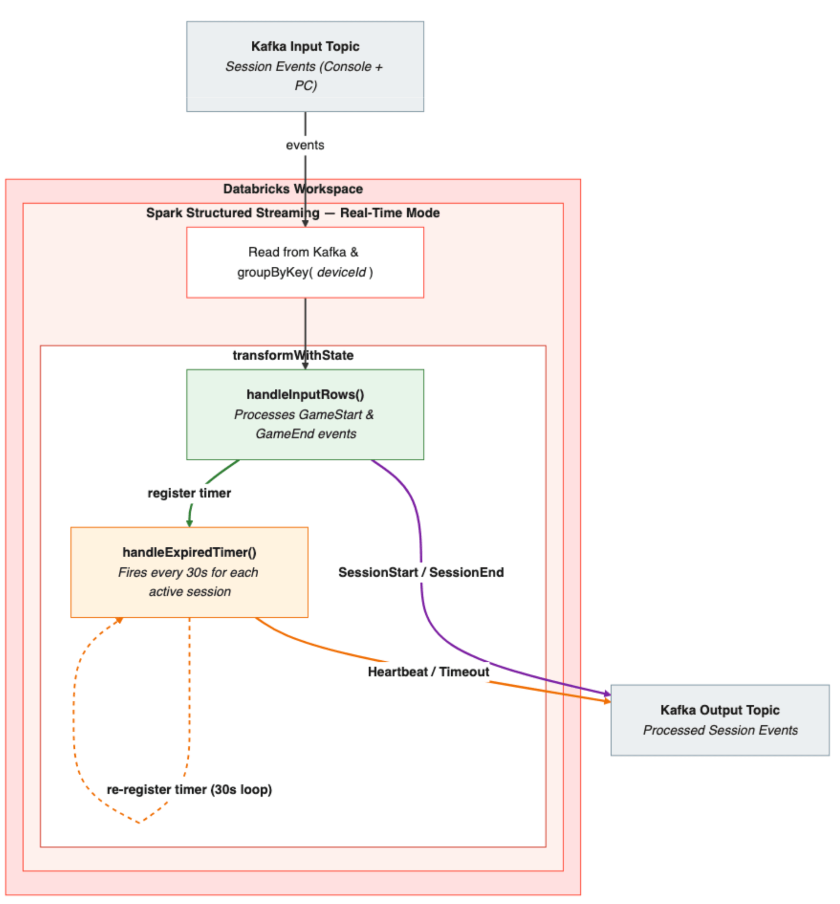

Sessionização parece um problema resolvido até você tentar fazer em tempo real e em escala de milhões de usuários simultâneos. O desafio não é detectar quando uma sessão começa, é decidir quando ela terminou. Se o jogador simplesmente para de mandar evento (fecha o app, cai a conexão, trava o celular), não existe nenhum evento explícito de "fim de sessão" pra disparar o fechamento. O jeito clássico de resolver isso em micro-batch é esperar uma janela de inatividade fechar, o que introduz atraso estrutural exatamente no momento em que você mais precisa de dado fresco: para personalizar conteúdo, recomendar próxima ação ou decidir agendamento dinâmico enquanto o jogador ainda está ativo.

## O problema específico de sessionização em tempo real

Numa plataforma de gaming com alcance global, a escala descrita é considerável: 4 milhões de sessões ativas simultaneamente, com cerca de 500 mil eventos de início e fim de sessão por minuto, mais 8 milhões de registros de heartbeat por minuto vindos de clientes ainda conectados. Em micro-batch tradicional, cada janela de processamento adiciona latência ao fechamento de sessão, e a decisão de "essa sessão expirou por inatividade" só é reavaliada quando o próximo batch roda, não no instante exato em que o timeout de fato acontece.

## O mecanismo: transformWithState com timers nativos



O operador `transformWithState` do Structured Streaming permite lógica de estado customizada por chave de agrupamento, e oferece dois métodos que trabalham em conjunto pra resolver exatamente o problema de sessão sem evento de fechamento explícito:

**handleInputRows()**: processa cada evento recebido de forma reativa, atualizando o estado da sessão (início, heartbeat, ou fim explícito quando o cliente envia esse sinal).

**handleExpiredTimer()**: dispara de forma proativa quando um timer configurado anteriormente expira, independentemente de ter chegado algum dado novo pra aquela chave. É esse método que resolve o caso da sessão abandonada sem aviso: você registra um timer no momento do último evento recebido, e se nenhum evento novo chegar antes do timer expirar, `handleExpiredTimer` fecha a sessão automaticamente, sem depender de uma janela de batch fechar.

O resultado é que uma única classe de processador stateful cobre o ciclo de vida inteiro da sessão, tanto o caminho reativo (evento chegou) quanto o proativo (nada chegou, e já passou tempo suficiente pra considerar encerrado).

## Os números: Real-Time Mode contra micro-batch

A comparação publicada mostra:

- Latência p99 de 432 milissegundos em Real-Time Mode.
- Ganho de aproximadamente 20x em relação ao mesmo pipeline rodando em modo micro-batch.

**Minha leitura:** o número de 20x chama atenção, mas o que considero mais relevante aqui é estrutural, não só de velocidade: em micro-batch, mesmo que você reduza a janela pra um segundo, você ainda paga o custo de reavaliar tudo periodicamente. Com timer nativo, o sistema só reage exatamente quando precisa, no momento exato do timeout, não numa próxima checagem agendada. É uma mudança de "polling" pra "evento", dentro do próprio motor de streaming, e isso importa mais pro caso de uso do que só a redução de latência média.

## Mão na massa: esqueleto de sessionização com transformWithState

Um exemplo simplificado do padrão de handleInputRows + handleExpiredTimer pra fechar sessão por inatividade:

```python
from pyspark.sql.streaming import StatefulProcessor, StatefulProcessorHandle
from pyspark.sql.types import StructType, StructField, StringType, LongType

TIMEOUT_MS = 5 * 60 * 1000  # 5 minutos de inatividade encerra a sessão

class SessionizerProcessor(StatefulProcessor):
    def init(self, handle: StatefulProcessorHandle):
        self.handle = handle
        self.state = handle.getValueState("sessao_ativa", schema="last_event_ts LONG, started_at LONG")

    def handleInputRows(self, key, rows, timer_values):
        estado_atual = self.state.get()
        agora = timer_values.get_current_processing_time_in_ms()

        if estado_atual is None:
            self.state.update({"last_event_ts": agora, "started_at": agora})
        else:
            self.state.update({"last_event_ts": agora, "started_at": estado_atual["started_at"]})

        # renova o timer de expiração a cada evento novo
        self.handle.registerTimer(agora + TIMEOUT_MS)

    def handleExpiredTimer(self, key, timer_values, expired_timer_info):
        estado_atual = self.state.get()
        if estado_atual is not None:
            duracao = timer_values.get_current_processing_time_in_ms() - estado_atual["started_at"]
            yield {"player_id": key, "session_duration_ms": duracao, "status": "encerrada_por_inatividade"}
            self.state.clear()
```

O detalhe que faz esse padrão funcionar é o timer sendo re-registrado a cada evento novo: enquanto o jogador continua ativo, o timer nunca dispara. No instante em que os eventos param, o timer configurado anteriormente expira e fecha a sessão sozinho, sem esperar próximo batch.

## O que muda no consumo downstream

Uma implicação prática que costuma passar batido: sessão fechada por `handleExpiredTimer` chega no destino (tabela Delta, fila de saída, sistema de personalização) de um jeito estruturalmente diferente de uma sessão fechada por evento explícito, mesmo que o schema de saída seja idêntico. Sessão fechada por evento reflete uma ação real do cliente (usuário saiu do app deliberadamente); sessão fechada por timer reflete uma inferência da plataforma sobre inatividade. Sistemas consumidores que tomam decisão de negócio em cima desse dado, como calcular tempo médio de sessão pra dimensionar capacidade de servidor de jogo, deveriam considerar guardar esse metadado (motivo do fechamento) como coluna própria, porque duração de sessão encerrada por timeout de 5 minutos embute uma imprecisão de até 5 minutos na duração real, enquanto duração de sessão fechada por evento explícito é exata. Ignorar essa diferença tende a distorcer métrica agregada de forma sutil, mas sistemática, sempre subindo a duração média reportada.

## O que isso não resolve

Timer nativo resolve o fechamento de sessão sem evento explícito, mas não resolve reconciliação de sessão em cenário de reconexão. Se o jogador cai e reconecta rapidamente com um novo identificador de conexão, decidir se isso é a "mesma sessão continuando" ou uma "sessão nova" ainda é uma regra de negócio que precisa ser modelada explicitamente, o motor de streaming não infere isso sozinho. Também vale registrar uma limitação documentada: `transformWithStateInPandas` não funciona em modo real-time, então times que já usam esse operador em Pandas API precisam migrar pra API nativa Scala/Python antes de adotar Real-Time Mode.

## Resumindo

Sessionização em tempo real de milhões de usuários simultâneos é um problema onde a estrutura importa mais que a força bruta. Handler reativo pra evento que chega e handler proativo pra timeout que expira, os dois dentro do mesmo processador stateful, resolvem de forma nativa um problema que historicamente exigia gambiarra de janela de batch cada vez menor. O ganho de 20x reportado é real, mas o valor está em não precisar mais decidir entre latência baixa e complexidade de implementação.

## Referências

- [Apache Spark Real-Time Mode for gaming: a better way to do real-time sessionization](https://www.databricks.com/blog/apache-spark-real-time-mode-gaming-better-way-do-real-time-sessionization) (blog oficial Databricks)
- [Apache Spark Structured Streaming Real-Time Mode: concepts](https://docs.databricks.com/aws/en/structured-streaming/real-time/concepts) (documentação oficial)
- [Stateful applications with transformWithState](https://docs.databricks.com/aws/en/stateful-applications/) (documentação oficial)

#Databricks #ApacheSpark #Streaming #Gaming
