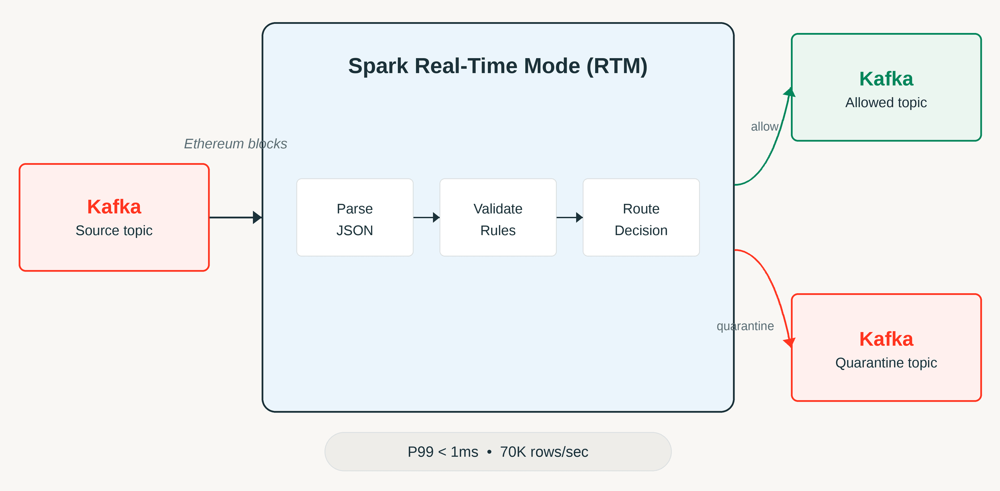

Detecção de anomalia em streaming quase sempre esbarra na mesma parede: o micro-batch. Structured Streaming tradicional processa em janelas de um a dois segundos, o que é rápido pra maioria dos casos de uso, mas péssimo quando o próprio ato de esperar o batch fechar já é tarde demais. Fraude, validação de payload sensível, dado corrompido entrando num pipeline crítico, esses cenários não toleram nem um segundo de atraso estrutural. O Real-Time Mode do Apache Spark existe pra atacar exatamente essa lacuna, e a Databricks publicou um experimento que usa um caso de uso concreto pra provar o ponto: analisar transações de blockchain em tempo real.

## O que muda estruturalmente no Real-Time Mode

Diferente do trigger de micro-batch, o Real-Time Mode processa dados conforme eles chegam, sem esperar uma janela fechar. Isso é possível por três mudanças arquiteturais combinadas: fluxo contínuo de dados entre estágios (em vez de materializar resultado intermediário a cada batch), agendamento simultâneo de todos os estágios da query (em vez de agendar estágio por estágio), e shuffle de streaming em memória entre os estágios, eliminando o custo de escrever e ler shuffle files a cada rodada.

Na prática, isso aproxima o Spark Structured Streaming de um modelo de processamento contínuo, algo historicamente associado a engines como Flink, mas dentro do mesmo runtime que já roda o resto do pipeline batch e streaming da sua organização.

## O experimento: transações Ethereum como teste de estresse



O time da Databricks montou um pipeline que ingere blocos e transações da blockchain Ethereum e classifica cada evento como `ALLOW` ou `QUARANTINE`, baseado em duas checagens:

- **Validação de invariante de protocolo**: um bloco onde `gas_used` é maior que `gas_limit` é logicamente impossível dentro das regras do próprio protocolo Ethereum, então vira sinal automático de dado corrompido ou malformado.
- **Higiene de payload**: o campo `extra_data` do bloco é inspecionado atrás de padrões que não deveriam estar ali, como fragmento de PII, token JWT ou chave de acesso da AWS vazada acidentalmente.

O cluster usado foi um Databricks Runtime 16.4 LTS, quatro workers i3.xlarge, modo single-user dedicado, com o Photon desabilitado propositalmente pra isolar o efeito do próprio Real-Time Mode.

## Os números que sustentam a promessa

- Taxa de entrada sustentada de aproximadamente 65.592 linhas por segundo.
- Taxa de processamento sustentada de aproximadamente 69.713 linhas por segundo (o motor conseguiu absorver a entrada sem acumular backlog).
- Mais de 23,2 milhões de mensagens processadas no total do experimento.
- Latência p95 abaixo de 0,5 milissegundo.
- Latência p99 de 1 milissegundo.

Pra contextualizar: micro-batch tradicional de 1-2 segundos representa uma diferença de três ordens de grandeza na latência de detecção. Se o objetivo é interromper uma transação suspeita antes que ela se propague, essa diferença não é cosmética.

## Mão na massa: um esqueleto de classificação em tempo real

O padrão de "classificar e rotear" descrito no experimento pode ser reproduzido em qualquer schema de evento estruturado. Um exemplo simplificado usando `transformWithState`, o operador que dá acesso a lógica customizada de estado dentro do Structured Streaming:

```python
from pyspark.sql.streaming import StatefulProcessor, StatefulProcessorHandle
from pyspark.sql.types import StructType, StructField, StringType, LongType

class BlockValidator(StatefulProcessor):
    def init(self, handle: StatefulProcessorHandle):
        self.handle = handle

    def handleInputRows(self, key, rows, timer_values):
        for row in rows:
            status = "ALLOW"
            if row["gas_used"] > row["gas_limit"]:
                status = "QUARANTINE"
            elif self._contem_padrao_sensivel(row["extra_data"]):
                status = "QUARANTINE"
            yield {"block_id": row["block_id"], "status": status}

    def _contem_padrao_sensivel(self, payload: str) -> bool:
        marcadores = ["AKIA", "eyJhbGciOi", "-----BEGIN"]
        return any(m in (payload or "") for m in marcadores)

query = (
    spark.readStream.table("bronze.eth_blocks")
    .groupBy("block_id")
    .transformWithState(
        statefulProcessor=BlockValidator(),
        outputStructType=StructType([
            StructField("block_id", LongType()),
            StructField("status", StringType()),
        ]),
    )
    .writeStream
    .trigger(availableNow=False)  # trigger real-time é configurado via cluster/runtime
    .toTable("silver.eth_blocks_classified")
)
```

Vale reforçar: ativar o Real-Time Mode em si depende de configuração no nível de runtime e cluster, não é só trocar o trigger na API, então a documentação oficial de referência deve ser consultada antes de rodar em produção.

**Na prática:** eu testaria esse tipo de pipeline sob picos reais de carga, não só sob taxa constante, antes de confiar cegamente no número de p99. Blockchain real tem rajadas de transação bem mais irregulares que um teste sintético de throughput constante, e é sob rajada que qualquer sistema de baixa latência costuma mostrar o comportamento real de fila.

## Por que blockchain foi uma escolha inteligente de benchmark

Vale parar um momento no motivo de usar blockchain como cenário de teste, porque não é óbvio à primeira vista. Transação de blockchain tem duas propriedades que a tornam um teste de estresse honesto pra sistema de detecção de anomalia: primeiro, o volume é público e replicável, qualquer pessoa pode auditar o dataset usado, o que reduz a chance de benchmark artificialmente favorável. Segundo, e mais importante, as regras de invariante do protocolo (como `gas_used` nunca poder ultrapassar `gas_limit`) são conhecidas e verificáveis de forma determinística, então não existe ambiguidade sobre o que conta como anomalia real versus falso positivo. Isso remove uma variável de confusão comum em benchmark de detecção de anomalia, onde a própria definição de "anomalia" já é subjetiva. Aplicado a um cenário corporativo, o equivalente seria ter regras de negócio claras e auditáveis (limite de crédito, faixa de valor esperado, formato de campo) antes de tentar aplicar esse tipo de classificação em tempo real; sem isso, o pipeline técnico até funciona, mas a qualidade da classificação despenca.

## O que isso não resolve

Real-Time Mode reduz drasticamente a latência de processamento, mas não substitui a necessidade de uma boa estratégia de resposta ao dado suspeito. Classificar como `QUARANTINE` em um milissegundo não adianta nada se o processo humano ou automatizado que trata esse alerta ainda leva minutos ou horas pra agir. Também é importante notar as limitações documentadas do `transformWithState` em modo real-time: `transformWithStateInPandas` não é suportado nesse modo, e o gerenciamento de estado (timers, TTL) tem regras próprias que diferem do modo de micro-batch tradicional, o que exige atenção redobrada ao migrar um pipeline existente.

## Resumindo

O experimento com blockchain Ethereum funciona como prova de conceito de algo mais amplo: quando o próprio Spark Structured Streaming consegue operar na casa de milissegundos, cenários que antes exigiam sair do ecossistema Spark (fraude, validação crítica, alerta operacional imediato) passam a caber dentro do mesmo runtime que já processa o resto do seu pipeline de dados. Vale testar, mas com expectativa realista sobre o que ainda depende de decisão e resposta humana depois da detecção.

## Referências

- [Ultra-fast anomaly detection using Apache Spark Real-Time Mode](https://www.databricks.com/blog/ultra-fast-anomaly-detection-using-apache-spark-real-time-mode) (blog oficial Databricks)
- [Apache Spark Structured Streaming Real-Time Mode: concepts](https://docs.databricks.com/aws/en/structured-streaming/real-time/concepts) (documentação oficial)
- [Stateful applications with transformWithState](https://docs.databricks.com/aws/en/stateful-applications/) (documentação oficial)

#Databricks #ApacheSpark #Streaming #DataEngineering
