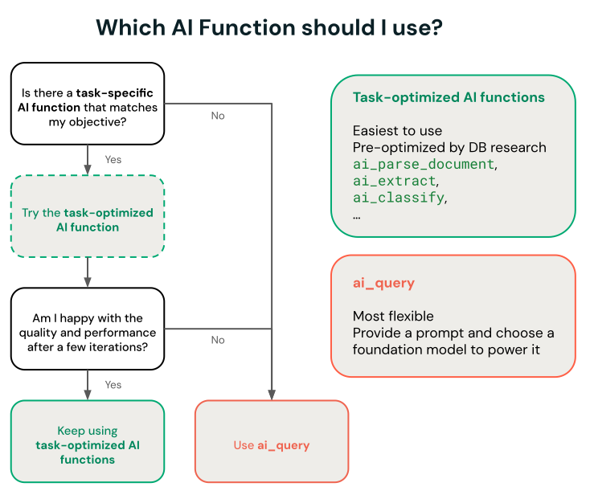

Todo mundo que já colocou um LLM pra classificar coisa em massa, triagem de ticket, moderação de conteúdo, roteamento de fila, sabe o incômodo: você está pagando o preço de um modelo que sabe escrever poesia só pra escolher entre "urgente" e "não urgente". O modelo de raciocínio geral é ótimo quando a pergunta é aberta, mas quando a resposta certa já está entre um punhado de opções conhecidas, ele vira overkill caro e lento.

Uma classe de modelo mais nova ataca exatamente esse ponto: em vez de gerar texto livre, o modelo recebe um conjunto discreto de opções e devolve uma decisão calibrada, com probabilidade por opção, numa fração do custo e da latência de um modelo de chat. E o detalhe que interessa a quem trabalha com dado: dá pra consultar esse tipo de modelo direto do SQL, sobre tabela governada pelo Unity Catalog, sem escrever uma linha de código de orquestração de agente.

## O que muda quando o modelo só precisa decidir, não conversar

Modelo de decisão não é uma versão menor de LLM, é uma categoria diferente de propósito. Ele não mantém contexto de conversa, não gera explicação em linguagem natural por padrão, e não tenta ser útil pra qualquer pergunta. Ele resolve um problema estreito: dado um conjunto fixo de rótulos possíveis, qual é o mais provável para esse input, e com que confiança.

Isso importa porque a maior parte do trabalho real de classificação em produção, moderação, roteamento, triagem, scoring de risco, já é fundamentalmente esse tipo de decisão fechada. Rodar um modelo de raciocínio geral pra esse tipo de tarefa é como contratar um consultor sênior pra carimbar formulário: funciona, mas o custo por decisão não faz sentido em escala.

## ai_query: a ponte entre o modelo e o dado que já está no Unity Catalog

O Azure Databricks expõe `ai_query`, uma AI Function de propósito geral que consulta qualquer modelo suportado direto do SQL ou do Python, sem precisar montar pipeline de inferência à parte. A diferença dela para as AI Functions específicas de tarefa (`ai_classify`, `ai_summarize` e afins) é o controle: `ai_query` deixa escolher o modelo, o prompt e os parâmetros manualmente, o que é exatamente o que se precisa pra apontar pra um modelo de decisão customizado hospedado num endpoint próprio de Model Serving.

Dois requisitos que vale checar antes de tentar: `ai_query` não roda em SQL warehouse Classic, precisa de Serverless; e o Databricks Runtime mínimo é 15.4 LTS, com 18.2 ou superior recomendado pra melhor desempenho.



## Mão na massa: consultando um modelo de decisão customizado

Modelo de decisão custom, do tipo Jev, normalmente não expõe uma interface padrão de chat completions, é servido como endpoint de Model Serving tradicional, e a chamada via `ai_query` usa a sintaxe de modelo customizado, com `endpoint`, `request` e `returnType` explícitos:

```sql
SELECT
  ticket_id,
  descricao,
  ai_query(
    endpoint => "triagem-suporte-decisao",
    request => named_struct(
      "texto", descricao,
      "canal", canal_origem,
      "cliente_plano", plano_contratado
    ),
    returnType => "STRUCT<categoria: STRING, urgencia: STRING, confianca: DOUBLE>"
  ) AS decisao
FROM suporte.tickets_abertos
WHERE status = 'novo';
```

O retorno estruturado (`categoria`, `urgencia`, `confianca`) já sai pronto pra virar coluna de uma tabela Delta, sem parsing de texto livre nem regex pra extrair campo de resposta de chat. É o mesmo padrão que a documentação oficial usa pra modelo de ML tradicional (o exemplo deles é um classificador de spam), só trocando o endpoint pelo modelo de decisão.

**Minha leitura:** o ganho aqui não é só custo por chamada, é arquitetural. Colocar a decisão dentro do próprio SQL means que o resultado nasce como coluna de tabela governada, direto no lugar onde a linhagem, a permissão de acesso e o histórico de mudança do Unity Catalog já se aplicam. Comparado a um pipeline de agente separado que escreve de volta pro lakehouse depois, é uma superfície de falha a menos.

## Três jeitos de hospedar o modelo, três níveis de esforço operacional

`ai_query` aceita três categorias de modelo, e a escolha entre elas muda bastante o quanto de infraestrutura sobra pra alguém manter:

**Modelo hospedado pela própria plataforma** (`system.ai.*`), como as famílias Claude, Llama e Qwen já disponibilizadas como serviço. Não exige provisionar nada, escala sozinho, e é a opção recomendada pra quem só precisa de inferência em lote sem customização de peso do modelo.

**Modelo com provisioned throughput**, pra quem já fez fine-tuning de um foundation model ou precisa de capacidade reservada. Aqui o endpoint de Model Serving precisa ser criado e dimensionado manualmente, mas o `ai_query` ainda cuida da paralelização e do retry da consulta em lote, não usa a capacidade do endpoint pra isso.

**Modelo customizado ou externo**, categoria onde entra um modelo de decisão tipo Jev: modelo de ML tradicional, treinado fora do ecossistema de foundation models, ou hospedado fora do Azure Databricks via endpoint de modelo externo. É a opção com mais controle e também a que exige mais decisão de infraestrutura por conta própria, criar e manter o endpoint de serving é responsabilidade de quem opera.

Pra quem está decidindo onde investir esforço de plataforma, essa lista já é um roteiro de priorização: comece pelo que o Azure Databricks hospeda de graça, e só desça pra opção customizada quando o modelo específico da tarefa justificar o trabalho extra de operar o endpoint.

## Governança pelo Unity Gateway, com uma ressalva real

Chamada de `ai_query` pra modelo hospedado (`system.ai.*`) passa automaticamente pelo Unity Gateway, mas só um subconjunto das funcionalidades de gateway se aplica a essa rota: rastreamento de uso e integração de orçamento (inclusive limite rígido de gasto) funcionam normalmente, mas guardrails via service policy, inference tables, tracing tables, rate limit e fallback entre provedor não se aplicam a chamada roteada por `ai_query`. Isso é fácil de assumir que "já vem incluso" e descobrir depois, em produção, que não vem.

## O que isso não resolve

`ai_query` resolve o transporte da chamada, não a qualidade da decisão. Modelo de decisão customizado ainda depende de curadoria de treino e avaliação com dado de verdade (ground truth), a documentação inclusive recomenda usar Agent Evaluation pra medir acurácia do batch antes de confiar no resultado em produção. E, ao contrário dos modelos `system.ai` hospedados pela própria plataforma, modelo fine-tuned ou totalmente customizado ainda exige provisionar e manter o endpoint de Model Serving por conta própria, sem o autoscaling automático que os modelos hospedados nativamente ganham de graça.

## Resumindo

Nem todo problema com IA é um problema de conversa. Quando a saída é uma decisão dentro de um conjunto fechado de opções, um modelo de decisão consultado via `ai_query` tende a custar menos, responder mais rápido e se integrar melhor com o dado que já mora no Unity Catalog do que montar mais um agente conversacional pra fazer a mesma triagem. **Na prática:** a pergunta que vale fazer antes de escrever o próximo prompt de classificação é simples: isso aqui é uma decisão entre opções conhecidas, ou é genuinamente uma pergunta aberta? A resposta muda completamente que tipo de modelo faz sentido pagar.

## Referências

- Databricks Docs, "Use ai_query": https://docs.databricks.com/aws/en/large-language-models/ai-query
- Microsoft Learn, "Use ai_query - Azure Databricks": https://learn.microsoft.com/en-us/azure/databricks/large-language-models/ai-query
- Databricks Docs, "ai_query function": https://docs.databricks.com/aws/en/sql/language-manual/functions/ai_query
- Microsoft Learn, "Structured outputs on Azure Databricks": https://learn.microsoft.com/en-us/azure/databricks/machine-learning/model-serving/structured-outputs
- Databricks Blog, "Running open-Jev in SQL on Databricks": https://www.databricks.com/blog/running-open-jev-sql-databricks

#AzureDatabricks #AIEngineering #SQL #ModelServing
