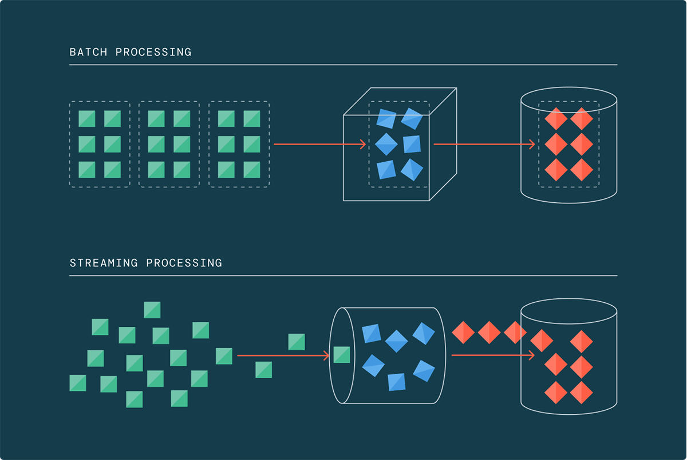

Uma pergunta que volta com frequência em decisão de arquitetura de dado é "esse pipeline precisa ser streaming ou batch pode resolver?", como se fossem dois mundos tecnológicos separados, com trade-off permanente entre um e outro. Essa pergunta parte de uma premissa que já não é verdadeira há alguns anos: no Azure Databricks, batch e streaming rodam no mesmo motor, com o mesmo código, e a decisão real não é qual tecnologia usar, é qual latência o negócio de fato precisa.

Trocar a pergunta "batch ou streaming" por "qual é o tempo certo pra esse dado chegar" muda a conversa inteira. Tem caso que genuinamente precisa de milissegundos, detecção de fraude em transação de cartão, por exemplo. Mas tem uma quantidade grande de pipeline hoje rodando em janela batch de hora em hora só porque foi assim que alguém desenhou há três anos, quando streaming parecia coisa de time de infraestrutura sênior com Kafka cluster próprio pra manter. Isso não é mais verdade.



## O mecanismo: um motor, dois modos de disparo

Spark Structured Streaming processa dado incrementalmente usando o mesmo modelo de execução do Spark batch, a diferença central está em como e quando o motor decide processar um novo lote de dado. O motor mantém checkpoint de progresso em armazenamento persistente, o que garante tolerância a falha e semântica de processamento exatamente uma vez: se o job cair no meio de um micro-lote, ele retoma exatamente de onde parou, sem duplicar nem perder registro.

O intervalo de disparo é onde mora a flexibilidade real. `Trigger.AvailableNow` processa todo dado disponível no momento em um ou mais micro-lotes e depois encerra o job sozinho, funcionando como um batch incremental disfarçado de streaming, útil pra quem quer rodar o pipeline a cada quinze minutos via agendamento em vez de manter processo contínuo ligado. No outro extremo, o modo de processamento contínuo entrega latência de ponta a ponta na casa de milissegundos pra caso que realmente demanda isso. No meio, o intervalo de disparo tradicional (a cada alguns segundos, minutos, o que fizer sentido) cobre a maioria dos casos de negócio reais.

## Mão na massa: o mesmo pipeline, dois perfis de latência

O ponto que costuma surpreender quem nunca testou isso é o quão pequena é a diferença de código entre rodar o mesmo pipeline como batch incremental ou como streaming contínuo:

```python
# Perfil 1: batch incremental a cada execução agendada
(df.writeStream
   .format("delta")
   .option("checkpointLocation", "/chk/pedidos")
   .trigger(availableNow=True)
   .table("vendas.silver.pedidos"))

# Perfil 2: streaming quase contínuo, latência de segundos
(df.writeStream
   .format("delta")
   .option("checkpointLocation", "/chk/pedidos")
   .trigger(processingTime="10 seconds")
   .table("vendas.silver.pedidos"))
```

A leitura de origem (`df`), a lógica de transformação e o destino Delta continuam idênticos, só o trigger muda. Isso significa que a decisão de latência deixa de ser uma escolha arquitetural irreversível tomada no dia um do projeto e vira um parâmetro que dá pra ajustar conforme a necessidade do negócio evolui, sem reescrever pipeline.

## Governança que atravessa dado histórico e dado em movimento

Um argumento que costuma ficar em segundo plano na discussão sobre streaming é a governança. Como tudo aterrissa em tabela Delta gerenciada pelo Unity Catalog, dado processado em streaming carrega o mesmo controle de acesso, a mesma linhagem e a mesma política de mascaramento de coluna que dado processado em batch. Isso evita o cenário comum em arquitetura mais antiga, onde o pipeline de tempo real vive numa stack de governança paralela (Kafka Connect, um cluster próprio, permissão gerenciada à parte) e acaba com regra de acesso divergente da que vale pro resto do lakehouse.

**Minha leitura:** o argumento de custo de streaming também merece uma correção de percepção. Existe uma crença antiga de que streaming custa mais que batch porque "fica ligado o tempo todo". Isso era verdade quando streaming significava cluster dedicado rodando 24 horas independente de ter dado chegando ou não. Com trigger incremental e compute serverless escalando pra zero entre execuções, o padrão de consumo se aproxima muito mais do batch tradicional do que a intuição sugere. Eu ainda testaria o custo real com carga de produção antes de assumir isso como verdade universal, mas a lacuna que existia é bem menor hoje do que era há alguns anos.

## Um cenário concreto: de hora em hora pra quase tempo real sem reescrever nada

Imagine um pipeline de detecção de estoque baixo que hoje roda a cada hora, porque foi assim que alguém configurou o Airflow há dois anos, quando ninguém tinha certeza se o cluster aguentaria rodar com mais frequência. Com o pipeline já escrito em Structured Streaming lendo via Auto Loader, a mudança pra latência de poucos minutos é trocar `trigger(availableNow=True)` agendado de hora em hora por `trigger(processingTime="5 minutes")` rodando continuamente, sem tocar em uma linha da lógica de transformação. O time de operação de loja passa a enxergar ruptura de estoque quase em tempo real, e o custo adicional, com compute serverless escalando conforme o volume real de evento chegando, costuma ser bem menor do que a intuição de "streaming é caro" sugere. Esse tipo de ganho incremental, sem projeto de reescrita, é onde a decisão de arquitetura realmente compensa o esforço de revisão.

## O que isso não resolve

Streaming incremental não é mágica pra todo tipo de carga. Transformação que exige olhar o dataset inteiro de uma vez, tipo reprocessamento completo de histórico pra corrigir uma regra de negócio retroativamente, ainda é trabalho de batch full, não incremental. Join com estado (stateful join) entre dois streams de alto volume também traz complexidade real de gerenciamento de watermark e tamanho de estado que não desaparece só porque a API é declarativa, exige entendimento de janela de tempo e tolerância a atraso de chegada de dado (late data) pra não estourar memória do executor. E streaming contínuo de baixíssima latência tem trade-off genuíno de custo e complexidade operacional frente ao modo de trigger incremental, não é a opção padrão certa pra maioria dos pipelines.

## Fechamento

A pergunta certa deixou de ser "esse pipeline é batch ou streaming" e passou a ser "quanto atraso entre o evento acontecer e o dado estar disponível pra consulta é aceitável pro caso de uso". Com o mesmo motor, o mesmo Delta Lake como destino e o mesmo Unity Catalog cuidando de governança, ajustar essa resposta não exige trocar de arquitetura, só de parâmetro de trigger. Vale revisar pipeline batch antigo que roda de hora em hora só por hábito, boa parte já poderia ganhar latência menor sem custo adicional relevante.

## Referências

- Databricks Blog, "Rethinking Data Streaming: Why It's Viable for More Use Cases than You Might Expect": https://www.databricks.com/blog/rethinking-data-streaming-why-its-viable-more-use-cases-you-might-expect
- Databricks Docs, "Structured Streaming": https://docs.databricks.com/en/structured-streaming/index.html
- Microsoft Learn, "Structured Streaming concepts - Azure Databricks": https://learn.microsoft.com/en-us/azure/databricks/structured-streaming/concepts

#Databricks #StructuredStreaming #EngenhariaDeDados #DeltaLake
