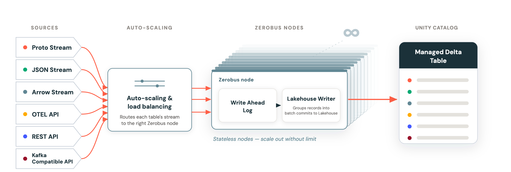

Ingestão de streaming tradicional carrega uma decisão que ninguém gosta de tomar cedo demais: quantas partições sua fila vai ter. Errar pra menos significa gargalo quando o volume cresce. Errar pra mais significa overhead e complexidade desnecessária desde o primeiro dia. E o pior: mudar o número de partições depois que o sistema já está em produção normalmente exige rebalanceamento doloroso. O Zerobus Ingest ataca esse problema removendo a própria pergunta: em vez de partição fixa, a garantia de ordenação vive na conexão do stream, não num índice de partição pré-definido.

## O que é o Zerobus Ingest

Zerobus é o serviço de ingestão de streaming totalmente gerenciado e serverless do Azure Databricks. Funciona como uma API push, onde produtores empurram dados diretamente para tabelas Delta governadas pelo Unity Catalog, sem provisionar broker de mensagens, sem gerenciar conector nem decidir esquema de partição antecipadamente. Segundo a documentação oficial, o fluxo de uso se resume a duas etapas: criar a tabela Delta com schema definido, e então enviar dados pra ela via gRPC, REST, OpenTelemetry (OTLP) ou, mais recentemente, um protocolo Kafka-compatível (ainda em Beta). A maior parte do serviço já está em disponibilidade geral (GA); os SDKs de C#/.NET e as APIs compatíveis com Kafka são as exceções documentadas em Beta.

## O mecanismo: particionamento dinâmico por conexão



A ideia central é simples de enunciar, mas exige repensar onde a ordenação "mora". Em vez de garantir ordem dentro de uma partição fixa (o modelo clássico de fila de mensagens), o Zerobus garante ordem dentro da conexão lógica de um produtor. Quando um cliente abre uma conexão de stream, ele recebe uma identidade lógica própria. Internamente, o serviço distribui essas conexões entre pods usando roteamento heurístico: se um pod está sobrecarregado, novas conexões são direcionadas pra outro pod com capacidade disponível. Isso destrava autoscaling de verdade, adicionar ou remover pods conforme a carga muda, sem exigir replanejamento de esquema de partição, porque a unidade de ordenação nunca dependeu do número de partições em primeiro lugar.

Duas peças de engenharia sustentam esse modelo em alta vazão:

**ZeroParser**: um decodificador protobuf customizado, desenhado para fazer parsing em um único passe (single-pass) e zero alocação de memória, mesmo lidando com descritores de schema dinâmicos. O número reportado é de aproximadamente 1 GB/s por núcleo de CPU.

**Write-ahead log com reconhecimento assíncrono**: o servidor retorna o offset máximo já confirmado no stream, permitindo que o cliente limpe seus buffers locais assim que recebe esse ack, sem precisar de confirmação síncrona por mensagem individual.

## O teste de carga: dataset NASA NEOWISE

Pra provar o mecanismo em escala real, a Databricks rodou um teste de 24 horas usando o dataset NEOWISE da NASA (cerca de 200 bilhões de pontos de observação acumulados em 11 anos de missão), com 2.048 streams concorrentes. Os números reportados:

- Throughput sustentado: 12 milhões de linhas por segundo.
- Vazão sustentada: 11,8 GB/s.
- Total ingerido: mais de 1 trilhão de registros.
- Resultado: mais de 1 petabyte de dado ingerido em menos de 24 horas.

**Minha leitura:** o que mais me impressiona nesse tipo de benchmark não é o número absoluto, é a escolha do dataset. Dado astronômico real, com 11 anos de heterogeneidade de schema e volume, é um teste bem mais honesto do que um gerador sintético de linhas idênticas. Ainda assim, vale sempre lembrar que benchmark de fornecedor mede o melhor cenário controlado por quem construiu o sistema, então acompanhar como isso se comporta no seu workload real, com seu schema e sua distribuição de chegada de dado, continua sendo o teste que importa de verdade.

## Mão na massa: enviando dados via gRPC (esqueleto conceitual)

Um exemplo simplificado de como um produtor Python se conectaria ao Zerobus pra empurrar eventos, com base no modelo de autenticação e endpoint documentado:

```python
from zerobus.sdk import ZerobusClient, StreamConfig

client = ZerobusClient(
    workspace_url="https://<seu-workspace>.cloud.databricks.com",
    client_id="<CLIENT_ID>",
    client_secret="<CLIENT_SECRET>",
)

stream = client.open_stream(
    table="main.telemetria.eventos_sensor",
    config=StreamConfig(ack_mode="async"),
)

for evento in gerar_eventos_sensor():
    stream.write(evento)

    # o ack assíncrono libera o buffer local sem round-trip por mensagem
    ultimo_offset_confirmado = stream.last_acked_offset()
    limpar_buffer_ate(ultimo_offset_confirmado)

stream.close()
```

O ponto chave nesse padrão é nunca bloquear o produtor esperando confirmação síncrona de cada linha individual, o que seria o gargalo clássico de qualquer sistema de ingestão de alta vazão.

## Onde isso se encaixa frente a Kafka e outras filas tradicionais

Vale situar o Zerobus frente ao que a maioria dos times já conhece. Numa fila Kafka tradicional, você decide o número de partições no momento da criação do tópico, e essa escolha define o teto de paralelismo de consumo daquele tópico dali pra frente. Aumentar partições depois é possível, mas reordena o mapeamento de chave pra partição, o que quebra garantia de ordenação pra chaves que já existiam antes do aumento, a não ser que você planeje isso com cuidado. O Zerobus evita essa armadilha inteira porque nunca expõe o conceito de partição pro produtor: a unidade que importa é a conexão de stream, que o cliente abre e fecha livremente, sem negociar antecipadamente quantas dessas conexões vão existir ou como elas mapeiam pra infraestrutura interna. Isso desloca a complexidade de dimensionamento do lado do usuário pro lado da plataforma, o que é exatamente a proposta de um serviço serverless: você paga pra não ter que tomar essa decisão.

## O que isso não resolve

Particionamento dinâmico por conexão resolve o problema de escalonamento operacional, mas não elimina a necessidade de pensar em chave de negócio pra consultas downstream. A tabela Delta resultante ainda se beneficia de boas escolhas de clustering e Z-ordering pra leitura eficiente, o particionamento dinâmico do lado da ingestão não substitui isso. Também vale notar que a documentação remete a um documento separado de "Zerobus Ingest quotas" pra limites precisos de throughput por workspace, então antes de dimensionar uma carga de produção nesse volume vale checar esses limites específicos da sua conta, não só o número do benchmark publicado.

## Resumindo

Deslocar a garantia de ordenação da partição fixa pra conexão de stream é o tipo de decisão arquitetural que parece pequena no papel mas resolve um problema operacional real: não ter que adivinhar, com meses de antecedência, quantas partições um sistema de ingestão vai precisar. O benchmark de 1 petabyte em 24 horas prova que o modelo escala, mas o valor prático pro dia a dia está em não precisar mais ter essa conversa de dimensionamento de partição logo na largada de um projeto novo.

## Referências

- [Ingesting the Milky Way at petabyte scale with Zerobus Ingest](https://www.databricks.com/blog/ingesting-milky-way-petabyte-scale-zerobus-ingest) (blog oficial Databricks)
- [Zerobus Ingest overview](https://docs.databricks.com/aws/en/ingestion/zerobus-overview) (documentação oficial)
- [Zerobus Ingest overview](https://learn.microsoft.com/en-us/azure/databricks/ingestion/zerobus-overview) (Microsoft Learn)

#Databricks #Zerobus #Streaming #DataEngineering
