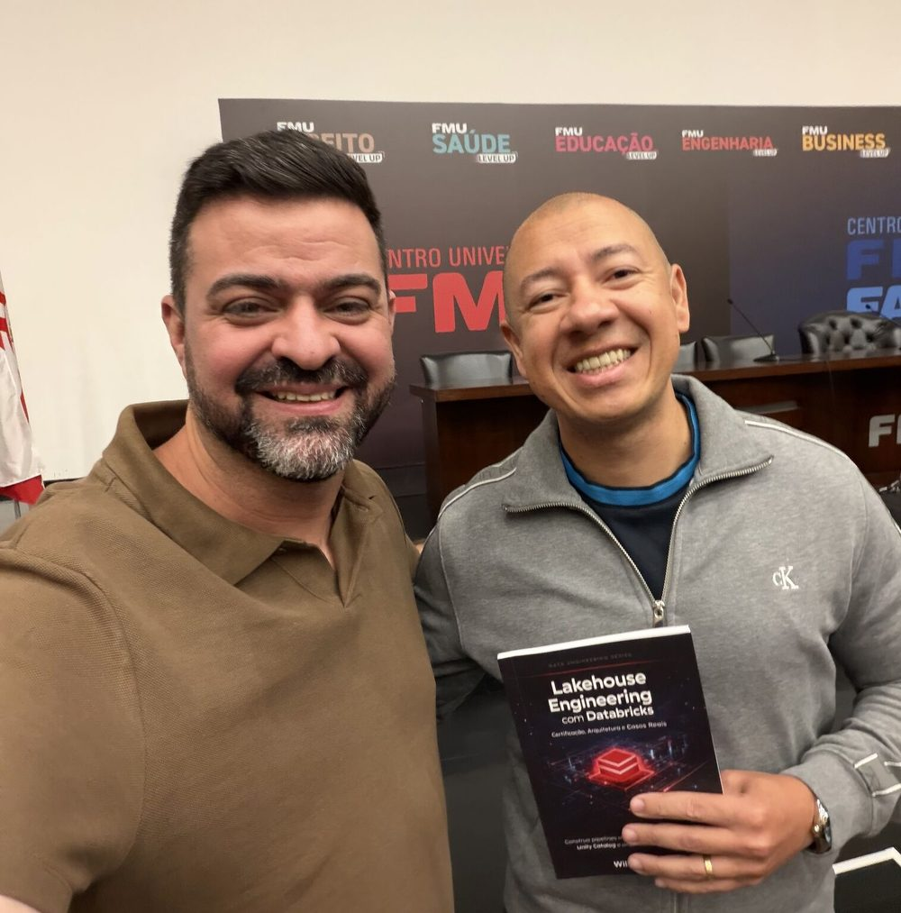

**📅 09 de maio de 2026 · 📍 FMU - Casa Metropolitana do Direito, São Paulo · Evento híbrido (Presencial e Online) · Evento realizado**

Hoje tive a oportunidade de participar da **Conferência Microsoft Fabric Brasil**, acompanhando palestras e trocando experiências com grandes referências da área: **Hugo Venturini**, **Sidney Cirqueira**, **Luciano Borba**, **Samyr Moises**, **Juliana Maria Lopes** e **Alison Pezzott**.

Um agradecimento especial ao **Sidney**, que em breve também estará compartilhando conhecimento com a **São Paulo Databricks User Group**. Vai ser uma excelente oportunidade para fortalecer ainda mais a troca de experiências entre profissionais de dados, analytics e IA.

Aproveitei também para rever amigos palestrantes e divulgar meu livro **Lakehouse Engineering com Databricks** entre a comunidade. 📖

## Sobre o evento

A **Conferência Microsoft Fabric Brasil** foi um dia inteiro de imersão total em Microsoft Fabric, com exposições completas abrangendo todos os níveis e camadas da plataforma — organizada pela comunidade em parceria com a Microsoft, reunindo grandes referências de dados e analytics do Brasil.

👉 [Página oficial do evento](https://hubingressos.com.br/evento/fabricmaio)
